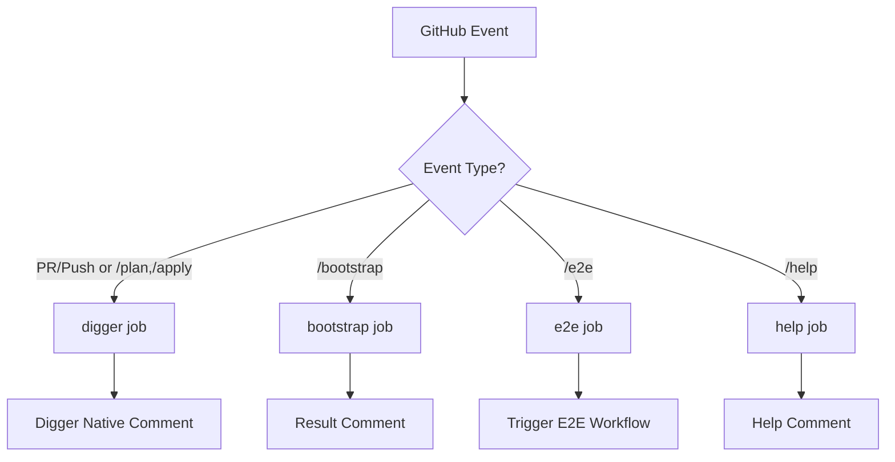

# GitHub Actions Workflows - Simplified Design

> **Philosophy**: Leverage Digger native features, minimize custom code.  
> **Goal**: Simple, maintainable CI with clear command routing.

---

## 🏗️ System Architecture

### Simplified Architecture

**Core Principle**: Use Digger native comments, simple workflow routing.

```
PR #123
  ├─ User comment: "/plan"
  ├─ Bot reaction: 👀
  └─ Digger comment: Plan results (auto-updated)
       ## Terraform Plan for `platform`
       **Plan**: 2 to add, 1 to change, 0 to destroy
       <details>...</details>
```

**Key Insight**: Digger provides status tracking - no need for custom Dashboard!

---

## 📁 Workflow Files

| File | Trigger | Purpose |
|------|---------|---------|
| **ci.yml** | PR, Comment, Push | Main pipeline (4 simple jobs) |
| **e2e-tests.yml** | Manual, Post-merge | Validation tests |
| **docs-site.yml** | Docs changes | Deploy documentation |
| **ops-drift-fix.yml** | Schedule | Drift detection |

---

## 🔄 ci.yml - Main Pipeline

### Job Flow



**Key**: Simple `if` conditions in workflow YAML, no parse job needed.

### Jobs

#### 1. **digger** - Terraform Orchestration

**Trigger**: 
- PR opened/updated (auto-plan)
- Comment contains `/plan` or `/apply` or `digger`
- Push to main (post-merge apply)

**Function**: Runs Digger which handles all Terraform operations

**Output**: Digger creates/updates native comments with plan/apply results

#### 2. **bootstrap** - L1 Layer Management

**Trigger**: Comment contains `/bootstrap`

**Function**: 
- Runs terragrunt plan/apply on bootstrap layer
- Cannot use Digger (chicken-egg dependency)

**Output**: Simple result comment with success/failure

#### 3. **e2e** - Test Trigger

**Trigger**: Comment contains `/e2e`

**Function**: Triggers e2e-tests.yml workflow

**Output**: Comment with workflow link

**Notes**:
- Uses `workflow_dispatch` with infra-flash App token to avoid bot comment suppression.

#### 4. **help** - Command Help

**Trigger**: Comment contains `/help`

**Function**: Displays available commands

**Output**: Help comment

---

## 📊 Available Commands

| Command | Handler | Function |
|---------|---------|----------|
| `/plan` or `digger plan` | digger job | Terraform plan all projects |
| `/apply` or `digger apply` | digger job | Terraform apply |
| `digger plan -p <project>` | digger job | Plan specific project |
| `/bootstrap plan` | bootstrap job | Plan L1 layer |
| `/bootstrap apply` | bootstrap job | Apply L1 layer |
| `/e2e` | e2e job | Trigger tests |
| `/help` | help job | Show commands |
| `@copilot review` | GitHub native | AI code review |

---

## 🔧 Implementation Details

### Bootstrap Script

**File**: `tools/ci/bootstrap.py`

Simple Python script that:
1. Runs `terragrunt init`
2. Runs `terragrunt plan` or `apply`
3. Returns exit code

No Dashboard dependency, pure execution.

### Digger Integration

Digger handles:
- Project detection (which layers changed)
- Plan/apply orchestration
- State locking
- Native PR comments with results

We just provide:
- `digger.yml` configuration
- Terraform/Terragrunt setup
- Secrets injection

---

## 🐛 Troubleshooting

### Commands not responding

**Check**:
1. Workflow `if` conditions in ci.yml
2. Comment spelling (case-sensitive)
3. PR vs Issue comment context

### Bootstrap fails

**Check**:
1. `tools/ci/bootstrap.py` exists and is executable
2. Terragrunt/Terraform setup action works
3. Bootstrap directory exists

### Digger not planning all projects

**Check**:
1. `digger.yml` has `include_patterns: ["**/*"]` for drift detection
2. Projects are properly configured

### No comments appearing

**Check**:
1. GitHub App token has correct permissions
2. Workflow has `pull-requests: write` permission
3. Job completed successfully (check Actions logs)

---

## 📚 Related Documentation

- [tools/ci/README.md](../../tools/ci/README.md) - Implementation details
- [docs/ssot/ops.pipeline.md](../../docs/ssot/ops.pipeline.md) - SSOT reference
- [digger.yml](../../digger.yml) - Digger configuration
