# GitHub Actions Workflows - Core Design

> **Philosophy**: Dashboard-first, event-driven infrastructure automation.  
> **Goal**: Every commit gets a persistent, updateable status dashboard.

---

## 🏗️ System Architecture

### The Dashboard Model

**Core Concept**: One persistent comment per commit that acts as the SSOT for all CI status.

```
PR #123
  ├─ Comment by user: "/plan"
  ├─ Comment by infra-flash: 👀 (reaction only)
  └─ Comment by infra-flash: Dashboard ← UPDATE THIS, DON'T CREATE NEW
       <!-- infra-dashboard:abc1234 -->
       ## ⚙️ Commit Dashboard `abc1234`
       | Stage | Status | Output | Time |
       |-------|--------|--------|------|
       | CI    | ⏳     | -      | -    |
       | Plan  | 🔄     | [View] | 14:23 |
       ...
```

**Anti-pattern**: ❌ Creating new comments for each status update (causes spam)  
**Correct pattern**: ✅ Update the single dashboard comment in-place

---

## 📁 Workflow Files

| File | Trigger | Purpose | Dashboard? |
|------|---------|---------|------------|
| **ci.yml** | PR, Comment, Push | Main orchestrator | ✅ Init + Update |
| **e2e-tests.yml** | Manual, Post-merge | Validation tests | ⚠️ Partial |
| **docs-site.yml** | Docs changes | Deploy docs | ❌ Independent |
| **ops-drift-fix.yml** | Schedule | Drift detection | ❌ Maintenance |

---

## 🔄 ci.yml - Main Pipeline

### Job Flow


### Jobs

#### 1. `parse` - Event Router
**Responsibility**: Determine what to do and initialize dashboard

**Steps**:
1. Parse event (PR/comment/push)
2. Determine mode (`digger` / `python` / `post-merge`)
3. Add 👀 reaction to command comments
4. **Initialize Dashboard** (`python -m ci init --pr <num>`)

**Outputs**:
- `mode`: Which job to run next
- `command`: Parsed command from comment
- `pr_number`: For dashboard updates
- `should_run`: Gate for conditional jobs

#### 2. `digger` - Terraform via Digger
**Responsibility**: Run terraform plan/apply through Digger orchestrator

**Dashboard Stages**:
- `plan-bootstrap`, `plan-platform`, `plan-data-*`: During plan
- `apply`: During apply

**Current Status**: ❌ **BROKEN** - No dashboard update logic  
**Fix Required**: Add post-step to update dashboard

#### 3. `pyci` - Python Commands
**Responsibility**: Custom logic (bootstrap, verify, etc.)

**Handles**:
- `/bootstrap plan|apply`
- Post-merge verification
- `workflow_dispatch` manual triggers

**Dashboard Updates**: ✅ Handled internally by `tools/ci/commands/run.py`

---

## 📊 Dashboard Stages

Default stages (defined in `tools/ci/core/dashboard.py`):

| Stage Key | Display Name | Typical Updater |
|-----------|--------------|-----------------|
| `ci` | CI Validate | ❌ None (needs job) |
| `plan-bootstrap` | Plan: bootstrap | `pyci` job |
| `plan-platform` | Plan: platform | `digger` job |
| `plan-data-staging` | Plan: data-staging | `digger` job |
| `plan-data-prod` | Plan: data-prod | `digger` job |
| `apply` | Apply | `digger` / `pyci` |
| `e2e` | E2E Tests | `e2e-tests` workflow |
| `review` | AI Review | Manual / Copilot |

---

## 🔧 Dashboard Update Mechanisms

### Method 1: Python API (Preferred)

Used by `pyci` job and commands:

```python
from tools.ci.core import Dashboard, GitHubClient

gh = GitHubClient()
dashboard = Dashboard(pr_number=123, commit_sha="abc123", github=gh)
dashboard.load()  # Find existing by marker

dashboard.update_stage("plan-bootstrap", "running", link=run_url)
dashboard.save()  # Update comment in-place
```

### Method 2: CLI Update (For external jobs)

Used when Python context isn't available:

```yaml
- name: Update Dashboard
  if: always()
  env:
    GITHUB_TOKEN: ${{ secrets.GITHUB_TOKEN }}
    PYTHONPATH: ${{ github.workspace }}/tools
  run: |
    python -m ci update \
      --pr ${{ needs.parse.outputs.pr_number }} \
      --stage "plan-platform" \
      --status "${{ steps.digger.outcome }}" \
      --link "${{ github.server_url }}/${{ github.repository }}/actions/runs/${{ github.run_id }}"
```

**Status Values**: `pending`, `running`, `success`, `failure`, `skipped`

---

## 🐛 Known Issues & Fixes

### Issue #1: Digger Dashboard Not Updating

**Symptom**: Digger runs but dashboard stays on ⏳ pending

**Root Cause**: `digger` job has no dashboard update step

**Fix**: Add this step after Digger action in `ci.yml`:

```yaml
- name: Update Dashboard (Digger)
  if: always() && needs.parse.outputs.pr_number != ''
  uses: actions/checkout@v4  # Need code for Python
  
- uses: actions/setup-python@v5
  with:
    python-version: '3.11'

- name: Update Dashboard Status
  if: always() && needs.parse.outputs.pr_number != ''
  env:
    GITHUB_TOKEN: ${{ steps.app-token.outputs.token }}
    PYTHONPATH: ${{ github.workspace }}/tools
  run: |
    # Determine stage from command
    STAGE="plan-platform"
    if [[ "${{ needs.parse.outputs.command }}" == "apply" ]]; then
      STAGE="apply"
    fi
    
    python -m ci update \
      --pr ${{ needs.parse.outputs.pr_number }} \
      --stage "$STAGE" \
      --status "${{ job.status }}" \
      --link "${{ github.server_url }}/${{ github.repository }}/actions/runs/${{ github.run_id }}"
```

### Issue #2: CI Validate Stage Never Updates

**Symptom**: `ci` stage always shows ⏳

**Root Cause**: No job is responsible for this stage

**Options**:
1. **Remove from default stages** (quick fix)
2. **Add validation job** that runs linters/tests

**Recommended Fix**: Remove `ci` from `dashboard.py` default stages since we don't have a validation job yet.

---

## 🎯 Command Examples

### User Types: `/plan`

```mermaid
sequenceDiagram
    User->>PR: Comment "/plan"
    PR->>parse: Webhook
    parse->>Dashboard: Create/Find by commit SHA
    parse->>User: 👀 Reaction
    parse->>digger: Trigger (mode=digger)
    digger->>Digger API: Run plan
    Digger API-->>digger: Plan output
    Note right of digger: ❌ Currently stops here
    digger->>Dashboard: ❌ Should update but doesn't
    Dashboard-->>User: Shows outdated status
```



**After Fix**:
```mermaid
sequenceDiagram
    User->>PR: Comment "/plan"
    ...
    digger->>Dashboard: ✅ Update plan-platform=success
    Dashboard-->>User: ✅ Shows correct status
```

### User Types: `/bootstrap apply`


---

## 📚 Related Documentation

- **Pipeline SSOT**: [docs/ssot/ops.pipeline.md](../../docs/ssot/ops.pipeline.md)
- **CI Tools**: [tools/ci/README.md](../../tools/ci/README.md)
- **Dashboard Implementation**: [tools/ci/core/dashboard.py](../../tools/ci/core/dashboard.py)

---

*Last updated: 2025-12-25 - Full design documentation with known issues*
