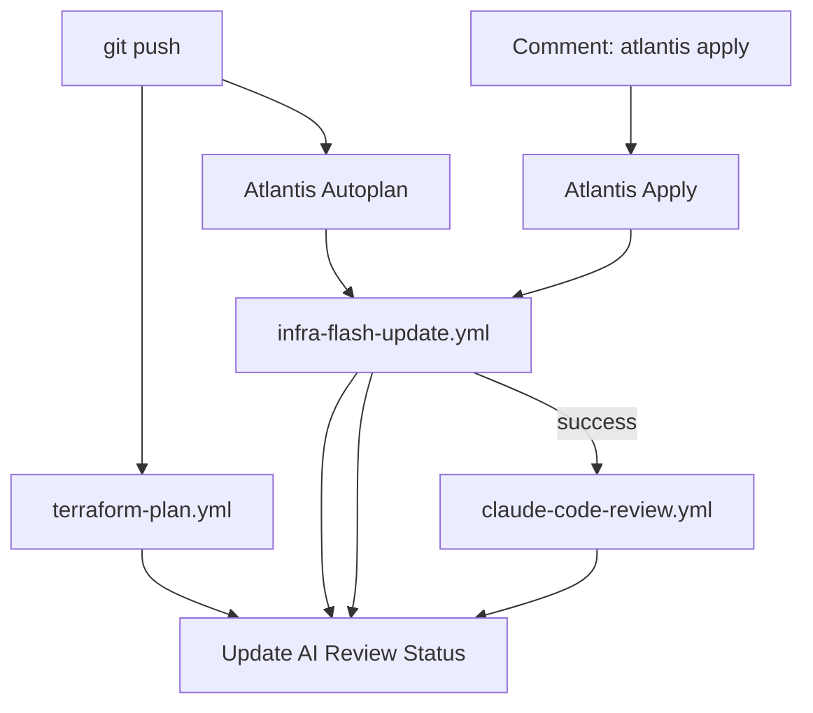

# GitHub Actions Workflows

## 架构概览 (Pipeline SSOT)

我们将 GitHub Actions 与 Atlantis 深度集成，围绕 **`infra-flash` 运维看板** 打造 SSOT 闭环：



## 核心设计原则

1.  **看板即真相 (Dashboard as SSOT)**: 所有流水线状态回写到对应 Commit 的唯一看板中。
2.  **紧凑看板 (10-15行)**: 主表只显示核心状态，详细历史折叠在 `<details>` 中。
3.  **👀 反馈链**: 人类 `atlantis plan/apply` 评论收到 👀 反应，表示已开始处理。
4.  **触发溯源**: Atlantis 输出和历史表均链接回触发它的评论。
5.  **AI Review 时机**: 仅在 Apply 成功后自动触发，更新 Dashboard 状态。

### Dashboard 格式
```markdown
## ⚡ Commit `abc1234` Dashboard

| Stage | Status | Link | Time |
|:---|:---:|:---|:---|
| Static CI | ✅ | [View](link) | 11:30 |
| Infra Plan | ✅ | [View](link) | 11:32 |
| Infra Apply | ✅ | [View](link) | 11:40 |
| AI Review | ✅ | [View](link) | 11:45 |

<details><summary>📜 Action History</summary>
| Action | Trigger | Output | Time |
| Plan | [@user](link) 👀 | [result](link) | 11:32 |
| Apply | [@user](link) 👀 | [result](link) | 11:40 |
</details>
```

### Atlantis 评论格式 (Plan/Apply 结果)

`atlantis-comment-format.yml` 将原始 Atlantis 输出格式化为用户友好的结构：

```markdown
## ✅ Plan Succeeded | ❌ Apply Failed

| | |
|:---|:---|
| **Project** | `platform` |
| **Dir** | `2.platform` |
| **Workspace** | `default` |
| **Triggered by** | [@user](link) |

**Plan: 3 to add, 1 to change, 0 to destroy**

### 💡 Next Step
`atl apply -p platform`  (成功时)
Fix errors below, then run `atlantis plan`  (失败时)

<details><summary>📜 Output</summary>
... terraform output ...
</details>
```

**设计原则**:
1. **状态优先**: 第一行即显示成功/失败
2. **位置结构化**: 表格展示 project/dir/workspace
3. **下一步可见**: 不折叠，直接展示操作建议
4. **详情折叠**: 冗长的 terraform 输出放在最后

## Workflows 列表

| Workflow | 触发器 | 职责 | 看板反馈 |
|:---|:---|:---|:---|
| `terraform-plan.yml` | `pull_request` | 静态 CI + 骨架评论创建 | 更新 `Static CI` 行 |
| `atlantis-acknowledge.yml` | `issue_comment` | 👀 立即响应 atlantis 命令 | N/A (仅加 👀) |
| `infra-flash-update.yml` | `issue_comment` | 搬运 Atlantis Plan/Apply 输出 | 更新 `Plan/Apply` 行 & `Action` 表 |
| `deploy-L1-bootstrap.yml` | `issue_comment` / `workflow_dispatch` | L1 Bootstrap (`bootstrap plan/apply`) | 更新 `Bootstrap Plan/Apply` 行 |
| `post-merge-verify.yml` | `push` (main) / `schedule` / `workflow_dispatch` | Merge 后全量 L1-L4 drift 检测 | 结果贴回被合并的 PR |
| `claude-code-review.yml`| `workflow_run` | Apply 成功后自动执行 AI 审计 | 更新 `AI Review` 行 |
| `claude.yml` | `@claude` 评论 | 手动触发 AI 编码/审计任务 | 更新 `AI Review` 行 |
| `infra-commands.yml` | `infra dig/help` | 指令分发器（健康探测/帮助） | 更新 `Health Check` 行 |

---

## Terraform 版本

所有 workflows 从 `.terraform-version` 文件读取 TF 版本，确保与 Atlantis 和本地开发一致。详见 [ops.pipeline.md](../../docs/ssot/ops.pipeline.md#13-版本要求与-ssot)。

---

## L1 Bootstrap Workflow

`deploy-L1-bootstrap.yml` is a **manual-trigger** workflow for initial cluster setup and disaster recovery:

### Scope (L1 Only)
- K3s cluster installation
- cert-manager deployment
- Platform PostgreSQL (for Vault/Casdoor)
- Atlantis deployment

### When to Use
| Scenario | Action |
|:---|:---|
| Initial cluster setup | Run `deploy-L1-bootstrap.yml` |
| L1 component recovery | Run `deploy-L1-bootstrap.yml` |
| L2/L3/L4 changes | Use Atlantis (PR-based) |

> **Note**: L2/L3/L4 are managed by Atlantis. See `atlantis.yaml` for project definitions.

### L3 Resource Import (Atlantis)

L3 resource imports are handled by **Atlantis** (not GitHub Actions) via the shared import script:

```bash
# atlantis.yaml workflow calls:
./0.tools/l3-import.sh "$NS" "$TG"
```

---

## Post-Merge Verification

`post-merge-verify.yml` provides drift detection after PRs are merged:

### Triggers
| Trigger | When | Purpose |
|:---|:---|:---|
| `push` to main | After merge | Verify merged changes |
| `schedule` (daily) | UTC 00:00 | Catch external drift |
| `workflow_dispatch` | Manual | On-demand verification |

### Flow
1. **L1 Verification**: Direct `terraform plan` in GHA
2. **L2/L3/L4 Verification**: Creates temp drift-check PR → Atlantis autoplan → Auto-close
3. **Results**: Posted to merged PR (push) or Issue (schedule with drift)

### Status Icons
| Status | Icon | Meaning |
|:---|:---:|:---|
| No changes | ✅ | Infrastructure matches code |
| Drift detected | ⚠️ | Changes detected, create PR to sync |
| Error | ❌ | Plan failed, check logs |

---
*Last updated: 2025-12-23*