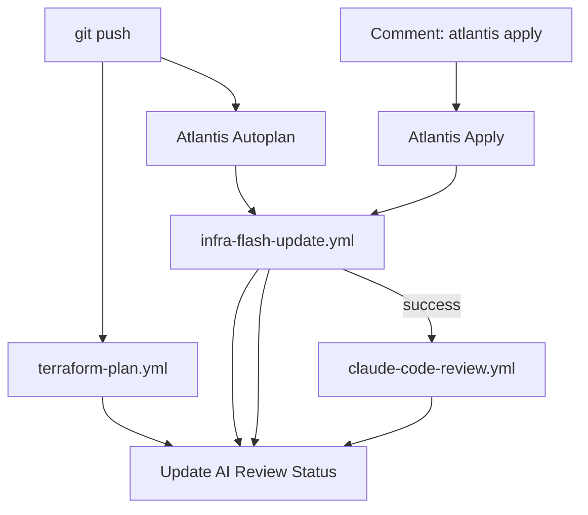

# GitHub Actions Workflows

## 架构概览 (Pipeline SSOT)

我们将 GitHub Actions 与 Atlantis 深度集成，围绕 **`infra-flash` 运维看板** 打造 SSOT 闭环：

## 核心设计原则

1.  **看板即真相 (Dashboard as SSOT)**: 所有流水线状态（CI、Plan、Apply、AI Review、Health Check）必须回写到对应 Commit 的唯一看板中。
2.  **去重占位符**: 使用 `<!-- next-step-placeholder -->` 等 Marker 机制，确保看板动态更新且无冗余。
3.  **身份隔离**:
    - `infra-flash[bot]`: 负责所有看板管理和 Atlantis 搬运。
    - `claude[bot]`: 负责 AI 审计与反馈。

## Workflows 列表

| Workflow | 触发器 | 职责 | 看板反馈 |
|:---|:---|:---|:---|
| `terraform-plan.yml` | `pull_request` | 静态 CI + 骨架评论创建 | 更新 `Static CI` 行 |
| `infra-flash-update.yml` | `issue_comment` | 搬运 Atlantis Plan/Apply 输出 | 更新 `Plan/Apply` 行 & `Action` 表 |
| `claude-code-review.yml`| `workflow_run` | **(NEW)** Apply 成功后自动执行 AI 审计 | 更新 `AI Review` 行 |
| `claude.yml` | `@claude` 评论 | 手动触发 AI 编码/审计任务 | 更新 `AI Review` 行 |
| `infra-commands.yml` | `infra dig/help` | **(NEW)** 指令分发器（健康探测/帮助） | 更新 `Health Check` 行 |
| `deploy-k3s.yml` | `push` to main | 灾备平面：全量 L1-L4 Flash | N/A |

---

## Terraform 版本

所有 workflows 从 `.terraform-version` 文件读取 TF 版本，确保与 Atlantis 和本地开发一致。详见 [ops.pipeline.md](../../docs/ssot/ops.pipeline.md#13-版本要求与-ssot)。

---

## ClickHouse Port-Forward in CI

`deploy-k3s.yml` uses `kubectl port-forward` to connect to ClickHouse for L2/L3 terraform apply:
- **L2 (Platform)**: Port-forwards to `data-staging` namespace
- **L3 (Data)**: Port-forwards to `data-prod` namespace

Both steps use `-var="clickhouse_host=127.0.0.1"` to override the in-cluster DNS.

---
*Last updated: 2025-12-22*