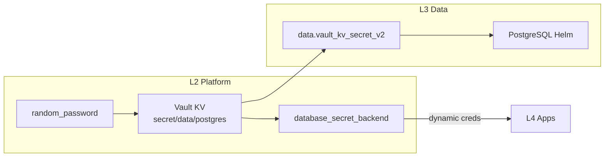

# 3.data (Data Layer / Layer 3)

**Scope**:
- **Relational**: Business PostgreSQL (Application data)
- **Cache**: Redis
- **Multi-model**: ArangoDB (Document, Graph, Key-Value)
- **OLAP**: ClickHouse
- **Namespace**: `data-<env>` (e.g. `data-staging`, `data-prod`)

## Architecture

This layer provides stateful services for **Business Applications** (L4).

*Note: Platform DB (for Vault/Casdoor) is in L1 (`1.bootstrap/5.platform_pg.tf`).*

### Password Flow (Fully Reproducible)



**No manual steps required** - all Vault configuration is IaC managed in L2.

### Components

| File | Component | Purpose |
|------|-----------|---------|
| `1.postgres.tf` | PostgreSQL | Business database, creds from Vault KV |
| `2.redis.tf` | Redis | Cache and session storage |
| `3.clickhouse.tf` | ClickHouse | OLAP analytics database |
| `4.arangodb.tf` | ArangoDB | Multi-model database (document/graph/KV) |

### Deployment Order

1. **L1** (Bootstrap): k3s, Platform PostgreSQL
2. **L2** (Platform): Vault, vault_mount, password generation, database engine config
3. **L3** (Data): Read password from Vault, deploy PostgreSQL Helm
4. **L4** (Apps): Get dynamic credentials via Vault Agent

### Credentials

| Service | Vault Path | Type |
|---------|------------|------|
| PostgreSQL root | `secret/data/postgres` | Static (L2 generated) |
| PostgreSQL app users | `database/creds/app-*` | Dynamic (short-lived) |
| Redis | `secret/data/redis` | Static (L2 generated) |
| ClickHouse | `secret/data/clickhouse` | Static (L2 generated) |
| ArangoDB | `secret/data/arangodb` | Static (L2 generated) |

## Design Decisions

### Namespace Ownership

The `data-<env>` namespaces are **owned by L3** (`3.data/1.postgres.tf`, per Terraform workspace). This follows the pattern:
- L1 owns `kube-system`, `platform` (namespace created in L1)
- L2 operates within `platform` (namespace passed from L1)
- **L3 owns `data-<env>`** (namespace created in L3)
- L4 operates within `apps-<env>` (and may create app-specific namespaces)

### Dual-SSOT Password Rationale

Password is stored in **both Vault KV and Helm values**:

| Location | Purpose | Justification |
|----------|---------|---------------|
| Vault KV (`secret/data/postgres`) | Dynamic credential generation | Vault Database Engine uses this to create short-lived app users |
| Helm values (via random_password) | Initial PostgreSQL deployment | PostgreSQL needs password at install time |

**Why not Vault Agent Injector for PostgreSQL itself?**
- PostgreSQL is the **database itself**, not an app consuming it
- The root password must exist at PostgreSQL startup
- Vault Agent pattern is for **consumers** (L4 apps), not the database server

## Disaster Recovery

### Backup Strategy

```bash
# Backup L3 PostgreSQL (run on VPS)
NS="data-staging" # or data-prod
kubectl exec -n "$NS" postgresql-0 -- pg_dump -U postgres app > l3_backup.sql

# Restore
kubectl exec -n "$NS" postgresql-0 -- psql -U postgres -d app < l3_backup.sql
```

### Recovery Steps

1. **Password Lost**: Re-run L2 apply (regenerates password, updates Vault KV)
2. **Data Loss**: Restore from pg_dump backup
3. **Full Recreation**: Delete `data-<env>` namespace, re-apply L3

## Health Checks & Validation

All L3 data services follow the health check matrix from [ops.pipeline.md](../docs/ssot/ops.pipeline.md#8-健康检查分层):

### Atlantis (In-Cluster Providers)

When `TF_VAR_kubeconfig_path` is empty (Atlantis in-cluster), the `kubectl` provider must set `load_config_file=false` to avoid defaulting to `http://localhost` and failing CRD applies (e.g., `kubectl_manifest`).

### Terraform-native Validation

Each service has **lifecycle preconditions** to ensure Vault KV availability:

```hcl
lifecycle {
  prevent_destroy = true  # Prevent accidental data loss
  
  precondition {
    condition     = can(data.vault_kv_secret_v2.{service}.data["password"]) && 
                    length(data.vault_kv_secret_v2.{service}.data["password"]) >= 16
    error_message = "{Service} password must be available in Vault KV and at least 16 characters."
  }
}
```

**Coverage**:
- ✅ **PostgreSQL**: Password validation (16+ chars)
- ✅ **Redis**: Password validation (16+ chars)  
- ✅ **ClickHouse**: Password validation (16+ chars)
- ✅ **ArangoDB**: Password validation (16+ chars) + JWT secret precondition

### Helm Chart Configuration

- **Timeout**: 300s (standardized across all releases)
- **Wait**: `wait = true` ensures readiness before completion
- **Lifecycle**: `prevent_destroy = true` on all database releases
- **Storage**: follow [ops.storage.md](../docs/ssot/ops.storage.md) (`local-path-retain`, reclaim policy, /data conventions)

**Note**: initContainer and other Pod-level health checks are configured via Helm chart defaults, not in Terraform values per SSOT guidelines.
Scalability for MVP:
- **Redis**: Master-only (no replicas)
- **ClickHouse**: Single shard, no ZooKeeper
- **ArangoDB**: Single mode (not Cluster)

Scale-out / multi-replica migration notes are tracked in:
- [docs/project/README.md](../docs/project/README.md) (execution plan / backlog)
- [db.overview.md](../docs/ssot/db.overview.md) (database capability SSOT)

---
*Last updated: 2025-12-20 (Added SSOT references to vault data sources per Issue #301)*
