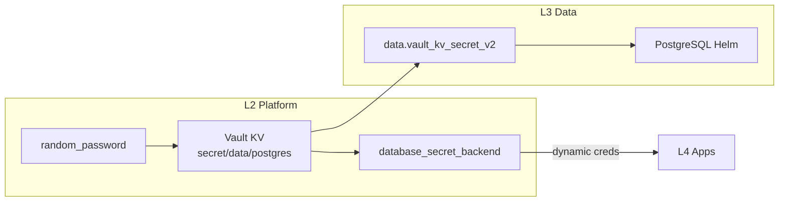

# 3.data (Data Layer / Layer 3)

**Scope**:
- **Relational**: Business PostgreSQL (Application data)
- **Cache**: Redis (planned)
- **Graph**: Neo4j (planned)
- **OLAP**: ClickHouse (planned)
- **Namespace**: `data`

## Architecture

This layer provides stateful services for **Business Applications** (L4).

*Note: Platform DB (for Vault/Casdoor) is in L1 (`1.bootstrap/5.platform_pg.tf`).*

### Password Flow (Fully Reproducible)

**No manual steps required** - all Vault configuration is IaC managed in L2.

### Components

| File | Component | Purpose |
|------|-----------|---------|
| `1.postgres.tf` | PostgreSQL | Business database, creds from Vault KV |

### Deployment Order

1. **L1** (Bootstrap): k3s, Platform PostgreSQL
2. **L2** (Platform): Vault, vault_mount, password generation, database engine config
3. **L3** (Data): Read password from Vault, deploy PostgreSQL Helm
4. **L4** (Apps): Get dynamic credentials via Vault Agent

### Credentials

| Service | Vault Path | Type |
|---------|------------|------|
| PostgreSQL root | `secret/data/postgres` | Static (L2 generated) |
| PostgreSQL app users | `database/creds/app-*` | Dynamic (short-lived) |

---
*Last updated: 2025-12-13*
