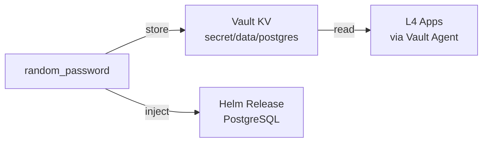

# 3.data (Data Layer / Layer 3)

**Scope**:
- **Relational**: Business PostgreSQL (Application data)
- **Cache**: Redis (planned)
- **Graph**: Neo4j (planned)
- **OLAP**: ClickHouse (planned)
- **Namespace**: `data`

## Architecture

This layer provides stateful services for **Business Applications** (L4).

*Note: Platform DB (for Vault/Casdoor) is in L1 (`1.bootstrap/5.platform_pg.tf`).*

### Password Flow



### Components

| File | Component | Purpose |
|------|-----------|---------|
| `1.postgres.tf` | PostgreSQL | Business database, creds at `secret/data/postgres` |

### Prerequisites

Before first deployment:
1. **Vault unsealed**: `vault operator unseal`
2. **KV engine enabled** (one-time bootstrap):
   ```bash
   vault secrets enable -path=secret kv-v2
   ```
3. **GitHub Secret**: `VAULT_ROOT_TOKEN` set from 1Password

### Credentials

| Service | Vault Path | Fields |
|---------|------------|--------|
| PostgreSQL | `secret/data/postgres` | username, password, host, port, database |

### Usage

```bash
# Deploy via Atlantis (PR merge to main)
# Or locally:
cd 3.data
terraform init
terraform apply
```

---
*Last updated: 2025-12-13*
