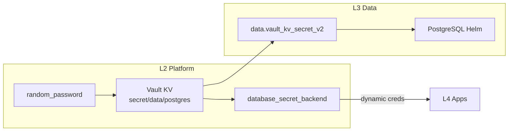

# 3.data (Data Layer / Layer 3)

**Scope**:
- **Relational**: Business PostgreSQL (Application data)
- **Cache**: Redis (planned)
- **Graph**: Neo4j (planned)
- **OLAP**: ClickHouse (planned)
- **Namespace**: `data`

## Architecture

This layer provides stateful services for **Business Applications** (L4).

*Note: Platform DB (for Vault/Casdoor) is in L1 (`1.bootstrap/5.platform_pg.tf`).*

### Password Flow (Fully Reproducible)



**No manual steps required** - all Vault configuration is IaC managed in L2.

### Components

| File | Component | Purpose |
|------|-----------|---------|
| `1.postgres.tf` | PostgreSQL | Business database, creds from Vault KV |

### Deployment Order

1. **L1** (Bootstrap): k3s, Platform PostgreSQL
2. **L2** (Platform): Vault, vault_mount, password generation, database engine config
3. **L3** (Data): Read password from Vault, deploy PostgreSQL Helm
4. **L4** (Apps): Get dynamic credentials via Vault Agent

### Credentials

| Service | Vault Path | Type |
|---------|------------|------|
| PostgreSQL root | `secret/data/postgres` | Static (L2 generated) |
| PostgreSQL app users | `database/creds/app-*` | Dynamic (short-lived) |

## Design Decisions

### Namespace Ownership

The `data` namespace is **owned by L3** (`3.data/1.postgres.tf`). This follows the pattern:
- L1 owns `kube-system`, `platform` (namespace created in L1)
- L2 operates within `platform` (namespace passed from L1)
- **L3 owns `data`** (namespace created in L3)
- L4 operates within `data` or creates app-specific namespaces

### Dual-SSOT Password Rationale

Password is stored in **both Vault KV and Helm values**:

| Location | Purpose | Justification |
|----------|---------|---------------|
| Vault KV (`secret/data/postgres`) | Dynamic credential generation | Vault Database Engine uses this to create short-lived app users |
| Helm values (via random_password) | Initial PostgreSQL deployment | PostgreSQL needs password at install time |

**Why not Vault Agent Injector for PostgreSQL itself?**
- PostgreSQL is the **database itself**, not an app consuming it
- The root password must exist at PostgreSQL startup
- Vault Agent pattern is for **consumers** (L4 apps), not the database server

## Disaster Recovery

### Backup Strategy

```bash
# Backup L3 PostgreSQL (run on VPS)
kubectl exec -n data postgresql-0 -- pg_dump -U postgres app > l3_backup.sql

# Restore
kubectl exec -n data postgresql-0 -- psql -U postgres -d app < l3_backup.sql
```

### Recovery Steps

1. **Password Lost**: Re-run L2 apply (regenerates password, updates Vault KV)
2. **Data Loss**: Restore from pg_dump backup
3. **Full Recreation**: Delete namespace, re-apply L3

---
*Last updated: 2025-12-13*
# L3 Data Deploy Sun Dec 14 00:36:06 +08 2025
