# Infrastructure as Code (IaC) Repository

> **环境即服务 (EaaS)** - 基于 BRN-004 设计理念的基础设施代码仓库

## 概述

本仓库实现了 TrueAlpha 项目的完整基础设施管理，遵循 **开源、自托管、单人强控、长期可扩展** 四个核心约束。

### 核心技术栈

| 组件 | 技术选型 | 版本 | 文档 |
|------|---------|------|------|
| **IaC 平台** | Terraform | >= 1.6 | [terraform/](terraform/) |
| **运行时编排** | Dokploy | latest | [compose/](compose/) |
| **可观测性** | SigNoz | latest | [observability/signoz/](observability/signoz/) |
| **开发者门户** | Backstage (预留) | latest | [backstage/](backstage/) |
| **网络层** | Cloudflare | - | [terraform/modules/cloudflare/](terraform/modules/cloudflare/) |
| **产品分析** | PostHog | latest | [analytics/posthog/](analytics/posthog/) |
| **密钥管理** | Infisical | latest | [secrets/](secrets/) |
| **CI/CD** | GitHub Actions + Atlantis | - | [ci/](ci/) |

## 快速开始

### 前置要求

- Terraform >= 1.6.0
- Docker >= 24.0
- Docker Compose >= 2.20
- Git
- (可选) Infisical CLI - 用于密钥管理

### 本地开发环境

```bash
# 1. Clone 仓库
git clone <repo-url>
cd infra

# 2. 从 Infisical 导出开发环境变量 (或使用 .env.example)
./scripts/deploy/export-secrets.sh dev
# 或者手动复制示例文件
cp secrets/.env.example .env.dev

# 3. 启动完整开发栈
docker compose -f compose/base.yml \
  -f compose/dev.yml \
  --env-file .env.dev \
  -p truealpha-dev up -d

# 4. 验证服务健康状态
docker compose -p truealpha-dev ps
```

## 仓库结构

```
infra/
├── README.md                    # 本文件
├── docs/                        # 文档目录
│   ├── 0.hi_zitian.md           # 👉 需要 Zitian 做的事情
│   ├── architecture.md          # 架构设计
│   ├── change_log/              # 变更日志
│   │   └── BRN-004.md           # BRN-004 相关变更记录
│   ├── runbooks/                # 运维手册
│   └── guides/                  # 开发指南
├── terraform/                   # Terraform 配置
│   ├── modules/                 # 可复用模块
│   └── envs/                    # 环境特定配置
├── compose/                     # Docker Compose 配置
├── scripts/                     # 自动化脚本
├── observability/               # 可观测性配置
├── analytics/                   # 分析平台配置
├── backstage/                   # Backstage 配置（预留）
└── ci/                          # CI/CD 配置
```

## 文档导航

### 📚 文档类型说明

本仓库文档分为5类，各司其职：

#### 1. 技术比对细节 → `docs/architecture.md`
- 技术选型对比与rationale
- 系统架构设计
- 数据流图和安全设计

#### 2. 介绍文档 → `README.md` (本文件)
- 仓库概述和快速开始
- 核心概念和工作流
- 文档导航

#### 3. 部署SOP模板 → `docs/deployment-sop.md`
**通用部署标准操作流程**，适用于所有环境
- GitHub Secrets 配置
- Infisical 配置
- 部署流程和验证
- 故障处理

#### 4. 环境特定SOP → `docs/env.d/{env}_sop.md`
每个环境的具体配置和操作，**以 deployment-sop.md 为模板**
- `docs/env.d/staging_sop.md` - Staging 环境配置
- `docs/env.d/test_sop.md` - Test (PR预览) 配置
- `docs/env.d/prod_sop.md` - Production 配置

#### 5. 部署进度追踪 → 两个层级

**整体进度**: `docs/PROGRESS.md`
- 所有环境的总体完成度
- 代码完成度 vs 实际部署状态
- 跨环境完成度对比

**具体环境状态**: `terraform/envs/{env}/STATUS.md`
- `terraform/envs/staging/STATUS.md` - Staging 部署状态
- `terraform/envs/test/STATUS.md` - Test 部署状态
- `terraform/envs/prod/STATUS.md` - Production 部署状态

---

### 📋 常用文档快速链接

| 场景 | 文档 |
|------|------|
| 我要开始部署 staging | 1. [deployment-sop.md](docs/deployment-sop.md) 了解流程<br>2. [env.d/staging_sop.md](docs/env.d/staging_sop.md) 查看配置<br>3. [envs/staging/STATUS.md](terraform/envs/staging/STATUS.md) 追踪进度 |
| 我要了解架构 | [architecture.md](docs/architecture.md) |
| 我要查看整体进度 | [PROGRESS.md](docs/PROGRESS.md) |
| 我需要运维操作 | [runbooks/operations.md](docs/runbooks/operations.md) |
| 我要开发新功能 | [guides/developer-onboarding.md](docs/guides/developer-onboarding.md) |

---

### 📝 文档更新规则

- **介绍/架构文档**: 唯一，避免重复
- **SOP模板**: 通用流程，所有环境复用
- **环境SOP**: 特定配置，基于模板扩展
- **进度追踪**: 实时更新，反映真实状态

更多规则见 [AGENTS.md](AGENTS.md)

## 环境管理

### 环境划分

| 环境 | 用途 | 域名模式 | 数据源 | 生命周期 |
|-----|------|---------|--------|---------|
| **dev** | 日常开发 | localhost | 本地容器 | 持久 |
| **ci** | 自动化测试 | - | 临时容器 | 分钟级 |
| **test** | PR 预览 | pr-{number}.{domain} | 临时 | PR 生命周期 |
| **staging** | 预发测试 | staging.{domain} | prod dump | 持久 |
| **prod** | 生产环境 | {domain} | 正式数据 | 持久 |

### 部署命令

```bash
# 部署到特定环境
ENV=staging ./scripts/deploy/deploy.sh

# 通过 Terraform 管理基础设施
cd terraform/envs/staging
terraform init
terraform plan
terraform apply
```

## 核心工作流

### 1. 基础设施变更 (Terraform)

```mermaid
graph LR
    A[修改 .tf 文件] --> B[创建 PR]
    B --> C[Atlantis 自动 plan]
    C --> D[审查 plan 输出]
    D --> E[评论 'atlantis apply']
    E --> F[变更生效]
```



### 2. 应用部署

```mermaid
graph LR
    A[推送代码] --> B[GitHub Actions]
    B --> C[导出配置]
    C --> D[Docker Compose]
    D --> E[Dokploy 部署]
```



### 3. PR 预览环境

```mermaid
graph LR
    A[创建 PR] --> B[自动部署预览]
    B --> C[生成预览 URL]
    C --> D[人工验证]
    D --> E[合并 PR]
    E --> F[自动销毁环境]
```



## 密钥管理

所有敏感配置通过 Infisical 统一管理:

```bash
# 导出环境变量
infisical export --env=dev --format=dotenv > .env.dev

# 或使用封装脚本
./scripts/deploy/export-secrets.sh dev
```

**安全规则:**
- ✅ `.env.example` 可以入库，作为配置模板
- ❌ `.env`, `.env.*` 绝不入库
- ❌ `*.tfvars` 包含真实值的绝不入库
- ✅ `*.tfvars.example` 可以入库作为模板

## 常用命令

### Docker Compose

```bash
# 启动服务
docker compose -f compose/base.yml -f compose/dev.yml --env-file .env.dev up -d

# 查看日志
docker compose -p truealpha-dev logs -f [service-name]

# 停止服务
docker compose -p truealpha-dev down

# 查看配置合并结果
docker compose -f compose/base.yml -f compose/dev.yml config
```

### Terraform

```bash
# 初始化
terraform init

# 验证配置
terraform validate

# 查看变更计划
terraform plan -var-file=terraform.tfvars

# 应用变更
terraform apply -var-file=terraform.tfvars

# 销毁资源
terraform destroy -var-file=terraform.tfvars
```

## 监控与观测

### SigNoz
- **URL**: `http://signoz.{domain}:3301`
- **功能**: Metrics + Logs + Traces 一体化查看

### PostHog
- **URL**: `http://posthog.{domain}:8000`
- **功能**: 产品分析与事件追踪

### Dokploy
- **URL**: `http://dokploy.{domain}:3000`
- **功能**: 应用部署管理

## 故障排查

### 常见问题

**问题: 服务启动失败**
```bash
# 1. 检查环境变量
docker compose config

# 2. 查看服务日志
docker compose logs [service-name]

# 3. 验证网络连接
docker compose exec [service-name] ping [target]
```

**问题: Terraform state 冲突**
```bash
# 1. 检查 state lock
terraform force-unlock [lock-id]

# 2. 刷新 state
terraform refresh
```

更多故障排查指南见 [docs/runbooks/](docs/runbooks/)

## 贡献指南

### 分支策略
- `main` - 生产分支，所有变更通过 PR 合并
- `staging` - 预发分支，自动部署到 staging 环境
- `feature/*` - 功能分支

### 提交规范
```
<type>(<scope>): <subject>

<body>
```

类型:
- `feat` - 新功能
- `fix` - 修复
- `docs` - 文档
- `infra` - 基础设施变更
- `ci` - CI/CD 变更

## 相关文档

- [BRN-004: EaaS 基础设施设计理念](../PEG-scaner/docs/origin/BRN-004.dev_test_prod_design.md)
- [架构设计](docs/architecture.md)
- [开发指南](docs/guides/)
- [运维手册](docs/runbooks/)

## License

MIT

## 联系方式

- **Owner**: Platform Team
- **Repository**: [GitHub Link]
- **文档**: [Backstage Portal] (预留)
