# Infrastructure as Code (IaC) Repository

> **环境即服务 (EaaS)** - 基于 BRN-004 设计理念的基础设施代码仓库

## 概述

本仓库实现了 TrueAlpha 项目的完整基础设施管理，遵循 **开源、自托管、单人强控、长期可扩展** 四个核心约束。

### 目录职责速览（入口优先级）

- `docs/project/BRN-004/` → 主文档入口（标准 3-5 文件 + README，记录背景/进度/决策/操作）
- `docs/` → 历史/参考文档（architecture、SOP 模板、runbooks 等），新增文档优先落在 `docs/project/`
- `terraform/` → 基础设施即代码（modules + envs）
- `compose/` → Docker Compose 运行时编排
- `scripts/` → 自动化脚本（部署、导出密钥等）
- `observability/`、`analytics/`、`backstage/` → 配套子系统
- `ci/` → CI/CD 配置

### 核心技术栈

| 组件 | 技术选型 | 版本 | 文档 |
|------|---------|------|------|
| **IaC 平台** | Terraform | >= 1.6 | [terraform/](terraform/) |
| **运行时编排** | Dokploy | latest | [compose/](compose/) |
| **可观测性** | SigNoz | latest | [observability/signoz/](observability/signoz/) |
| **开发者门户** | Backstage (预留) | latest | [backstage/](backstage/) |
| **网络层** | Cloudflare | - | [terraform/modules/cloudflare/](terraform/modules/cloudflare/) |
| **产品分析** | PostHog | latest | [analytics/posthog/](analytics/posthog/) |
| **密钥管理** | 自托管 Infisical | latest | [secrets/](secrets/) |
| **CI/CD** | GitHub Actions + Atlantis | - | [ci/](ci/) |

## 快速开始

### 前置要求

- Terraform >= 1.6.0
- Docker >= 24.0
- Docker Compose >= 2.20
- Git
- (可选) Infisical CLI - 用于密钥管理

### 本地开发环境

```bash
# 1. Clone 仓库
git clone <repo-url>
cd infra

# 2. 从 Infisical 导出开发环境变量 (或使用 .env.example)
./scripts/deploy/export-secrets.sh dev
# 或者手动复制示例文件
cp secrets/.env.example .env.dev

# 3. 启动完整开发栈
docker compose -f compose/base.yml \
  -f compose/dev.yml \
  --env-file .env.dev \
  -p truealpha-dev up -d

# 4. 验证服务健康状态
docker compose -p truealpha-dev ps
```

## 仓库结构

```
infra/
├── README.md                    # 本文件
├── docs/                        # 文档目录（主入口在 project/，其余为参考/历史）
│   ├── 0.hi_zitian.md           # 👉 需要 Zitian 做的事情
│   ├── architecture.md          # 架构设计
│   ├── change_log/              # 变更日志
│   │   └── BRN-004.md           # BRN-004 相关变更记录
│   ├── project/                 # 📌 主文档集合（标准 3-5 文件 + README）
│   │   └── BRN-004/             # 当前项目实施记录
│   ├── runbooks/                # 运维手册
│   └── guides/                  # 开发指南
├── terraform/                   # Terraform 配置
│   ├── modules/                 # 可复用模块
│   └── envs/                    # 环境特定配置
├── compose/                     # Docker Compose 配置
├── scripts/                     # 自动化脚本
├── observability/               # 可观测性配置
├── analytics/                   # 分析平台配置
├── backstage/                   # Backstage 配置（预留）
└── ci/                          # CI/CD 配置
```

## 文档导航

### 📚 主文档（集中在 `docs/project/BRN-004/`）

标准文件集（新增内容优先放这里）：
- `README.md` → 项目索引、外部 BRN/IRD/TRD 链接、当前阶段/状态
- `context.md` → 背景、环境信息、决策依据
- `progress.md` → 里程碑与完成度（补充/细化 `docs/PROGRESS.md`）
- `decisions.md` → 关键决策与变更记录（保持时间线）
- `ops.md` → 与该项目强相关的 SOP/运行手册入口（可链接到 runbooks）

### 📖 配套/参考文档（保留历史，不新增同类散件）
- `docs/architecture.md` → 技术选型对比、系统架构设计
- `docs/deployment-sop.md` → 通用部署 SOP 模板（所有环境复用）
- `docs/env.d/{env}_sop.md` → 环境特定 SOP（staging/test/prod）
- `docs/runbooks/` → 运维操作手册
- `docs/guides/` → 开发/接入指南
- `docs/change_log/` → 变更记录（按 BRN）
- `docs/0.hi_zitian.md` → 用户待办
- `docs/PROGRESS.md` → 跨环境整体进度
- `terraform/envs/{env}/STATUS.md` → 具体环境部署状态

### 🧭 外部设计文档
- [BRN-004: EaaS 基础设施设计](https://github.com/wangzitian0/PEG-scaner/blob/main/docs/origin/BRN-004.dev_test_prod_design.md)
- [BRN-007: 应用环境机制](https://github.com/wangzitian0/PEG-scaner/blob/main/docs/origin/BRN-007.app_env_design.md)
- [IRD-004: 基础设施设计](https://github.com/wangzitian0/PEG-scaner/blob/main/docs/specs/infra/IRD-004.env_eaas_infra.md)
- [TRD-004: 实施方案](https://github.com/wangzitian0/PEG-scaner/blob/main/docs/specs/tech/TRD-004.env_eaas_implementation.md)

---

### 📋 常用文档快速链接

| 场景 | 文档 |
|------|------|
| 我要开始部署 staging | 1. [deployment-sop.md](docs/deployment-sop.md) 了解流程<br>2. [env.d/staging_sop.md](docs/env.d/staging_sop.md) 查看配置<br>3. [envs/staging/STATUS.md](terraform/envs/staging/STATUS.md) 追踪进度 |
| 我要了解架构 | [architecture.md](docs/architecture.md) |
| 我要查看整体进度 | [PROGRESS.md](docs/PROGRESS.md) |
| 我需要运维操作 | [runbooks/operations.md](docs/runbooks/operations.md) |
| 我要开发新功能 | [guides/developer-onboarding.md](docs/guides/developer-onboarding.md) |

---

### 📝 文档更新规则

- **介绍/架构文档**: 唯一，避免重复
- **SOP模板**: 通用流程，所有环境复用
- **环境SOP**: 特定配置，基于模板扩展
- **进度追踪**: 实时更新，反映真实状态

更多规则见 [AGENTS.md](AGENTS.md)

## 环境管理

### 环境划分

| 环境 | 用途 | 域名模式 | 数据源 | 生命周期 |
|-----|------|---------|--------|---------|
| **dev** | 日常开发 | localhost | 本地容器 | 持久 |
| **ci** | 自动化测试 | - | 临时容器 | 分钟级 |
| **test** | PR 预览 | x-test.truealpha.club / api-x-test.truealpha.club；PR: x-test-*.truealpha.club | 临时 | PR 生命周期 |
| **staging** | 预发测试 | x-staging.truealpha.club / api-x-staging.truealpha.club | prod dump | 持久 |
| **prod** | 生产环境 | truealpha.club / api.truealpha.club | 正式数据 | 持久 |

### 部署命令（脚本化，无 UI）

```bash
# 一键分层部署 (Terraform plan/apply + 拉取密钥 + compose 部署)
./scripts/deploy/layered_deploy.sh staging apply

# 仅应用层（已完成 Terraform 且已有 .env.<env>）
./scripts/deploy/deploy.sh staging

# （计划）自托管 Infisical/SigNoz/PostHog 由 Terraform/Dokploy 自动化，当前仅提供 compose 定义，待接入 TF。 
```

## 核心工作流

### 1. 基础设施变更 (Terraform)

```mermaid
graph LR
    A[修改 .tf 文件] --> B[创建 PR]
    B --> C[GitHub Actions terraform.yml 运行 plan]
    C --> D[审查 plan 输出]
    D --> E[workflow_dispatch: action=apply]
    E --> F[变更生效]
```



### 2. 应用部署

```mermaid
graph LR
    A[推送代码] --> B[GitHub Actions]
    B --> C[导出配置]
    C --> D[Docker Compose]
    D --> E[Dokploy 部署]
```



### 3. PR 预览环境

```mermaid
graph LR
    A[创建 PR] --> B[自动部署预览]
    B --> C[生成预览 URL]
    C --> D[人工验证]
    D --> E[合并 PR]
    E --> F[自动销毁环境]
```



## 密钥管理

所有敏感配置通过自托管 Infisical 统一管理（GitHub Secrets 仅存 MI 三元组）:

```bash
# 导出环境变量
infisical export --env=dev --format=dotenv > .env.dev

# 或使用封装脚本
./scripts/deploy/export-secrets.sh dev
```

**安全规则:**
- ✅ `.env.example` 可以入库，作为配置模板
- ❌ `.env`, `.env.*` 绝不入库
- ❌ `*.tfvars` 包含真实值的绝不入库
- ✅ `*.tfvars.example` 可以入库作为模板

## 常用命令

### Docker Compose

```bash
# 启动服务
docker compose -f compose/base.yml -f compose/dev.yml --env-file .env.dev up -d

# 查看日志
docker compose -p truealpha-dev logs -f [service-name]

# 停止服务
docker compose -p truealpha-dev down

# 查看配置合并结果
docker compose -f compose/base.yml -f compose/dev.yml config
```

### Terraform

```bash
# 初始化
terraform init

# 验证配置
terraform validate

# 查看变更计划
terraform plan -var-file=terraform.tfvars

# 应用变更
terraform apply -var-file=terraform.tfvars

# 销毁资源
terraform destroy -var-file=terraform.tfvars
```

## 监控与观测（自托管）

- SigNoz（待部署模块）: `http://signoz.{domain}:3301` — Metrics/Logs/Traces  
- PostHog（待部署模块）: `http://posthog.{domain}:8000` — 产品分析  
- Dokploy: `http://dokploy.{domain}:3000` — 应用部署管理（当前部署基于 compose，后续可接 Dokploy API）

## 自动化覆盖说明
- 已有：Cloudflare/VPS Terraform，compose 部署脚本（deploy.sh，layered_deploy.sh 组合 Terraform + 部署）。
- 待补：自托管 Infisical/SigNoz/PostHog 的 Terraform/compose 定义与部署；Dokploy API/CLI 集成，实现完全声明式、无 UI。

## 故障排查

### 常见问题

**问题: 服务启动失败**
```bash
# 1. 检查环境变量
docker compose config

# 2. 查看服务日志
docker compose logs [service-name]

# 3. 验证网络连接
docker compose exec [service-name] ping [target]
```

**问题: Terraform state 冲突**
```bash
# 1. 检查 state lock
terraform force-unlock [lock-id]

# 2. 刷新 state
terraform refresh
```

更多故障排查指南见 [docs/runbooks/](docs/runbooks/)

## 贡献指南

### 分支策略
- `main` - 生产分支，所有变更通过 PR 合并
- `staging` - 预发分支，自动部署到 staging 环境
- `feature/*` - 功能分支

### 提交规范
```
<type>(<scope>): <subject>

<body>
```

类型:
- `feat` - 新功能
- `fix` - 修复
- `docs` - 文档
- `infra` - 基础设施变更
- `ci` - CI/CD 变更

## 相关文档

- [BRN-004: EaaS 基础设施设计理念](../PEG-scaner/docs/origin/BRN-004.dev_test_prod_design.md)
- [架构设计](docs/architecture.md)
- [开发指南](docs/guides/)
- [运维手册](docs/runbooks/)

## License

MIT

## 联系方式

- **Owner**: Platform Team
- **Repository**: [GitHub Link]
- **文档**: [Backstage Portal] (预留)
