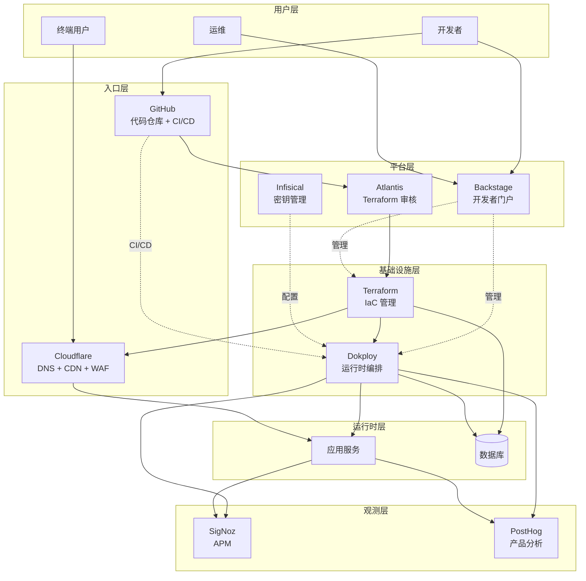
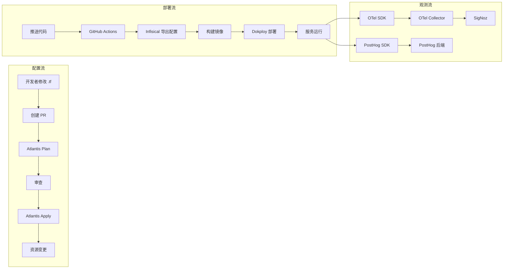
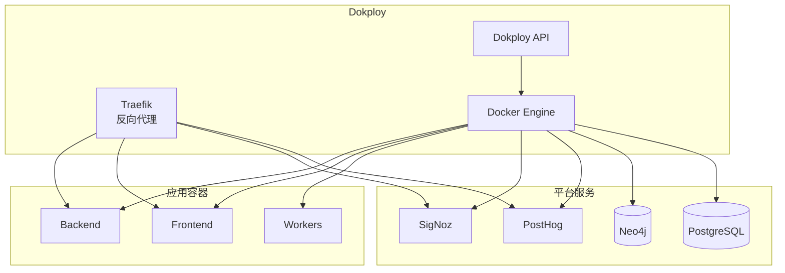
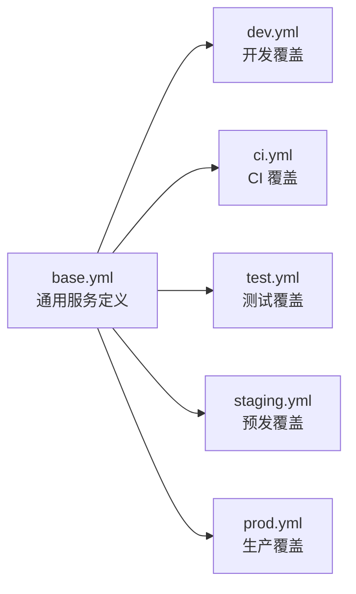
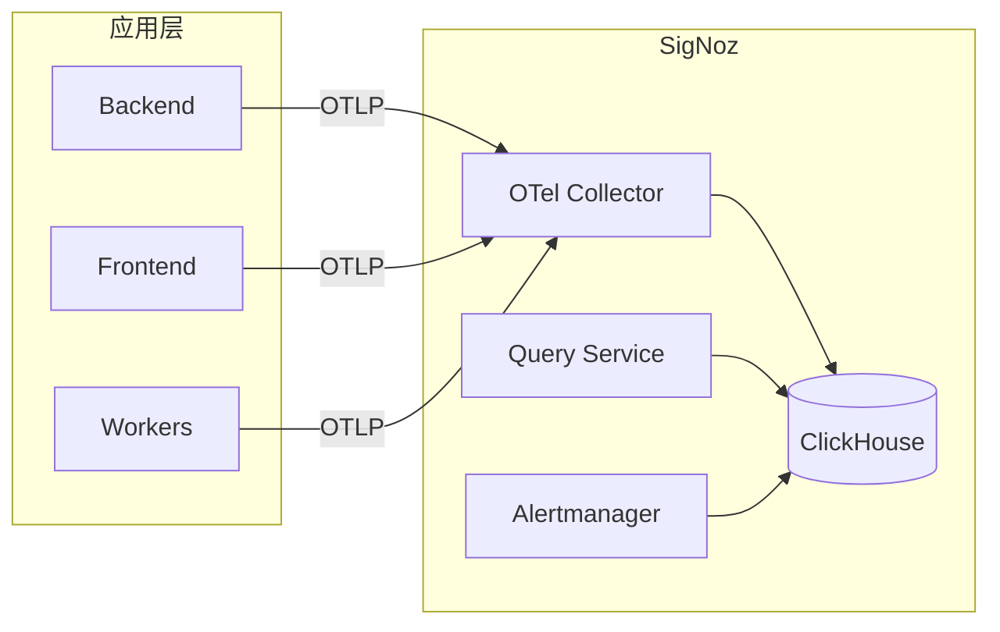
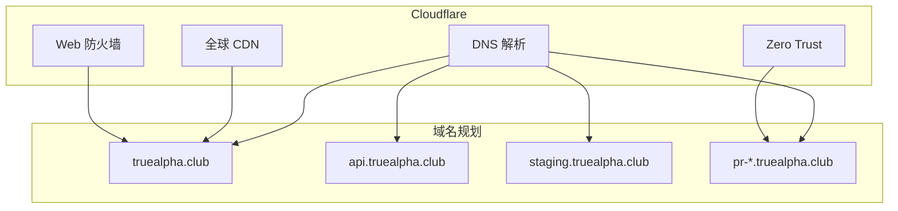
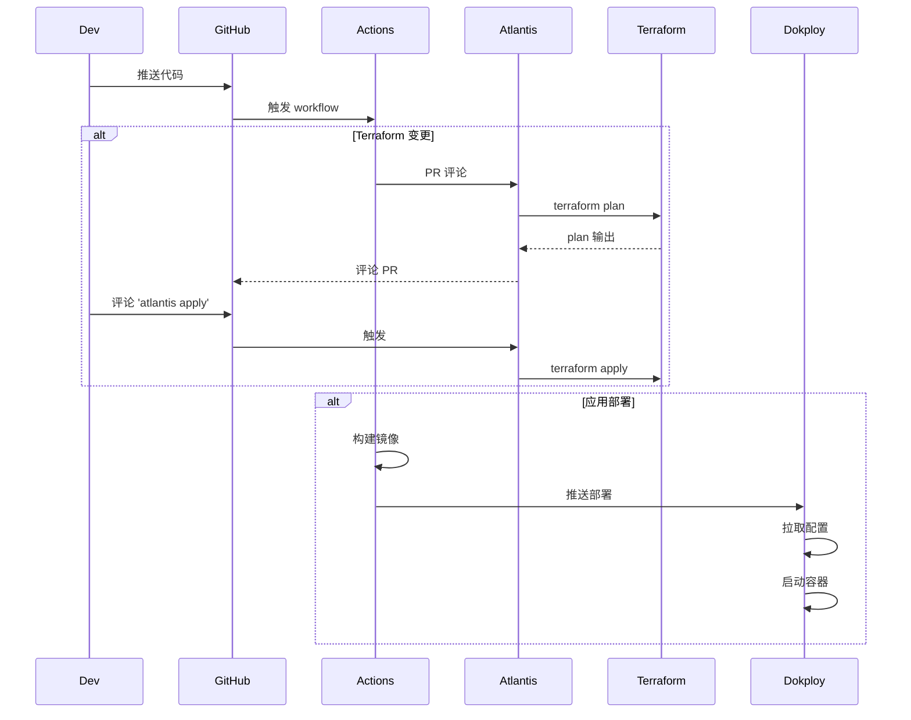

# 架构设计文档

> **基于 BRN-004 的 EaaS 基础设施架构**

## 系统架构

### 整体架构图



### 数据流图



## 核心组件

### 1. Terraform - 基础设施即代码

**职责:**
- 管理所有云资源（VPS、DNS、数据库等）
- 环境一致性保证
- 变更历史追踪

**关键特性:**
- Provider 支持: Cloudflare, VPS Provider, Dokploy API
- State 管理: 远程 backend（S3/R2）
- 模块化设计: 可复用的基础设施模块
- 环境隔离: dev/test/staging/prod 独立配置

**目录结构:**
```
terraform/
├── backend.tf              # State backend 配置
├── providers.tf            # Provider 声明
├── variables.tf            # 全局变量
├── outputs.tf              # 输出定义
├── modules/                # 模块库
│   ├── vps/                # VPS 实例模块
│   ├── cloudflare/         # Cloudflare DNS/CDN/WAF
│   ├── database/           # 托管数据库
│   └── monitoring/         # 监控资源
└── envs/                   # 环境配置
    ├── dev/
    ├── test/
    ├── staging/
    └── prod/
```

### 2. Dokploy - 运行时平台

**职责:**
- 容器编排与管理
- 应用部署
- 服务发现
- 自动 SSL

**架构:**


### 3. Docker Compose - 服务定义

**分层策略:**



**配置继承:**
- `base.yml`: 所有环境共享的服务结构
- `{env}.yml`: 环境特定的端口、卷挂载、路由配置

**启动命令:**
```bash
docker compose \
  -f compose/base.yml \
  -f compose/${ENV}.yml \
  --env-file .env.${ENV} \
  -p app-${ENV} \
  up -d
```

### 4. SigNoz - 可观测性

**架构:**


**数据类型:**
- **Traces**: 分布式追踪
- **Metrics**: 时序指标
- **Logs**: 结构化日志

### 5. Cloudflare - 网络层

**功能模块:**



### 6. Infisical - 密钥管理

**数据模型:**
```
Organization: TrueAlpha
└── Project: Infrastructure
    ├── Environment: dev
    │   ├── PEG_ENV=development
    │   ├── DB_TABLE_PREFIX=dev_
    │   └── NEO4J_URI=...
    ├── Environment: test
    ├── Environment: staging
    └── Environment: prod
```

**特性:**
- 版本控制
- 访问审计
- 角色权限
- CLI 集成

### 7. CI/CD Pipeline

**工作流:**



## 环境隔离策略

### 数据隔离

**Neo4j Label 前缀:**
```python
# 通过环境变量控制
DB_TABLE_PREFIX = os.getenv("DB_TABLE_PREFIX", "dev_")

# Repository 层自动添加前缀
def get_label(base_label: str) -> str:
    return f"{DB_TABLE_PREFIX}{base_label}"

# dev: dev_Company
# prod: prod_Company
```

**PostgreSQL Schema/Table 前缀:**
```sql
-- dev 环境
CREATE TABLE dev_users (...);

-- prod 环境
CREATE TABLE prod_users (...);
```

### 网络隔离

**Docker 网络:**
```yaml
networks:
  app_network:
    name: truealpha-${ENV}
    driver: bridge
```

**域名隔离:**
- dev: `localhost:*`
- test: `pr-{number}.truealpha.club`
- staging: `staging.truealpha.club`
- prod: `truealpha.club`

### 配置隔离

**环境变量文件:**
```
.env.dev
.env.test
.env.staging
.env.prod
```

**Infisical 环境分离:**
每个环境独立 environment，配置版本独立管理。

## 安全设计

### 密钥管理

**不入库:**
- `.env` 文件
- `*.tfvars` 包含真实值
- SSH 私钥
- API tokens

**入库:**
- `.env.example` 模板
- `*.tfvars.example` 模板
- 公钥

### 访问控制

**Cloudflare Zero Trust:**
- PR 预览环境需要身份验证
- 内部工具 (Dokploy/SigNoz/PostHog) 受保护

**GitHub:**
- Branch protection rules
- Required reviewers
- Status checks

**Terraform:**
- State 加密
- State lock
- Plan 必须审查

### 网络安全

**Cloudflare WAF 规则:**
- Rate limiting
- Bot 防护
- DDoS 防护
- IP 白名单（可选）

## 扩展性设计

### 横向扩展

**VPS 扩展:**
```hcl
# terraform/modules/vps/main.tf
resource "provider_instance" "app" {
  count = var.instance_count  # 从 1 扩展到 N
  # ...
}
```

**Dokploy 多节点:**
- 支持管理多台 server
- 通过 Terraform 统一配置

### 纵向扩展

**资源调整:**
```hcl
# terraform/envs/prod/terraform.tfvars
vps_size = "s-4vcpu-8gb"  # 从小规格升级
```

### 迁移路径

**Dokploy → Kubernetes:**
1. Docker Compose 配置转换为 K8s manifests
2. 使用 Kompose 等工具辅助转换
3. 应用代码无需改动（仍使用环境变量）

**数据库扩展:**
- 单机 → 托管服务（RDS/Aiven）
- 通过 Terraform module 切换

## 灾难恢复

### 备份策略

**数据库:**
- Neo4j: 每日快照
- PostgreSQL: 每日 dump
- 保留策略: 7 天本地 + 30 天远程

**Terraform State:**
- 远程 backend 自动版本控制
- 定期手动备份

**配置:**
- Infisical 自动版本历史
- Git 仓库作为配置备份

### 恢复流程

**应用恢复:**
1. 从 Git 检出代码
2. 从 Infisical 导出配置
3. Docker Compose 启动

**数据库恢复:**
```bash
# Neo4j
neo4j-admin database restore --from-path=/backup

# PostgreSQL
psql < backup.sql
```

**基础设施恢复:**
```bash
# 重新创建所有资源
cd terraform/envs/prod
terraform init
terraform apply
```

## 监控与告警

### 关键指标

**基础设施层:**
- VPS CPU/Memory/Disk 使用率
- Docker 容器状态
- 网络流量

**应用层:**
- API 响应时间 (p50/p95/p99)
- 错误率
- QPS (Queries Per Second)

**业务层:**
- 用户活跃度 (PostHog)
- 关键漏斗转化率
- 核心功能可用性

### 告警规则

**SigNoz 告警:**
```yaml
- name: high_error_rate
  condition: error_rate > 5%
  duration: 5m
  severity: critical
  
- name: slow_response
  condition: p95_latency > 1s
  duration: 10m
  severity: warning
```

## 成本优化

### 资源规划

| 环境 | VPS 规格 | 数据库 | 估算成本 |
|-----|---------|--------|---------|
| dev | 本地 | 本地容器 | $0 |
| test | 共享 staging | 临时 | ~$0 |
| staging | 2vCPU 4GB | 小规格 | ~$20/月 |
| prod | 4vCPU 8GB | 中规格 | ~$60/月 |

### 优化策略

**资源共享:**
- test 环境复用 staging VPS
- dev 完全本地化

**弹性伸缩:**
- 根据流量调整实例规格
- 非高峰期降级

**监控成本:**
- SigNoz 自托管（vs Datadog $15/host）
- PostHog 自托管（vs Mixpanel $25/月）
- 总节省: ~$50/月

## 技术债务

### 已知限制

1. **Dokploy 非标准 K8s**
   - **影响**: 长期可能需要迁移
   - **缓解**: Docker Compose 配置易于转换

2. **单机 State Backend**
   - **影响**: State 文件单点
   - **缓解**: 定期备份 + 迁移到 S3/R2

3. **手动扩容**
   - **影响**: 无自动伸缩
   - **缓解**: 监控 + 告警 + 快速手动响应

### 改进计划

**Q1 2026:**
- [ ] 迁移 State 到远程 backend
- [ ] 完善告警规则
- [ ] 自动化备份脚本

**Q2 2026:**
- [ ] Backstage 完整上线
- [ ] 自定义插件开发
- [ ] 服务目录完善

**Q3 2026:**
- [ ] 评估 K8s 迁移
- [ ] 多 region 部署
- [ ] 高可用改造

## 参考资料

- [BRN-004: EaaS 设计理念](../../PEG-scaner/docs/origin/BRN-004.dev_test_prod_design.md)
- [Terraform 最佳实践](https://www.terraform-best-practices.com/)
- [Dokploy 官方文档](https://docs.dokploy.com/)
- [SigNoz 架构](https://signoz.io/docs/architecture/)
- [Twelve-Factor App](https://12factor.net/)
