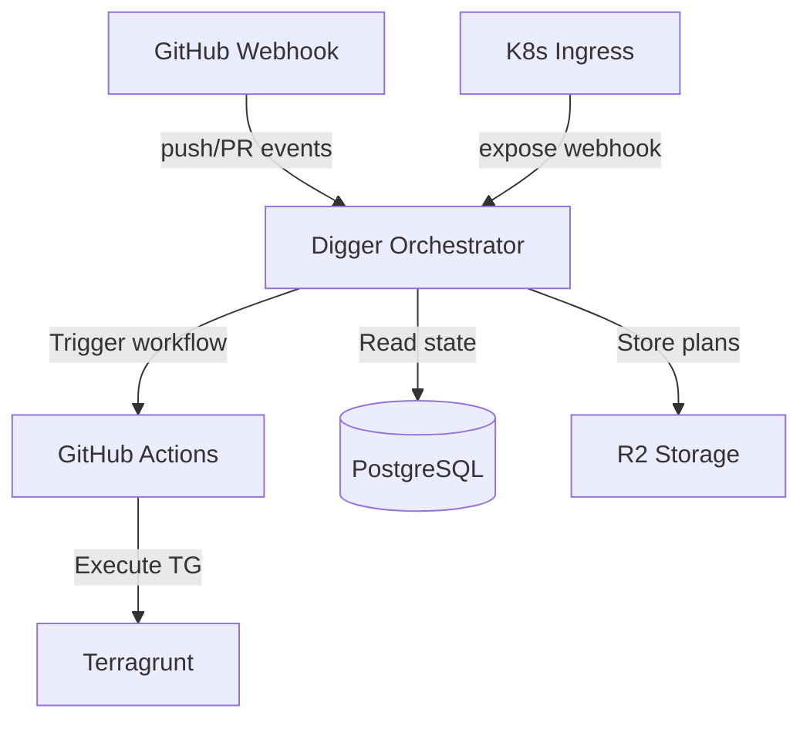

# Digger Orchestrator 自部署方案

> **状态**: 规划中  
> **优先级**: P1（解决 push 事件 apply 自动化）  
> **预计工时**: 2-3 天

---

## 问题背景

### 当前架构痛点
1. **Digger OSS 限制**: 不支持 `push` 事件，无法在 post-merge 时自动 apply
2. **Workaround 复杂**: 需要维护两套逻辑
   - PR/Comment: Digger orchestration
   - Push: 原生 terragrunt (post-merge-apply job)
3. **功能缺失**: OSS 版本无法使用 `on_commit_to_default: [digger apply]`

### 为什么需要自部署 Orchestrator

根据 [Digger 文档](https://docs.opentaco.dev/ce/getting-started/with-terragrunt) 和搜索结果：

- ✅ **完整事件支持**: 自部署版支持 `push` 事件，可监听 webhook 并触发 CI
- ✅ **on_commit_to_default**: 配置 `workflow_configuration.on_commit_to_default: [digger apply]` 实现 post-merge 自动 apply
- ✅ **统一编排**: 所有层 (bootstrap/platform/data) 都通过 Digger 管理，不需要特殊处理
- ✅ **K8s 内运行**: 在集群内有完整网络访问，可直接访问 Vault/Kubernetes API

---

## 技术方案

### 1. 部署架构



### 2. 组件清单

| 组件 | 部署位置 | 说明 |
|------|---------|------|
| **Digger Backend** | `bootstrap/` | Helm chart 或 manifests |
| **PostgreSQL** | `envs/*/data/` | 复用 Platform PG 或独立部署 |
| **Webhook Endpoint** | Cloudflare Tunnel | `digger.internal.domain` |
| **GitHub App** | GitHub Settings | 替代 PAT，权限更细粒度 |

### 3. 配置修改

#### 3.1 digger.yml
```yaml
# 启用 orchestrator 模式
workflows:
  terragrunt:
    workflow_configuration:
      on_pull_request_pushed: [digger plan]
      on_pull_request_closed: [digger unlock]
      on_commit_to_default: [digger apply]  # 🎯 核心：post-merge 自动 apply
    plan:
      steps:
        - run: terragrunt init -no-color
        - run: terragrunt plan -no-color -out=plan.tfplan
    apply:
      steps:
        - run: terragrunt init -no-color
        - run: terragrunt apply -no-color -auto-approve plan.tfplan

# Bootstrap 也纳入 Digger 管理（orchestrator 可处理依赖）
projects:
  - name: bootstrap
    dir: bootstrap
    terragrunt: true
    workflow: terragrunt
    
  - name: platform
    dir: platform
    terragrunt: true
    workflow: terragrunt
    depends_on: [bootstrap]  # 显式依赖
    
  - name: data-staging
    dir: envs/staging/data
    terragrunt: true
    workflow: terragrunt
    depends_on: [platform]
```

#### 3.2 CI Workflow 简化
```yaml
# .github/workflows/ci.yml
jobs:
  digger:
    runs-on: ubuntu-latest
    steps:
      - uses: actions/checkout@v4
      - uses: diggerhq/digger@v0.6.80
        with:
          setup-terragrunt: true
          digger-hostname: https://digger.internal.domain  # 指向自部署
        env:
          GITHUB_TOKEN: ${{ secrets.GITHUB_TOKEN }}
```

移除：
- ❌ `bootstrap-plan` job（Digger 接管）
- ❌ `bootstrap-apply` job
- ❌ `post-merge-apply` job
- ❌ `no-backend`, `disable-locking` workarounds

---

## 实施步骤

### Phase 1: 基础设施准备 (1 天)
- [ ] **Step 1.1**: 在 `bootstrap/digger.tf` 创建 Helm release
  - Namespace: `digger-system`
  - Image: `diggerhq/digger-backend:latest`
  - 环境变量: DB 连接、GitHub App 凭证
- [ ] **Step 1.2**: 创建 PostgreSQL 数据库
  - 方案 A: 复用 Platform PG (`digger` database)
  - 方案 B: 独立 CNPG Cluster (推荐，隔离性好)
- [ ] **Step 1.3**: Ingress 配置
  - DNS: `digger.internal.domain` → Traefik
  - TLS: Let's Encrypt wildcard cert

### Phase 2: GitHub App 配置 (0.5 天)
- [ ] **Step 2.1**: 创建 GitHub App
  - Repository webhooks: `push`, `pull_request`, `issue_comment`
  - Permissions: `contents:read`, `pull_requests:write`, `checks:write`
  - Webhook URL: `https://digger.internal.domain/webhook`
- [ ] **Step 2.2**: 生成 Private Key
  - 存入 Vault: `secret/infra/github-app/digger`
  - Terraform 读取并注入 Digger pod

### Phase 3: Digger 部署与验证 (1 天)
- [ ] **Step 3.1**: Apply bootstrap 变更
  ```bash
  cd bootstrap
  terragrunt apply
  ```
- [ ] **Step 3.2**: 验证 webhook
  ```bash
  curl -X POST https://digger.internal.domain/health
  ```
- [ ] **Step 3.3**: 测试 PR plan
  - 创建测试 PR → 观察 Digger 是否触发 plan
- [ ] **Step 3.4**: 测试 post-merge apply
  - Merge PR → 观察 Digger 是否自动触发 apply job

### Phase 4: CI 简化与清理 (0.5 天)
- [ ] **Step 4.1**: 更新 `.github/workflows/ci.yml`
  - 移除所有 bootstrap 专用 jobs
  - 移除 `post-merge-apply` job
  - 更新 `digger-hostname` 配置
- [ ] **Step 4.2**: 更新 `digger.yml`
  - 添加 `on_commit_to_default` 配置
  - 添加 bootstrap project
  - 移除 `-backend=false` workaround
- [ ] **Step 4.3**: 删除旧代码
  ```bash
  rm tools/ci/bootstrap.py  # 不再需要
  ```

---

## 风险与对策

| 风险 | 影响 | 对策 |
|------|------|------|
| Orchestrator 故障导致无法 apply | 🔴 高 | 保留手动 apply 能力（`/apply` 注释） |
| Webhook 延迟或丢失 | 🟡 中 | 配置重试机制 + 监控告警 |
| GitHub App 权限不足 | 🟡 中 | 遵循最小权限原则 + 文档记录 |
| Bootstrap 依赖循环（Digger 在 K8s 上） | 🟢 低 | Bootstrap 仍可本地手动 apply |

---

## 验收标准

- ✅ PR 推送后自动触发 plan，结果评论到 PR
- ✅ Merge 到 main 后自动触发 apply（所有层按依赖顺序）
- ✅ `/apply` 注释仍可手动触发单项目 apply
- ✅ CI 运行时间缩短 30%+（移除冗余 jobs）
- ✅ 监控告警配置完成（Orchestrator 健康检查）

---

## 参考资料

- [Digger Backend Setup](https://docs.digger.dev/ce/local-development/backend)
- [Apply on Merge](https://github.com/diggerhq/docs/blob/main/configuration/apply-on-merge.md)
- [Terragrunt with Digger](https://docs.opentaco.dev/ce/getting-started/with-terragrunt)
- [GitHub App Webhooks](https://docs.github.com/en/apps/creating-github-apps/setting-up-a-github-app/about-webhooks)
