# SSOT 文档索引

> **Single Source of Truth** - 话题式架构文档
> **定位**：技术参考手册，关键信息集中，避免混乱
> **受众**：所有人（查阅技术细节时使用）

---

## 📚 与其他文档的关系

| 文档类型 | 路径 | 适用场景 |
|---------|------|---------|
| **[开发者体验](../onboarding/)** | `docs/onboarding/` | **新手入门，快速上手** → 场景驱动教程 |
| **SSOT（本目录）** | `docs/ssot/` | **查技术细节，理解原理** → 话题式参考 |
| **Layer README** | 各目录 | **修改基础设施，了解设计** → 模块说明 |

**建议使用方式**：
- 先看 [开发者体验](../onboarding/) 快速上手
- 遇到问题查 **SSOT**（本目录）了解技术细节
- 需要修改基础设施时看对应模块的 README

---

## Core - 核心 (必读)

| 文件 | 核心问题 | 关键内容 |
|------|----------|----------|
| [core.dir.md](./core.dir.md) | 项目结构 | 目录树、Layer 定义、Namespace 注册 |
| [core.env.md](./core.env.md) | 环境模型 | environment/workspace/namespace/state key/域名/vars 统一规则 |
| [core.vars.md](./core.vars.md) | 非密钥变量 | TF_VAR 列表、默认值、Feature Flags |

---

## Platform - 平台层

| 文件 | 核心问题 | 关键内容 |
|------|----------|----------|
| [platform.auth.md](./platform.auth.md) | 统一认证 | Casdoor SSO 门户覆盖、Vault RBAC (Identity Groups)、宏观进度看板 |
| [platform.network.md](./platform.network.md) | 域名规则 | Internal vs Env 模式（环境模型见 `core.env.md`） |
| [platform.secrets.md](./platform.secrets.md) | 密钥管理 | 四层模型、1Password 清单、SSO flags |
| [platform.ai.md](./platform.ai.md) | AI 接入 | OpenRouter、变量/密钥、注入方式 |

> 注：`platform.auth.md` 已包含登录白屏排障、TokenFormat 与 Token 过期问题跟踪。

---

## Data - 数据层

| 文件 | 核心问题 | 关键内容 |
|------|----------|----------|
| [db.overview.md](./db.overview.md) | 数据库总览 + Quick Start | 各库快速接入、Vault 机制概述 |
| [db.vault-integration.md](./db.vault-integration.md) | Vault 接入详解 | Per-App Token、新应用接入流程、故障排查 |
| [db.platform_pg.md](./db.platform_pg.md) | Platform PG | Vault/Casdoor 后端 |
| [db.business_pg.md](./db.business_pg.md) | Business PG | 业务应用数据库 |
| [db.redis.md](./db.redis.md) | Redis | 缓存、消息队列 |
| [db.clickhouse.md](./db.clickhouse.md) | ClickHouse | OLAP、SigNoz |
| [db.arangodb.md](./db.arangodb.md) | ArangoDB | 图数据库 |

> DB SSOT Key 约定：`db.platform_pg` / `db.business_pg` / `db.redis` / `db.clickhouse` / `db.arangodb`（跨文档引用时统一使用）。

---

## Ops - 运维

| 文件 | 核心问题 | 关键内容 |
|------|----------|----------|
| [ops.pipeline.md](./ops.pipeline.md) | 流程汇总 | PR CI + Atlantis (Platform/Data) + deploy-bootstrap (手动) |
| [ops.e2e-regressions.md](./ops.e2e-regressions.md) | 部署验证 | E2E 自动化测试、烟雾测试、CI 架构讨论 |
| [ops.recovery.md](./ops.recovery.md) | 故障恢复 | Secrets 恢复、Vault Token、State Lock |
| [ops.storage.md](./ops.storage.md) | 存储与备份 | /data、StorageClass、R2 备份与同步 |
| [ops.observability.md](./ops.observability.md) | 日志与监控 | SigNoz、OTel、数据保留 |
| [ops.alerting.md](./ops.alerting.md) | 告警 | 规则分级、通知通道、值班策略 |

---

## 维护约定（SSOT → Wikipedia 风格）

- **固定格式**：每个 SSOT 页面最后包含 `Used by（反向链接）`，用于双向链接（类似 "What links here"）。
- **避免漂移**：一处信息 SSOT 化后，其他文档只保留摘要并链接到该 SSOT 页面。
- **稳定链接**：如需调整路径，优先保留旧路径的入口页（redirect），避免外部引用 404。
- **连接信息**：DB 连接参数/示例尽量内联在各 `db.*.md` 页面，避免单独的“连接汇总页”造成重复维护与 404 风险。
- **TODO 标注**：未完成事项使用 `> TODO(module): 描述` 格式标注。

---

## 层级架构

```mermaid
flowchart TB
    B["Bootstrap<br/>Trust Anchor<br/>• K3s Cluster<br/>• Platform PostgreSQL<br/>• Atlantis CI<br/>密钥来源：GitHub Secrets"]
    P["Platform<br/>(Vault, SSO, PaaS, Obs)<br/>依赖: Bootstrap"]
    D["Data<br/>(业务数据库)<br/>依赖: Platform (Vault)"]

    B --> P
    B --> D
    P --> D
```

---

## 相关文档

- **[开发者接入指南](../onboarding/README.md)** - 场景驱动的快速上手教程
- **[文档中心](../README.md)** - 文档体系总入口
- **[设计文档](../project/)** - BRN-* 项目设计
- **[AI 行为准则](../../AGENTS.md)** - Claude 协作规范

---

*Last updated: 2025-12-22 (Updated Auth SSOT with responsibility model)*

## Used by

- [docs/README.md](../README.md)
- [docs/onboarding/](../onboarding/) - 各场景指南引用 SSOT 技术细节
- [e2e_regressions/](../../e2e_regressions/) - 自动化测试框架
- [.github/workflows/](../../.github/workflows/) - CI/CD 工作流

---

