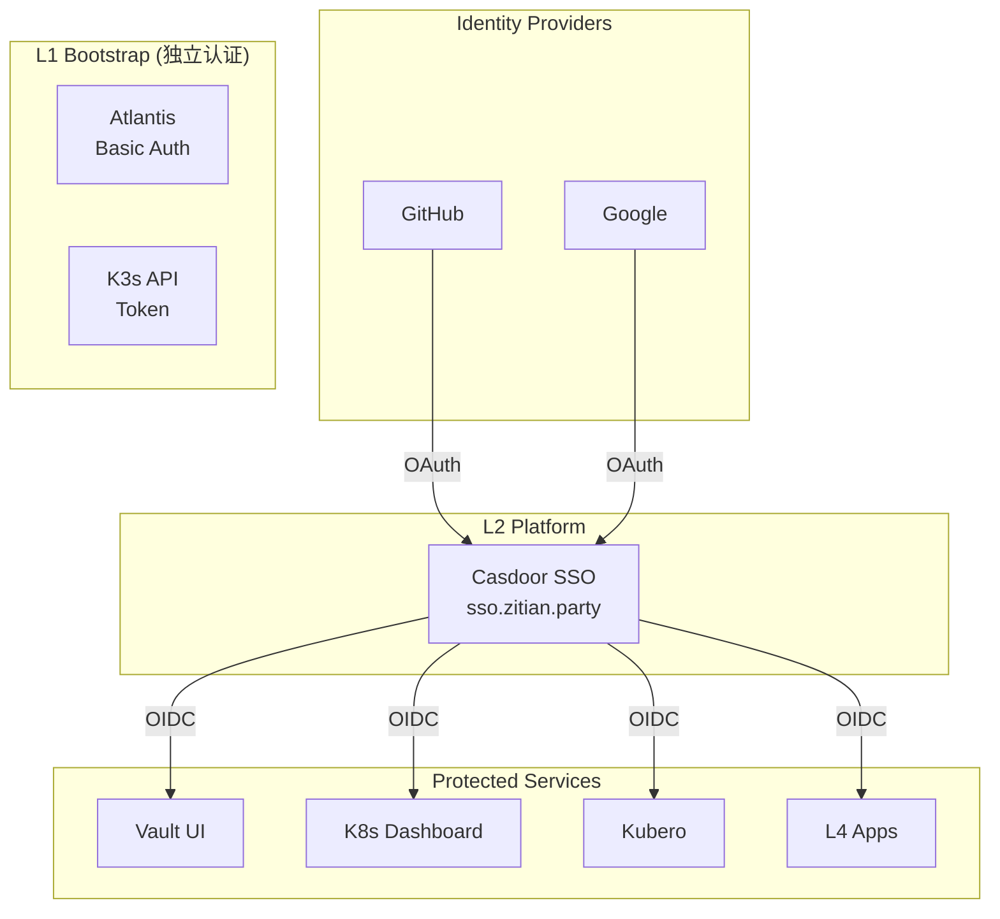

# 认证与授权 SSOT

> **一句话**：Casdoor 作为统一 SSO 入口，所有 L2+ 服务通过 OIDC 接入，L1 服务使用独立认证。

## 架构



## 认证分层

| 层级 | 服务 | 认证方式 | 说明 |
|------|------|----------|------|
| **L1** | Atlantis | Basic Auth | ⚠️ 不能依赖 L2 (循环依赖) |
| **L1** | K3s API | Token | 系统级，不变 |
| **L2** | Casdoor | GitHub/Google OAuth | SSO 入口 |
| **L2** | Vault UI | Casdoor OIDC | Vault 原生支持 |
| **L2** | Dashboard | Casdoor OIDC | 替换当前 OAuth2-Proxy |
| **L2** | Kubero | Casdoor OIDC | 替换当前无认证 |
| **L4** | Apps | Casdoor SDK/OIDC | 可选 |

## 为什么选 Casdoor？

| 对比 | OAuth2-Proxy | Vault | Casdoor |
|------|-------------|-------|---------|
| **真正的 SSO** | ❌ 每个应用独立 session | ❌ 不是 IdP | ✅ 一次登录全部可用 |
| **OIDC Provider** | ❌ | ⚠️ Enterprise | ✅ 免费 |
| **用户管理** | ❌ | ⚠️ 弱 | ✅ 完整 |
| **成本** | 无 | Enterprise $$ | 免费 |

## 当前状态 vs 目标

| 服务 | 当前 | 目标 |
|------|------|------|
| Vault | Token 登录 | Casdoor OIDC |
| Dashboard | OAuth2-Proxy | Casdoor OIDC |
| Kubero | 无认证 | Casdoor OIDC |
| OAuth2-Proxy | ✅ 已部署 | 🗑️ 移除 (被 Casdoor 替代) |

## 实施步骤

1. **部署 Casdoor** (L2)
   - 连接 L1 Platform PostgreSQL
   - 配置 GitHub/Google OAuth
   - 域名: `sso.zitian.party`

2. **配置 Vault OIDC**
   ```hcl
   resource "vault_jwt_auth_backend" "casdoor" {
     path         = "oidc"
     type         = "oidc"
     oidc_discovery_url = "https://sso.zitian.party"
     oidc_client_id     = var.casdoor_vault_client_id
     oidc_client_secret = var.casdoor_vault_client_secret
   }
   ```

3. **迁移 Dashboard 到 Casdoor**

4. **移除 OAuth2-Proxy**

## 相关文件

- [1.oauth.tf](../../2.platform/1.oauth.tf) - OAuth2-Proxy (过渡方案)
- [2.secret.tf](../../2.platform/2.secret.tf) - Vault 配置
- [3.dashboard.tf](../../2.platform/3.dashboard.tf) - Dashboard
