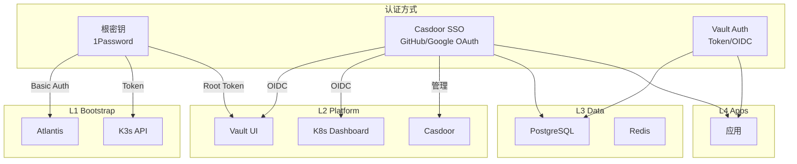

# 认证与授权 SSOT

> **一句话**：L1 使用根密钥，L2 支持根密钥+SSO 双认证，L3/L4 完全走 Vault+SSO。

## 分层认证架构

---

## 层级认证策略

| 层级 | 服务 | 认证方式 | 说明 |
|------|------|----------|------|
| **L1** | Atlantis | 根密钥 (Basic Auth) | 不能依赖 L2 SSO (循环依赖) |
| **L1** | K3s API | 根密钥 (Token) | 系统级 |
| **L2** | Vault | 根密钥 (Root Token) + SSO (OIDC) | **双认证** - 灾难恢复 |
| **L2** | Dashboard | 根密钥 + SSO (OIDC) | **双认证** - 运维需要 |
| **L2** | Casdoor | 根密钥 (admin 密码) | SSO 入口本身 |
| **L3** | PostgreSQL | Vault 动态凭据 | 业务 DB |
| **L3** | Redis | Vault 动态凭据 | 业务缓存 |
| **L4** | Apps | Vault + SSO | 业务层完全依赖平台认证 |

---

## 根密钥管理

| 服务 | 根密钥位置 | GitHub Secret | 用途 |
|------|-----------|---------------|------|
| Atlantis | 1Password `Atlantis` | `ATLANTIS_WEB_PASSWORD` | Web 登录 |
| K3s | kubeconfig 文件 | *(CI 生成)* | kubectl |
| Vault | 1Password `Vault (zitian.party)` | `VAULT_UNSEAL_KEY` | 解封/Root 登录 |
| Casdoor | 1Password `Casdoor Admin` | *(代码中)* | 管理登录 |

---

## SSO (Casdoor) 配置

### Identity Providers

| Provider | 用途 | 状态 |
|----------|------|------|
| GitHub | 开发者登录 | ⏳ 待配置 |
| Google | 备用登录 | ⏳ 待配置 |

### OIDC Clients (待创建)

| 应用 | Client ID | Redirect URI |
|------|-----------|--------------|
| Vault | `vault-oidc` | `https://vault.zitian.party/ui/vault/auth/oidc/oidc/callback` |
| Dashboard | `dashboard-oidc` | `https://dash.zitian.party/oauth2/callback` |
| Kubero | `kubero-oidc` | `https://kubero.zitian.party/auth/callback` |

---

## 认证凭据存储对照

| 凭据类型 | 存储位置 | 访问方式 |
|----------|----------|----------|
| 根密钥 | 1Password | `op` CLI 本地 |
| CI 密钥 | GitHub Secrets | `${{ secrets.* }}` |
| 运行时密钥 | Vault | Kubernetes SA |
| 用户凭据 | Casdoor DB | OIDC Token |

---

## 实施状态

| 组件 | 状态 |
|------|------|
| Casdoor 部署 | ✅ 已部署 (sso.zitian.party) |
| GitHub OAuth | ⏳ Casdoor UI 中配置 |
| Vault OIDC | ⏳ 待配置 |
| Dashboard OIDC | ❌ 不支持原生 OIDC，使用 Token 认证 |
| Kubero OAuth2 | ⏳ 待配置 |
| OAuth2-Proxy | ✅ 已移除 (被 Casdoor 替代) |

---

## 相关文件

- [secrets.md](secrets.md) - 密钥管理 SSOT
- [5.casdoor.tf](../../2.platform/5.casdoor.tf) - Casdoor 部署
- [2.secret.tf](../../2.platform/2.secret.tf) - Vault 配置
