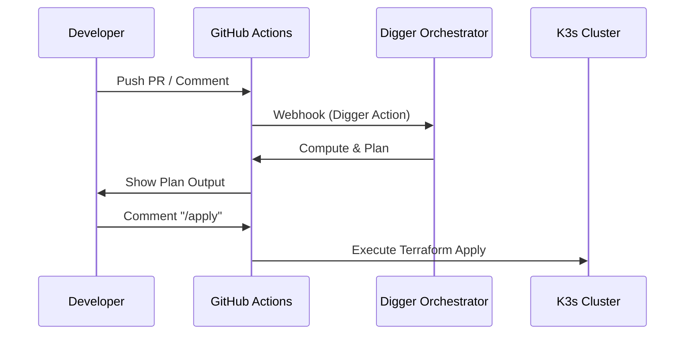

# Bootstrap 计算层 SSOT

> **核心问题**：K3s 集群如何配置？Digger Orchestrator 如何认证和集成？

---

## 组件概览

| 组件 | 职责 | 代码位置 | 认证方式 |
|------|------|----------|----------|
| **K3s** | Kubernetes 集群 | `bootstrap/1.k3s.tf` | Token (Kubeconfig) |
| **Digger** | GitOps CI/CD 编排 | `bootstrap/2.digger.tf` | Bearer Token / Basic Auth |

---

## K3s 集群

### 关键配置

| 变量 | 默认值 | 说明 |
|------|--------|------|
| `vps_host` | (必填) | VPS 公网 IP |
| `cluster_name` | `truealpha-k3s` | K3s 集群名称 |

### 网络

- **Ingress Controller**: Traefik (K3s 内置)
- **K3s API**: `k3s.<internal_domain>:6443` (Cloudflare DNS-only，不代理)

### 集群访问

```bash
# 获取 kubeconfig
ssh root@<vps_host> cat /etc/rancher/k3s/k3s.yaml

# 修改 server 地址
# https://127.0.0.1:6443 → https://k3s.<internal_domain>:6443
```

---

## Digger Orchestrator

### 部署配置

- **Namespace**: `bootstrap`
- **URL**: `https://digger.<internal_domain>`
- **数据库**: Platform PostgreSQL (专用 `digger` 数据库)
- **认证方式**: 
  - **API**: Bearer Token (用于 GitHub Actions)
  - **Web UI**: Basic Auth (不走 SSO)

### 安全加固

GitHub Webhook IP 白名单已在 Ingress 配置。

### 部署逻辑

> [!IMPORTANT]
> Digger 负责编排 L2-L4 层，但 **L1 Bootstrap 自身脱离 Digger 编排**。

| 层级 | 路径 | 编排工具 | 触发命令 |
|------|------|----------|----------|
| **L1 (Bootstrap)** | `bootstrap/` | GitHub Actions | `/bootstrap plan/apply` |
| **L2 (Platform)** | `platform/` | Digger | `/plan`, `/apply` |
| **L3 (Data)** | `envs/*/data/` | Digger | `/plan`, `/apply` |

### 工作流程



> Pipeline 详情见 [ops.pipeline.md](./ops.pipeline.md)

---

## 故障恢复

Bootstrap 计算层是 Trust Anchor，恢复策略见 [ops.recovery.md](./ops.recovery.md)。

关键点：
- Digger 使用独立数据库和认证，不依赖 SSO（可独立恢复）
- K3s 集群恢复需要 VPS 访问权限和 kubeconfig

---

## Used by

- [docs/ssot/README.md](./README.md)
- [docs/ssot/core.md](./core.md)
- [bootstrap/README.md](../../bootstrap/README.md)
