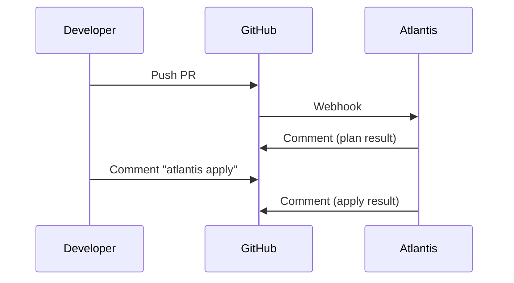

# Bootstrap 计算层 SSOT

> **核心问题**：K3s 集群如何配置？Atlantis 如何认证和集成？

---

## 组件概览

| 组件 | 职责 | 代码位置 | 认证方式 |
|------|------|----------|----------|
| **K3s** | Kubernetes 集群 | `bootstrap/1.k3s.tf` | Token (Kubeconfig) |
| **Atlantis** | GitOps CI/CD | `bootstrap/2.atlantis.tf` | Basic Auth |

---

## K3s 集群

### 关键配置

| 变量 | 默认值 | 说明 |
|------|--------|------|
| `vps_host` | (必填) | VPS 公网 IP |
| `cluster_name` | `truealpha-k3s` | K3s 集群名称 |

### 网络

- **Ingress Controller**: Traefik (K3s 内置)
- **K3s API**: `k3s.<internal_domain>:6443` (Cloudflare DNS-only，不代理)

### 集群访问

```bash
# 获取 kubeconfig
ssh root@<vps_host> cat /etc/rancher/k3s/k3s.yaml

# 修改 server 地址
# https://127.0.0.1:6443 → https://k3s.<internal_domain>:6443
```

---

## Atlantis CI

### 部署配置

- **Namespace**: `bootstrap`
- **URL**: `https://atlantis.<internal_domain>`
- **认证方式**: Basic Auth（**不走 SSO**，避免循环依赖）

### 安全加固

GitHub Webhook IP 白名单：
```yaml
nginx.ingress.kubernetes.io/whitelist-source-range: "140.82.112.0/20,185.199.108.0/22,192.30.252.0/22"
```

### 项目定义

见根目录 [`atlantis.yaml`](../../atlantis.yaml)：

| 项目 | 路径 | 触发方式 |
|------|------|----------|
| `bootstrap` | `bootstrap/` | 手动 (`deploy-bootstrap.yml`) |
| `platform` | `platform/` | Autoplan |
| `data-staging` | `envs/staging/data/` | Autoplan |
| `data-prod` | `envs/prod/data/` | Autoplan |

### 工作流程



> Pipeline 详情见 [ops.pipeline.md](./ops.pipeline.md)

---

## 故障恢复

Bootstrap 计算层是 Trust Anchor，恢复策略见 [ops.recovery.md](./ops.recovery.md)。

关键点：
- Atlantis 使用 Basic Auth，不依赖 SSO（可独立恢复）
- K3s 集群恢复需要 VPS 访问权限和 kubeconfig

---

## Used by

- [docs/ssot/README.md](./README.md)
- [docs/ssot/core.md](./core.md)
- [bootstrap/README.md](../../bootstrap/README.md)
