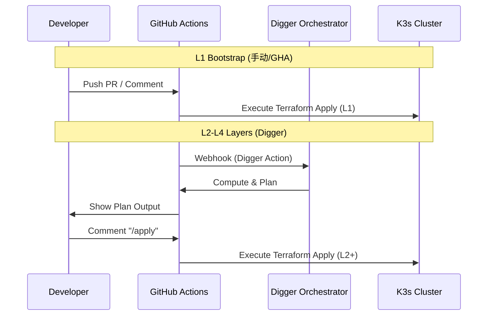
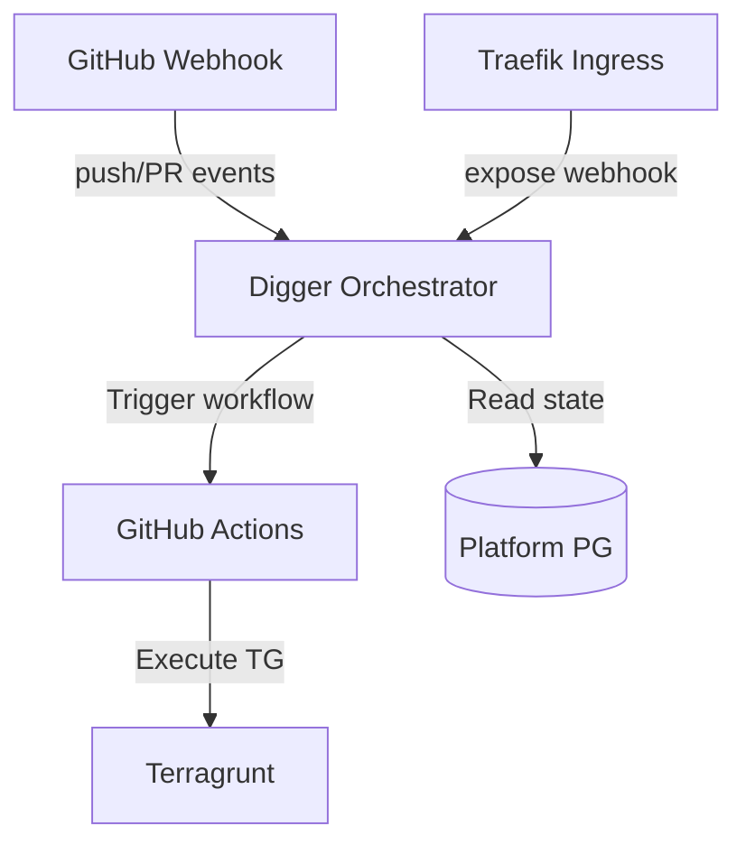

# Bootstrap 计算层 SSOT

> **SSOT Key**: `bootstrap.compute`
> **核心定义**: 定义 K3s 计算集群的配置、节点管理以及 GitOps 编排器 (Digger) 的集成方式。

---

## 1. 真理来源 (The Source)

> **原则**：Bootstrap 层是整个系统的信任锚点 (Trust Anchor)，其配置不依赖于上层服务。

本话题的配置和状态由以下物理位置唯一确定：

| 维度 | 物理位置 (SSOT) | 说明 |
|------|----------------|------|
| **K3s 集群定义** | [`bootstrap/1.k3s.tf`](../../bootstrap/1.k3s.tf) | 集群节点、版本配置 |
| **Digger 定义** | [`bootstrap/2.digger.tf`](../../bootstrap/2.digger.tf) | 编排器部署配置 |
| **认证凭证** | **GitHub Secrets** | L1 豁免：`VPS_HOST`, `SSH_KEY` |
| **环境变量** | [`tools/envs/env.ci`](../../tools/envs/env.ci) | 变量契约 |

### Code as SSOT 索引

- **集群安装脚本**：参见 [`bootstrap/scripts/install-k3s.sh.tmpl`](../../bootstrap/scripts/install-k3s.sh.tmpl)
- **默认配置值**：参见 [`bootstrap/variables.tf`](../../bootstrap/variables.tf) (搜索 `vps_host`, `cluster_name`)

---

## 2. 架构模型



### 关键决策 (Architecture Decision)

- **Trust Anchor**: Bootstrap (L1) 必须独立于 Digger (L2)。Digger 自身运行在 K3s 上，因此不能用来部署 K3s（鸡生蛋问题）。
- **Ingress Controller**: 使用 K3s 内置的 Traefik。
- **K3s API**: 暴露在 `k3s.<internal_domain>:6443`，必须绕过 Cloudflare 代理 (Grey Cloud)，因为 Cloudflare 免费版不支持非标准端口代理。

### Digger Orchestrator 自部署

> **目标**: 实现 post-merge 自动 apply，统一 L2-L3 层 CI/CD 编排。



**组件**:
| 组件 | 位置 | 说明 |
|------|------|------|
| Digger Backend | `bootstrap/2.digger.tf` | Helm release |
| PostgreSQL | Platform PG `digger` database | 复用，不独立部署 |
| Webhook | `digger.<internal_domain>` | Traefik Ingress |
| GitHub App | `infra-flash` | 复用现有 App |

**配置要点** (`digger.yml`):
```yaml
workflows:
  terragrunt:
    workflow_configuration:
      on_commit_to_default: [digger apply]  # Post-merge 自动 apply
```

---

## 3. 设计约束 (Dos & Don'ts)

### ✅ 推荐模式 (Whitelist)

- **模式 A**: L1 变更推荐通过 GitHub Actions (`deploy-k3s.yml`) 触发，保持状态一致性。
- **模式 B**: 紧急情况下允许本地 `terraform apply`，但事后必须推送代码。

### ⛔ 禁止模式 (Blacklist)

- **反模式 A**: **严禁** 使用 Digger 编排 `bootstrap/` 目录（会导致死锁）。
- **反模式 B**: **禁止** 在 K3s Master 节点直接运行负载高的业务 Pod（应通过 Taint/Toleration 隔离，当前单节点除外）。

---

## 4. 标准操作程序 (Playbooks)

### SOP-001: 获取集群访问权限 (Kubeconfig)

- **触发条件**: 新设备接入 / 调试集群
- **步骤**:
    1. SSH 登录 VPS: `ssh root@<vps_host>`
    2. 读取配置: `cat /etc/rancher/k3s/k3s.yaml`
    3. 本地替换: 将 `https://127.0.0.1:6443` 替换为 `https://k3s.<internal_domain>:6443`

### SOP-002: 部署/更新 L1 Bootstrap

- **触发条件**: 修改了 `1.k3s.tf` 或 `2.digger.tf`
- **执行者**: GitHub Actions (推荐) 或 Ops
- **步骤**:
    1. 提交代码到 `main` 分支。
    2. 观察 Actions 中的 `deploy-bootstrap` 工作流。
    3. (手动回退) 本地运行:
       ```bash
       cd bootstrap
       terraform init
       terraform apply
       ```

---

## 5. 验证与测试 (The Proof)

本文档描述的行为由以下测试用例守护：

| 行为描述 | 测试文件 (Test Anchor) | 覆盖率 |
|----------|-----------------------|--------|
| **计算节点连通性** | [`test_compute.py`](../../e2e_regressions/tests/bootstrap/compute/test_compute.py) | ✅ Critical |
| **Digger 服务状态** | [`test_digger.py`](../../e2e_regressions/tests/bootstrap/compute/test_digger.py) | ⚠️ Pending |

**如何运行验证**:
```bash
pytest e2e_regressions/tests/bootstrap/compute/ -v
```

---

## Used by

- [docs/ssot/README.md](./README.md)
- [docs/ssot/core.md](./core.md)
- [bootstrap/README.md](../../bootstrap/README.md)