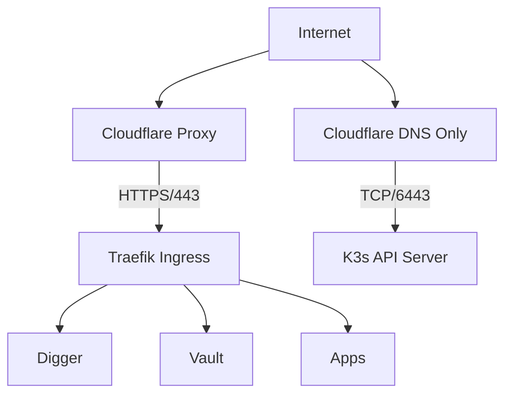

# Bootstrap 网络层 SSOT

> **SSOT Key**: `bootstrap.network`
> **核心定义**: 定义全局 DNS 解析规则、TLS 证书颁发机制以及 Ingress 流量入口。

---

## 1. 真理来源 (The Source)

> **原则**：网络层负责流量的“寻址”和“加密”，是所有服务的入口。

本话题的配置和状态由以下物理位置唯一确定：

| 维度 | 物理位置 (SSOT) | 说明 |
|------|----------------|------|
| **DNS 记录** | [`bootstrap/3.dns_and_cert.tf`](../../bootstrap/3.dns_and_cert.tf) | Cloudflare 记录定义 |
| **TLS 证书** | [`bootstrap/3.dns_and_cert.tf`](../../bootstrap/3.dns_and_cert.tf) | cert-manager ClusterIssuer |
| **Ingress 规则** | 各层 `ingress.tf` | 具体的路由规则分散在各应用定义中 |

### Code as SSOT 索引

- **ClusterIssuer 定义**：参见 [`bootstrap/3.dns_and_cert.tf`](../../bootstrap/3.dns_and_cert.tf) (搜索 `ClusterIssuer`)
- **Digger 入口**：参见 [`bootstrap/2.digger.tf`](../../bootstrap/2.digger.tf)

---

## 2. 架构模型



### 关键决策 (Architecture Decision)

- **Cloudflare 模式**: 
    - **Orange Cloud (Proxy)**: 默认用于 Web 服务 (443)，提供 DDoS 保护和 CDN。
    - **Grey Cloud (DNS Only)**: 必须用于非 HTTP 端口服务 (如 K3s API 6443)，因为 Cloudflare 免费版不代理这些端口。
- **证书管理**: 使用 `cert-manager` + Let's Encrypt。避免手动管理证书过期。

### 域名映射 (Domain Mapping)

| 服务 | 域名 | 层级 | Ingress |
|------|------|------|---------|
| Digger | `digger.<internal_domain>` | Bootstrap | ✅ |
| Vault | `secrets.<internal_domain>` | Platform | ✅ |
| Casdoor | `sso.<internal_domain>` | Platform | ✅ |
| Kubero | `kcloud.<internal_domain>` | Platform | ✅ |
| K3s API | `k3s.<internal_domain>` | Bootstrap | ❌ (直接访问) |

---

## 3. 设计约束 (Dos & Don'ts)

### ✅ 推荐模式 (Whitelist)

- **模式 A**: 内部管理服务使用 `internal_domain` (`zitian.party`)。
- **模式 B**: 业务应用使用 `base_domain` (`truealpha.club`) 或其子域。
- **模式 C**: 所有 HTTP 服务 **必须** 启用 TLS (Redirect Scheme: HTTPS)。

### ⛔ 禁止模式 (Blacklist)

- **反模式 A**: **禁止** K3s API (`k3s.xxx`) 开启 Cloudflare Proxy，会导致 kubectl 无法连接。
- **反模式 B**: **严禁** 在 Ingress 中硬编码证书 Secret 名称，应统一使用 `cert-manager.io/cluster-issuer` 注解。

### 安全设置 (Security Hardening)

- **Cloudflare SSL/TLS**: Full (strict)
- **Always Use HTTPS**: On
- **Minimum TLS Version**: 1.2

---

## 4. 标准操作程序 (Playbooks)

### SOP-001: 新增 DNS 记录

- **触发条件**: 部署新应用
- **步骤**:
    1. 在 `bootstrap/3.dns_and_cert.tf` 中添加 `cloudflare_record` 资源。
    2. 提交 PR 并合并 (Apply L1)。
    3. 验证解析: `dig +short myapp.example.com`

### SOP-002: 证书排错

- **触发条件**: 浏览器提示证书过期 / 访问不安全
- **步骤**:
    1. 检查 Certificate 资源: `kubectl get certificate -A`
    2. 检查 Challenge 状态: `kubectl get challeng -A`
    3. 查看 cert-manager 日志: `kubectl logs -n cert-manager -l app=cert-manager`

---

## 5. 验证与测试 (The Proof)

本文档描述的行为由以下测试用例守护：

| 行为描述 | 测试文件 (Test Anchor) | 覆盖率 |
|----------|-----------------------|--------|
| **DNS 解析验证** | [`test_network.py`](../../e2e_regressions/tests/bootstrap/network_layer/test_network.py) | ✅ Critical |
| **Ingress 路由验证** | [`test_ingress.py`](../../e2e_regressions/tests/bootstrap/network_layer/test_ingress.py) | ✅ Critical |

**如何运行验证**:
```bash
pytest e2e_regressions/tests/bootstrap/network_layer/ -v
```

---

## Used by

- [docs/ssot/README.md](./README.md)
- [docs/ssot/core.md](./core.md)
- [bootstrap/README.md](../../bootstrap/README.md)
