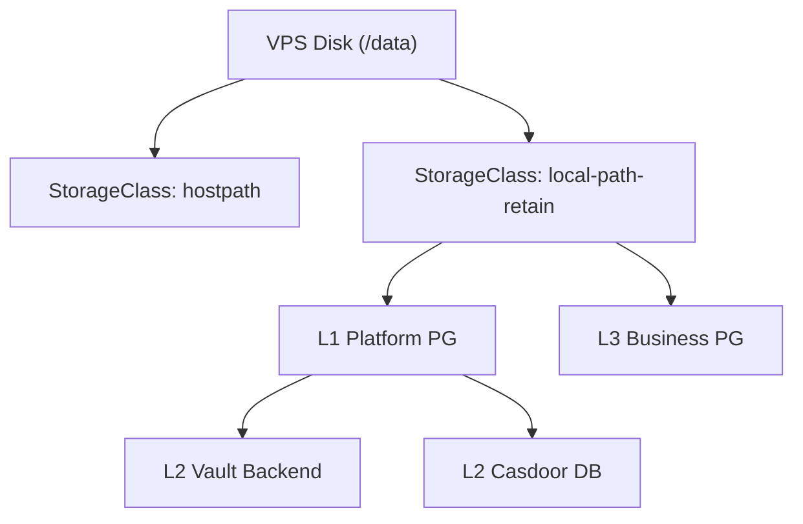

# Bootstrap 存储层 SSOT

> **SSOT Key**: `bootstrap.storage`
> **核心定义**: 定义集群的基础存储类 (StorageClass) 以及作为 Trust Anchor 的平台级数据库 (Platform PG)。

---

## 1. 真理来源 (The Source)

> **原则**：L1 存储层为上层提供持久化能力，其自身状态必须独立于 Vault（除了 Platform PG 密码，见豁免）。

本话题的配置和状态由以下物理位置唯一确定：

| 维度 | 物理位置 (SSOT) | 说明 |
|------|----------------|------|
| **StorageClass 定义** | [`bootstrap/4.storage.tf`](../../bootstrap/4.storage.tf) | local-path, hostpath |
| **Platform PG 定义** | [`bootstrap/5.platform_pg.tf`](../../bootstrap/5.platform_pg.tf) | L1 PostgreSQL |
| **密码凭证** | **GitHub Secrets** | L1 豁免：`TF_VAR_platform_pg_password` |

### Code as SSOT 索引

- **数据目录规范**：参见 [`bootstrap/scripts/install-k3s.sh.tmpl`](../../bootstrap/scripts/install-k3s.sh.tmpl) (定义 `/data` 挂载)
- **PVC 绑定逻辑**：参见 [`bootstrap/4.storage.tf`](../../bootstrap/4.storage.tf)

---

## 2. 架构模型



### 关键决策 (Architecture Decision)

- **Platform PG 位置**: 必须在 L1 部署。因为 L2 Vault 依赖它作为 Storage Backend，形成了循环依赖，所以它不能由 Vault 管理，只能作为 Bootstrap 的一部分。
- **Reclaim Policy**: 默认为 `Retain`。防止误删 PVC 导致数据丢失。
- **数据目录**: 统一使用 `/data` 作为宿主机挂载点，便于备份和迁移。

---

## 3. 设计约束 (Dos & Don'ts)

### ✅ 推荐模式 (Whitelist)

- **模式 A**: 有状态服务 (DB, Vault) **必须** 使用 `local-path-retain` StorageClass。
- **模式 B**: 临时/缓存服务 (Redis) 推荐使用 `local-path` (Delete Policy)。

### ⛔ 禁止模式 (Blacklist)

- **反模式 A**: **禁止** 生产环境数据库使用默认的 `local-path` (除非你想 PVC 删除时数据也没了)。
- **反模式 B**: **严禁** 在容器内存储数据而不挂载 PVC（Pod 重启即丢数据）。

---

## 4. 标准操作程序 (Playbooks)

### SOP-001: 恢复 Platform PG

- **触发条件**: 数据库损坏 / 误删
- **步骤**:
    1. 停止上层服务: `kubectl scale deploy -n platform vault --replicas=0`
    2. 恢复数据:
       ```bash
       # 从 R2 下载备份
       rclone copy r2:backups/platform-pg/latest.dump /data/restore/
       # 导入数据
       pg_restore -d digger /data/restore/latest.dump
       ```
    3. 重启服务: `kubectl scale deploy -n platform vault --replicas=1`

### SOP-002: 扩容 Storage

- **触发条件**: 磁盘使用率 > 80%
- **步骤**:
    1. 升级 VPS 硬盘配置。
    2. 在宿主机扩展文件系统: `resize2fs /dev/sda1`。
    3. 无需重启 K3s，Pod 自动感知容量变化。

---

## 5. 验证与测试 (The Proof)

本文档描述的行为由以下测试用例守护：

| 行为描述 | 测试文件 (Test Anchor) | 覆盖率 |
|----------|-----------------------|--------|
| **PVC 持久化验证** | [`test_storage.py`](../../e2e_regressions/tests/bootstrap/storage_layer/test_storage.py) | ✅ Critical |
| **Platform PG 连通性** | [`test_platform_pg.py`](../../e2e_regressions/tests/bootstrap/storage_layer/test_platform_pg.py) | ✅ Critical |

**如何运行验证**:
```bash
pytest e2e_regressions/tests/bootstrap/storage_layer/ -v
```

---

## Used by

- [docs/ssot/README.md](./README.md)
- [docs/ssot/core.md](./core.md)
- [docs/ssot/ops.storage.md](./ops.storage.md)