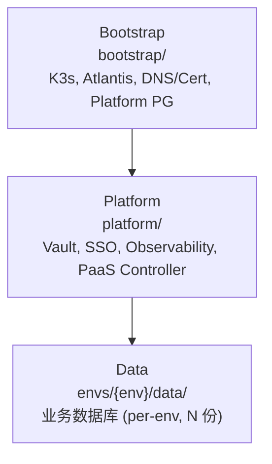

# 目录结构 SSOT

> **核心问题**：代码在哪里？负责什么？层级依赖关系是什么？

---

## 模块架构

为了简化架构，基础设施被划分为三个核心模块。

### 模块职责详解

| 模块 | 核心职责 | 部署份数 | 多环境策略 | 关键组件 |
|------|----------|---------|-----------|-----------|
| **Bootstrap** | Trust Anchor + 基础运行环境 | **1 套** | 无依赖，GitHub Actions 部署 | K3s, Atlantis, DNS, Storage |
| **Platform** | 控制面中心 (密钥/认证/PaaS) | **1 套** | 统一管理，Atlantis `platform` 项目 | Vault, Casdoor, Kubero, SigNoz |
| **Data** | 数据面 (业务数据库) | **N 套** | Per-env (staging/prod)，依赖 Platform 认证 | PostgreSQL, Redis, ClickHouse |

---

## 拓扑依赖 (Topological Order)

基础设施必须遵循严格的拓扑顺序进行部署和更新，以避免循环依赖和运行时错误。

### 核心依赖链
1. **Bootstrap → Platform**: 
   - Platform 的所有组件运行在 Bootstrap 提供的 K8s 集群上。
   - Platform 的域名解析依赖 Bootstrap 的 DNS 配置。
2. **Platform → Data**: 
   - **认证依赖**: Data 层使用 Vault Secrets Operator (VSO) 同步密钥，必须依赖 Platform 先配置好 Vault 的 Kubernetes Auth Role (见 `platform/91.vault-auth-kubernetes.tf`)。
   - **存储依赖**: Data 层数据库在 Vault 中的路径和权限由 Platform 定义。

### 循环依赖规避
- **数据流 vs 配置依赖**: 
  - 虽然 SigNoz (Platform) 最终会向 Data 层 ClickHouse 写入数据，但这是一个**运行时数据流**。
  - **配置依赖**（如 Vault Role）必须是单向递增的。

---

## 完整目录树

```mermaid
flowchart TB
    Root["root/"]
    Root --> Agents["AGENTS.md<br/>(!) AI 行为准则"]
    Root --> CheckNow["0.check_now.md<br/>(!) 当前 sprint"]
    Root --> AtlantisYaml["atlantis.yaml<br/>(!) GitOps 配置"]
    Root --> RootReadme["README.md<br/>(!) 项目入口"]

    Root --> ToolsDir["0.tools/"]
    ToolsDir --> ToolsReadme["README.md<br/>脚本索引"]
    ToolsDir --> ToolsMigrate["migrate-state.sh<br/>State 迁移"]

    Root --> DocsDir["docs/"]
    DocsDir --> DocsSsotDir["ssot/"]
    DocsSsotDir --> SsotCoreDir["core.dir.md<br/>(!) 本文件"]
    DocsSsotDir --> SsotOpsPipeline["ops.pipeline.md<br/>(!) 部署流程"]

    Root --> GithubDir[".github/"]
    GithubDir --> WorkflowsDir["workflows/"]
    WorkflowsDir --> TerraformPlan["terraform-plan.yml<br/>(!) TF 验证"]
    WorkflowsDir --> DeployBootstrap["deploy-bootstrap.yml<br/>(!) Bootstrap 手动引导"]

    Root --> BootstrapDir["bootstrap/<br/>Bootstrap 层"]
    BootstrapDir --> B1["1.k3s.tf<br/>集群"]
    BootstrapDir --> B2["2.atlantis.tf<br/>GitOps"]
    BootstrapDir --> B3["3.dns_and_cert.tf<br/>DNS/TLS"]

    Root --> PlatformDir["platform/<br/>Platform 层"]
    PlatformDir --> P1["2.vault.tf<br/>Vault"]
    PlatformDir --> P2["5.casdoor.tf<br/>SSO"]
    PlatformDir --> P3["10.kubero.tf<br/>PaaS"]
    PlatformDir --> P4["11.signoz.tf<br/>可观测"]

    Root --> EnvsDir["envs/<br/>环境配置层"]
    EnvsDir --> EnvsDataShared["data-shared/<br/>Data 共享逻辑"]
    EnvsDir --> EnvsStaging["staging/data/<br/>Staging 数据面"]
    EnvsDir --> EnvsProd["prod/data/<br/>Prod 数据面"]
```

---

## Namespace 规则

| 模块 | Namespace | 组件 | 部署模式 | 备注 |
|------|-----------|------|---------|------|
| Bootstrap | `kube-system` | 系统组件 | 单例 | |
| Bootstrap | `bootstrap` | Atlantis | 单例 | |
| Platform | `platform` | Vault, SSO, Dashboard | 单例 | |
| Platform | `kubero` | Kubero UI | 单例 | |
| Platform | `observability` | SigNoz | 单例 | |
| Data | `data-staging` | Staging DB | per-env | |
| Data | `data-prod` | Prod DB | per-env | |

---

## Used by

- [docs/README.md](../README.md)
- [docs/ssot/core.env.md](./core.env.md)
- [platform/README.md](../../platform/README.md)
