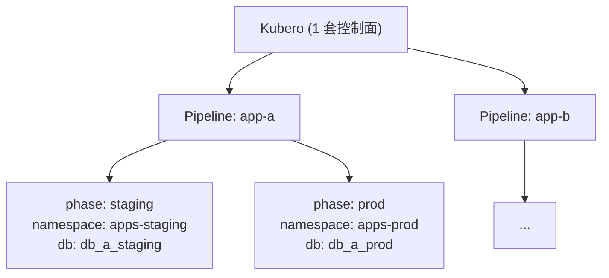

# 环境（Env）SSOT

> **核心问题**：这个项目的“环境”到底是什么意思？它如何映射到 **Terraform workspace / state key / Kubernetes namespace / 域名**，并如何影响变量（vars）设计？

## 1. 术语与目标

### 术语
- **Environment（环境）**：业务环境维度，当前仅支持 `staging` / `prod`（以后可扩展 `test`/preview）。
- **Terraform Workspace**：L3/L4 用 workspace 做环境隔离；L2 为 singleton（`default` workspace）。
- **Namespace**：K8s 的隔离边界。L1/L2 为 shared namespaces；L3/L4 用 env-suffix 做隔离。
- **State Key**：Terraform remote state 在 R2 中的 key（按 layer + env 拆分）。
- **env_prefix**：对外业务域名的环境前缀（例如 `x-staging`）；**仅影响业务应用域名**，不影响 `internal_domain` 下的平台域名。

### 目标
把以下四件事统一起来，避免“同名不同义”导致的漂移：
1. `environment`（业务语义）
2. Terraform workspace（执行/状态隔离）
3. Kubernetes namespace（运行时隔离）
4. 域名（对外路由隔离）

---

## 2. Layer × 环境：单例与多环境

### 2.1 单例（Singleton）

| 层 | 部署份数 | 管理方式 |
|----|---------|---------|
| **L1 Bootstrap** | 1 套 | GitHub Actions `deploy-k3s.yml` |
| **L2 Platform** | 1 套 | Atlantis `platform`（`workspace=default`） |
| **L4 Apps 控制面** | 1 套 | Atlantis `apps-staging`/`apps-prod`（Kubero 只部署一次） |

> L1/L2/L4控制面 是"平台底座"，staging/prod 共享同一套。

### 2.2 多环境（Per-env）

| 层 | workspace | state key |
|----|-----------|-----------|
| **L3 Data** | `staging` / `prod` | `k3s/data-staging.tfstate` / `k3s/data-prod.tfstate` |

### 2.3 L4 多环境策略

L4 的 Kubero 是单控制面，通过 **Pipeline/Phase** 管理多 app × 多 env：

**App Vars 管理**：
- Key 定义：App repo 的 `.env.example`（进 git）
- Value 存储：**Kubero**（通过 UI/CLI 设置，不进 git）

---

## 3. Namespace 规范（建议的唯一规则）

> 原则：**shared 的不带环境后缀；env 的必须带后缀**。

| Layer | Namespace（固定/模式） | 说明 |
|---|---|---|
| L1 | `kube-system`, `cert-manager`, `bootstrap` | 集群核心 + Atlantis（代码：`1.bootstrap/3.dns_and_cert.tf`, `1.bootstrap/2.atlantis.tf`） |
| L2 | `platform` | 平台服务（单例）（代码：`1.bootstrap/5.platform_pg.tf`, `2.platform/2.secret.tf`） |
| L3 | `data-<env>` | 业务数据库（`data-staging` / `data-prod`） |
| L4 | `apps-<env>` | 业务应用（`apps-staging` / `apps-prod`） |

> **完整 Namespace 规则**见 [core.dir.md](./core.dir.md#namespace-规则)

> 备注（以代码为准）：当前 `3.data/` 与 `4.apps/` 目录仅有 README、**没有 Terraform 资源**（尚未落地 namespace 创建/部署逻辑），但 `atlantis.yaml` 已声明了 `data-staging/prod` 与 `apps-staging/prod` 的 workspace/state key 约束。为避免未来迁移成本，文档先固定 namespace 规则，等 L3/L4 IaC 落地时按本规则实现即可。

---

## 4. 域名与路由：internal vs env

### 4.1 平台域名（internal_domain）

平台服务统一使用 `internal_domain`（可与 `base_domain` 相同，也可独立）：

- `<service>.<internal_domain>`：平台入口（通常走 Ingress + HTTPS）
  - 例：`atlantis.<internal_domain>`, `secrets.<internal_domain>`, `kdashboard.<internal_domain>`, `kcloud.<internal_domain>`, `sso.<internal_domain>`
- `k3s.<internal_domain>:6443`：K3s API（**DNS-only**，不走 Cloudflare proxy）

这部分详见：
- [platform.network.md](./platform.network.md)（域名规则与服务映射）
- `1.bootstrap/3.dns_and_cert.tf`（Cloudflare 记录与证书）

### 4.2 业务域名（base_domain + env_prefix）

业务应用（L4）对外域名使用 `base_domain`，并通过 `env_prefix` 做环境隔离：

- **staging**（推荐）：`env_prefix="x-staging"`
  - Frontend：`x-staging.<base_domain>`
  - Backend：`x-staging-api.<base_domain>`
- **prod**（推荐）：`env_prefix=""`
  - Frontend：`<base_domain>`
  - Backend：`api.<base_domain>`

> 约束：`env_prefix` 只描述“业务域名前缀”，**不用于** Vault/Atlantis 等平台域名。

### 4.3 Cloudflare Proxy（Orange/Grey）

- **internal_domain 下的平台服务**：通常走 Cloudflare proxy（443），获得 CDN/WAF/TLS 终止等能力
- **K3s API**：必须 Grey（DNS-only）
- **其他特殊服务**：以各自 Terraform/SSOT 为准（避免文档写死）

---

## 5. Vars 设计：哪些放 TF_VAR，哪些放 tfvars？

> 原则：**Secret 不进 tfvars**；SSOT 在 1Password（见 [platform.secrets.md](./platform.secrets.md)），GitHub Secrets 是可重建副本。

### 5.1 L1/L2：GitHub Secrets → TF_VAR_（CI/Atlantis 注入）

- **L1**：`deploy-k3s.yml` 通过 `.github/actions/terraform-setup` 把 GitHub Secrets 写入 `TF_VAR_*`
- **L2**：Atlantis 的 `helm_release.atlantis` 也会在 Pod 环境中注入 `TF_VAR_*`（见 `1.bootstrap/2.atlantis.tf`）

结论：L1/L2 变量以 **TF_VAR** 为主（CI/Atlantis 注入），不依赖 envs 下的 `*.tfvars`。

### 5.2 L3/L4：`envs/<env>.tfvars`（非密钥）+ Vault（密钥）

按 `atlantis.yaml` 约定（L3/L4）：
- `terraform workspace = <env>`
- plan 时使用：`-var-file=../envs/<env>.tfvars`

`envs/<env>.tfvars` 只允许放：
- 环境标识（`environment`）
- 域名与路由策略（`base_domain`, `internal_domain`, `env_prefix`）
- feature flags / 容量参数（CPU/存储大小等）

密钥必须走：
- 1Password → GitHub Secrets（Bootstrap 密钥）
- 或 Vault（Runtime 密钥，L2+）

---

## 6. 文件职责（Where is the Truth）

- `docs/ssot/core.env.md`：**环境模型的唯一 SSOT**（本文件）
- `envs/README.md`：如何维护 `envs/<env>.tfvars` 的操作指南（不再重复架构）
- [core.vars.md](./core.vars.md)：变量清单（类型/默认值/注入方式），并链接回本文件解释“环境语义”
- [platform.network.md](./platform.network.md)：域名规则与服务映射
- `atlantis.yaml`：workspace/state key/var-file 的执行约束（以实际为准）

---

## 7. 常见坑（本次“乱”的来源）

1. **namespace 命名冲突**：`data` vs `data-<env>`、`apps` vs `apps-<env>`  
   - 统一以本文件 §3 为准：env 资源必须带后缀。
2. **把 env_prefix 当成 internal_domain 的前缀**  
   - `env_prefix` 仅用于业务域名（L4），平台域名永远用 `internal_domain`。
3. **以为 L2 也是多环境**  
   - 当前 SSOT 明确：L2 是单例（platform workspace）。

---

## Used by

- [docs/ssot/core.vars.md](./core.vars.md)
- [docs/ssot/platform.network.md](./platform.network.md)

---

## TODO: 开发者体验改进

### 1. 环境概念对开发者过于复杂
**问题**: 文档详细解释了 workspace、namespace、state key、域名的关系，但对于应用开发者来说，他们只想知道"我的应用应该部署在哪个环境"。

**建议**:
- [ ] 在文档开头增加"开发者速查"章节
- [ ] 简化说明：
  - **Staging 环境**: 用于测试和预发布，域名为 `x-staging.<base_domain>`，namespace 为 `apps-staging`
  - **Prod 环境**: 用于生产流量，域名为 `<base_domain>`，namespace 为 `apps-prod`
  - **如何选择**: 开发和测试用 staging，上线后用 prod
- [ ] 提供决策流程图

**受影响角色**: 应用开发者（环境选择）

### 2. 缺少环境间数据隔离的说明
**问题**: 开发者不清楚 staging 和 prod 环境之间是否共享数据库、Redis 等资源。

**建议**:
- [ ] 新增 "## 环境资源隔离" 章节
- [ ] 明确说明：
  - **数据库**: staging (`data-staging` namespace) 和 prod (`data-prod` namespace) 完全独立
  - **密钥**: 通过 Vault 分别管理，不同环境有不同的 Vault Role
  - **网络**: 同一个 K8s 集群，但通过 namespace 隔离
  - **域名**: 通过 Ingress 规则和 `env_prefix` 区分
  - **平台服务**: L1/L2 平台服务（Vault、Dashboard、Atlantis）是共享的
- [ ] 警告：staging 环境的数据不会自动同步到 prod

**受影响角色**: 应用开发者（理解隔离策略）

### 3. L4 多环境策略需要开发者操作指南
**问题**: 文档解释了 Kubero Pipeline/Phase 架构，但没有告诉开发者如何实际操作。

**建议**:
- [ ] 在 "2.3 L4 多环境策略" 章节后增加"开发者操作指南"
- [ ] 提供步骤：
  1. 在 Kubero UI 创建 Pipeline
  2. 为 Pipeline 添加 staging 和 prod 两个 Phase
  3. 每个 Phase 如何配置数据库连接（使用不同的 Vault secret path）
  4. 如何在两个环境间推进代码（staging 验证通过后部署到 prod）
- [ ] 链接到 4.apps/README.md 的详细 Kubero 使用指南（待创建）

**受影响角色**: 应用开发者（多环境部署）
