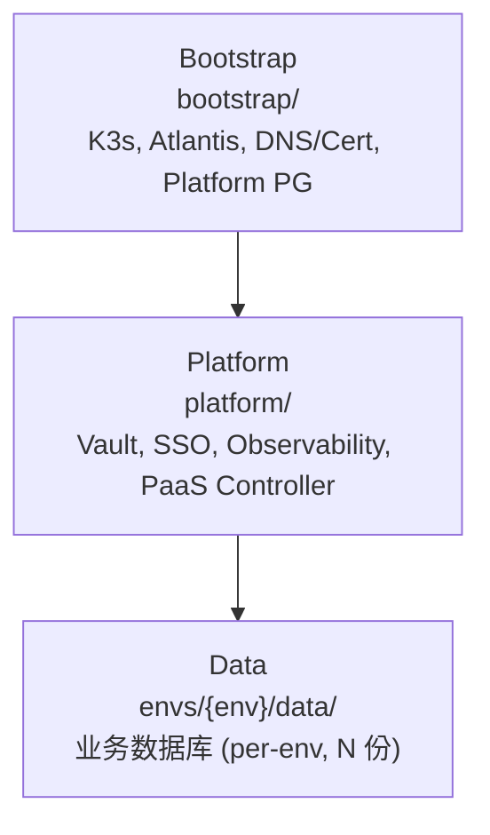
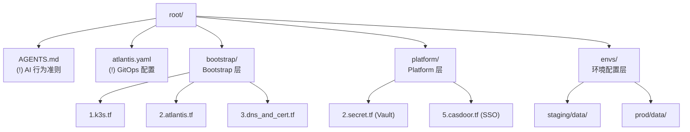

# 基础设施核心 SSOT

> **核心问题**：架构如何组织？环境如何隔离？变量如何配置？网络如何规划？

---

## 1. 三层架构



| 模块 | 核心职责 | 部署份数 | 关键组件 |
|------|----------|---------|----------|
| **Bootstrap** | Trust Anchor + 基础运行环境 | **1 套** | K3s, Atlantis, DNS, Storage |
| **Platform** | 控制面中心 (密钥/认证/PaaS) | **1 套** | Vault, Casdoor, Kubero, SigNoz |
| **Data** | 数据面 (业务数据库) | **N 套** | PostgreSQL, Redis, ClickHouse |

> 详细技术配置见：[bootstrap.*.md](./README.md#bootstrap---引导层)、[platform.*.md](./README.md#platform---平台层)

### 拓扑依赖

1. **Bootstrap → Platform**: Platform 运行在 Bootstrap 的 K8s 集群上
2. **Platform → Data**: Data 层依赖 Platform 的 Vault 认证

---

## 2. 目录结构



### Namespace 规则

| 模块 | Namespace | 组件 |
|------|-----------|------|
| Bootstrap | `kube-system`, `bootstrap` | 系统组件, Atlantis |
| Platform | `platform`, `kubero`, `observability` | Vault, SSO, SigNoz |
| Data | `data-staging`, `data-prod` | 业务数据库 |

---

## 3. 环境隔离

### 设计原则

- **统一基座**: Staging 和 Prod 共享同一个 K3s 集群
- **Workspace 隔离**: Data 层通过目录路径区分 State
- **Namespace 隔离**: Kubernetes Namespace 作为环境隔离的硬边界

### 模块与多环境映射

| 模块 | 份数 | 多环境策略 |
|:---|:---:|:---|
| **Bootstrap** | 1 套 | 全局单例 |
| **Platform** | 1 套 | 全局单例 |
| **Data** | N 套 | Per-env (staging/prod) |

### 域名规则

| 环境 | 域名模式 | 示例 |
|:---|:---|:---|
| **基建/Platform** | `<service>.<internal_domain>` | `secrets.zitian.party` |
| **Staging** | `x-staging.<base_domain>` | `x-staging.truealpha.club` |
| **Prod** | `<base_domain>` | `truealpha.club` |

---

## 4. 变量规范

### 分类

| 类别 | 示例 | 定义位置 | 注入方式 |
|------|------|----------|----------|
| **TF 变量** | `base_domain`, `vps_host` | `variables.tf` | TF_VAR_* |
| **Feature Flags** | `enable_observability` | `variables.tf` | tfvars |
| **Helm Values** | chart versions | `variables.tf` | TF → Helm |

### Bootstrap 变量

| 变量 | 必填 | 默认值 | 用途 |
|------|------|--------|------|
| `vps_host` | ✅ | - | VPS IP |
| `cluster_name` | ❌ | `truealpha-k3s` | K3s 集群名 |
| `base_domain` | ✅ | `truealpha.club` | 生产域名 |
| `internal_domain` | ❌ | (同 base) | 内部域名 |

### Platform 变量

| 变量 | 必填 | 默认值 | 用途 |
|------|------|--------|------|
| `vault_chart_version` | ❌ | `0.31.0` | Vault Helm 版本 |
| `vault_image_tag` | ❌ | `1.20.4` | Vault 镜像版本 |

### Feature Flags

| Flag | 层级 | 默认值 | 作用 |
|------|------|--------|------|
| `enable_infra` | Bootstrap | `true` | 部署共享基础设施 |
| `enable_observability` | Bootstrap | `false` | 部署 SigNoz |
| `enable_ssl` | Bootstrap | `true` | 启用 TLS |

---

## 5. 网络规则

### Cloudflare 配置

| 模式 | 代理 | 用途 | 示例 |
|------|------|------|------|
| `<service>.<internal_domain>` | ✅ Orange | 内部平台 | `atlantis.zitian.party` |
| `k3s.<internal_domain>` | ❌ Grey | K3s API | `k3s.zitian.party:6443` |
| `<base_domain>` | ✅ Orange | 生产 | `truealpha.club` |

### 服务域名映射

| 服务 | 域名 | 层级 |
|------|------|------|
| Atlantis | `atlantis.<internal_domain>` | Bootstrap |
| Vault | `secrets.<internal_domain>` | Platform |
| Casdoor | `sso.<internal_domain>` | Platform |
| Kubero | `kcloud.<internal_domain>` | Platform |

### TLS 证书

cert-manager + Let's Encrypt:
```yaml
annotations:
  cert-manager.io/cluster-issuer: "letsencrypt-prod"
```

---

## Used by

- [docs/README.md](../README.md)
- [bootstrap.*.md](./README.md#bootstrap---引导层)
- [platform.*.md](./README.md#platform---平台层)
