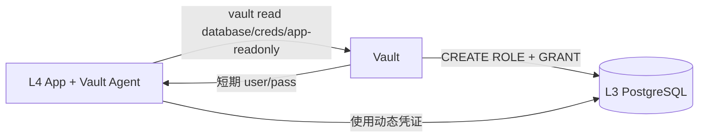

# Business PostgreSQL SSOT

> **核心问题**：业务应用如何使用 PostgreSQL？

## 概述

| 属性 | 值 |
|------|------|
| **层级** | L3 Data |
| **命名空间** | `data-<env>` (staging/prod) |
| **密码来源** | Vault (`secret/data/postgresql`) |
| **StorageClass** | `local-path-retain` |
| **消费者** | L4 Apps |

---

## Vault 动态凭证



**可用角色**：
- `database/creds/app-readonly` - SELECT 权限 (TTL: 1h)
- `database/creds/app-readwrite` - SELECT, INSERT, UPDATE, DELETE (TTL: 1h)

> TODO(vault): 配置 Vault Database Engine for PostgreSQL

---

## 连接方式

| 方式 | 适用场景 |
|------|----------|
| Vault Agent Sidecar | 生产 App (推荐) |
| 静态密码 (Vault KV) | 调试/迁移 |

**服务地址**：`postgresql.data-<env>.svc.cluster.local:5432`

---

## Vault Agent 配置

```yaml
annotations:
  vault.hashicorp.com/agent-inject: "true"
  vault.hashicorp.com/role: "my-app"
  vault.hashicorp.com/agent-inject-secret-pg: "secret/data/postgresql"
  vault.hashicorp.com/agent-inject-template-pg: |
    {{- with secret "secret/data/postgresql" -}}
    export PGPASSWORD="{{ .Data.data.password }}"
    {{- end }}
```

---

## Vault Secrets 路径

| 路径 | 字段 | 用途 |
|------|------|------|
| `secret/data/postgresql` | `password` | 静态密码 |
| `database/creds/app-readonly` | `username`, `password` | 动态凭证 |

---

## 相关文件

- [3.data/](../../3.data/)
- [db.connection.md](./db.connection.md)
- [platform.secrets.md](./platform.secrets.md)

---

## Used by（反向链接）

- [README.md](./README.md)
- [db.overview.md](./db.overview.md)
