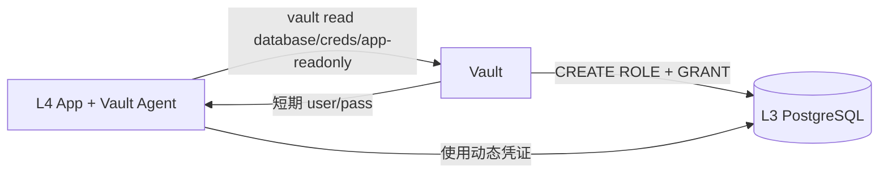

# 数据库能力 SSOT

> **核心问题**：哪些 DB 属于哪个层？密码谁管？

## 架构概览

```
┌─────────────────────────────────────────────────────────────┐
│  L1 Bootstrap — Platform PostgreSQL                         │
├─────────────────────────────────────────────────────────────┤
│  用途：Vault + Casdoor 的 Backend                           │
│  StorageClass: local-path-retain                            │
│  密码来源：GitHub Secret (打破 SSOT)                         │
│  备份策略：VPS /data pg_dump + rsync                         │
└─────────────────────────────────────────────────────────────┘
                           │
                           ▼
┌─────────────────────────────────────────────────────────────┐
│  L3 Data — 业务数据库                                        │
├─────────────────────────────────────────────────────────────┤
│  PostgreSQL (业务)  Redis    Neo4j    ClickHouse            │
│  └─ 密码: Vault     └─ Vault └─ Vault └─ Vault              │
│  └─ NS: data        └─ data  └─ data  └─ data               │
│  └─ Storage: local-path-retain (持久化)                     │
└─────────────────────────────────────────────────────────────┘
```

## 服务矩阵

| 数据库 | 层级 | 命名空间 | 密码来源 | StorageClass | 消费者 |
|--------|------|----------|----------|--------------|--------|
| **Platform PG** | L1 | `platform` | GitHub Secret | `local-path-retain` | Vault, Casdoor |
| **Business PG** | L3 | `data` | Vault | `local-path-retain` | L4 Apps |
| **Redis** | L3 | `data` | Vault | `local-path-retain` | L4 Apps (Cache) |
| **Neo4j** | L3 | `data` | Vault | `local-path-retain` | L4 Apps (Graph) |
| **ClickHouse** | L3 | `data` | Vault | `local-path-retain` | L4 Apps (OLAP) |

## 为什么 Platform PG 在 L1？

1. **循环依赖**：Vault 需要 PG → 其他服务需要 Vault → 无法用 Vault 管理 Vault 的 PG 密码
2. **Trust Anchor**：L1 是信任锚点，允许打破 SSOT 规则
3. **隔离**：Platform PG 只服务于平台组件，不混用业务数据
4. **备份**：`pg_dump` 比 Raft snapshot 更标准，易于恢复

## 连接方式

| 消费者 | 目标 DB | 连接字符串来源 | 凭证类型 |
|--------|---------|----------------|----------|
| Vault Pod | Platform PG | Helm values (L1 注入) | 静态 (GitHub Secret) |
| Casdoor Pod | Platform PG | Helm values (L1 注入) | 静态 (GitHub Secret) |
| L4 App Pod | Business PG | Vault Agent 注入 | **动态** (Vault Database Engine) |
| L4 App Pod | Redis | Vault Agent 注入 | 静态 (Vault KV) |

### Vault 动态凭证流程



**可用角色**：
- `database/creds/app-readonly` - SELECT 权限 (TTL: 1h)
- `database/creds/app-readwrite` - SELECT, INSERT, UPDATE, DELETE (TTL: 1h)

## 相关文件

- Platform PG: [`1.bootstrap/5.platform_pg.tf`](../../1.bootstrap/5.platform_pg.tf)
- L3 Data: [`3.data/`](../../3.data/)
