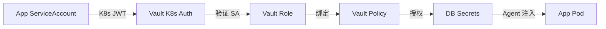
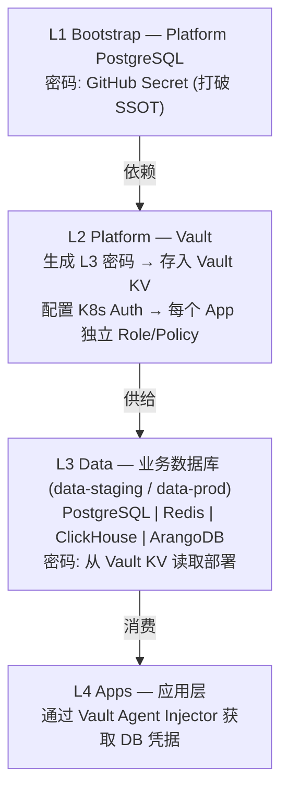

# 数据库总览 SSOT

> **核心问题**：哪些 DB 属于哪个层？密码谁管？应用如何接入？

## Vault 接入机制（Per-App Token）

每个应用通过 **Kubernetes ServiceAccount** 获取独立的 Vault Token，实现最小权限和审计隔离：



**详细接入流程** → [db.vault-integration.md](./db.vault-integration.md)

---

## 服务矩阵

| 数据库 | SSOT Key | 层级 | 命名空间 | 密码来源 | 消费者 | 详情 |
|--------|----------|------|----------|----------|--------|------|
| **Platform PG** | `db.platform_pg` | L1 | `platform` | GitHub Secret | Vault, Casdoor | [db.platform_pg.md](./db.platform_pg.md) |
| **Business PG** | `db.business_pg` | L3 | `data-<env>` | Vault | L4 Apps | [db.business_pg.md](./db.business_pg.md) |
| **Redis** | `db.redis` | L3 | `data-<env>` | Vault | L4 Apps (Cache) | [db.redis.md](./db.redis.md) |
| **ClickHouse** | `db.clickhouse` | L3 | `data-<env>` | Vault | L4 Apps, SigNoz | [db.clickhouse.md](./db.clickhouse.md) |
| **ArangoDB** | `db.arangodb` | L3 | `data-<env>` | Vault | L4 Apps (Graph) | [db.arangodb.md](./db.arangodb.md) |

---

## Quick Start

### PostgreSQL

| 属性 | 值 |
|------|------|
| **服务地址** | `postgresql.data-<env>.svc.cluster.local:5432` |
| **Vault 静态密码** | `secret/data/postgres` |
| **Vault 动态凭据** | `database/creds/app-readonly` / `app-readwrite` |

```yaml
# Pod annotations (使用 Vault Agent Injector)
annotations:
  vault.hashicorp.com/agent-inject: "true"
  vault.hashicorp.com/role: "my-app"
  vault.hashicorp.com/agent-inject-secret-pg: "secret/data/postgres"
  vault.hashicorp.com/agent-inject-template-pg: |
    {{- with secret "secret/data/postgres" -}}
    export PGPASSWORD="{{ .Data.data.password }}"
    {{- end }}
```

---

### Redis

| 属性 | 值 |
|------|------|
| **服务地址** | `redis-master.data-<env>.svc.cluster.local:6379` |
| **Vault 路径** | `secret/data/redis` |

```yaml
annotations:
  vault.hashicorp.com/agent-inject: "true"
  vault.hashicorp.com/role: "my-app"
  vault.hashicorp.com/agent-inject-secret-redis: "secret/data/redis"
  vault.hashicorp.com/agent-inject-template-redis: |
    {{- with secret "secret/data/redis" -}}
    export REDIS_PASSWORD="{{ .Data.data.password }}"
    {{- end }}
```

---

### ClickHouse

| 属性 | 值 |
|------|------|
| **服务地址** | `clickhouse.data-<env>.svc.cluster.local` |
| **端口** | 8123 (HTTP) / 9000 (Native) |
| **Vault 路径** | `secret/data/clickhouse` |

```yaml
annotations:
  vault.hashicorp.com/agent-inject: "true"
  vault.hashicorp.com/role: "my-app"
  vault.hashicorp.com/agent-inject-secret-ch: "secret/data/clickhouse"
  vault.hashicorp.com/agent-inject-template-ch: |
    {{- with secret "secret/data/clickhouse" -}}
    export CLICKHOUSE_PASSWORD="{{ .Data.data.password }}"
    {{- end }}
```

---

### ArangoDB

| 属性 | 值 |
|------|------|
| **服务地址** | `arangodb.data-<env>.svc.cluster.local:8529` |
| **Vault 路径** | `secret/data/arangodb` |
| **字段** | `password` (root), `jwt_secret` |

```yaml
annotations:
  vault.hashicorp.com/agent-inject: "true"
  vault.hashicorp.com/role: "my-app"
  vault.hashicorp.com/agent-inject-secret-arango: "secret/data/arangodb"
  vault.hashicorp.com/agent-inject-template-arango: |
    {{- with secret "secret/data/arangodb" -}}
    export ARANGO_PASSWORD="{{ .Data.data.password }}"
    {{- end }}
```

---

## 架构图



---

> 变更记录见 [change_log/](../change_log/README.md)

## Used by

- [docs/ssot/db.business_pg.md](./db.business_pg.md)
- [docs/project/BRN-008.md](../project/BRN-008.md)

---

## TODO: 开发者体验改进

### 1. Quick Start 需要场景化组织
**问题**: 当前 Quick Start 按数据库类型组织（PostgreSQL/Redis/ClickHouse/ArangoDB），但开发者更关心"我的应用需要什么"而不是"每个数据库怎么用"。

**建议**:
- [ ] 重新组织 Quick Start 章节，按应用场景分类：
  - **场景 A: Web 应用 + 关系数据库** (PostgreSQL only)
  - **场景 B: Web 应用 + 缓存** (PostgreSQL + Redis)
  - **场景 C: 数据分析应用** (PostgreSQL + ClickHouse)
  - **场景 D: 图数据应用** (ArangoDB)
- [ ] 每个场景提供：
  - 典型用例说明
  - 需要配置的 Vault annotations (完整 YAML)
  - 应用代码示例（如何连接和使用）
  - 完整的部署命令序列

**受影响角色**: 应用开发者（选择技术栈）

### 2. 缺少"从零开始"的完整示例
**问题**: 当前文档假设开发者已经有应用，只需要接入数据库。但很多开发者可能是从零开始，需要端到端的指导。

**建议**:
- [ ] 新增 "## 端到端示例：部署第一个数据库应用" 章节
- [ ] 提供一个完整的 Todo List 应用示例：
  - 前端：静态 HTML + JavaScript
  - 后端：Node.js/Python/Go（选一个最简单的）
  - 数据库：PostgreSQL via Vault
- [ ] 步骤包括：
  1. 克隆示例代码仓库
  2. 在 L2 创建 Vault Role 和 Policy (Terraform)
  3. 在 Kubero 创建 Pipeline
  4. 配置环境变量和 Vault annotations
  5. 推送代码触发部署
  6. 验证应用运行并能访问数据库
- [ ] 提供故障排查清单

**受影响角色**: 应用开发者（零基础接入）
