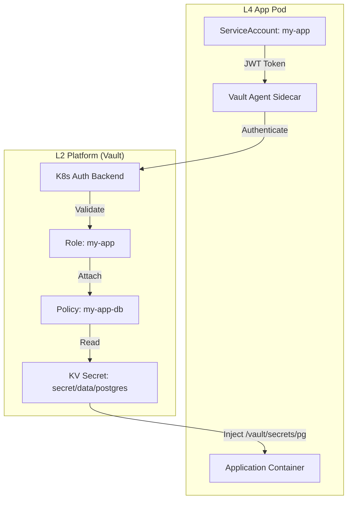

# Vault 数据库接入指南

> **核心问题**：应用如何通过 Vault 安全地获取数据库凭据？

## Per-App Token 机制

每个应用使用独立的 Vault Token，通过 Kubernetes ServiceAccount 自动获取，实现：

- **隔离**：App A 无法读取 App B 的密钥
- **审计**：每个 Token 可追溯到具体应用
- **最小权限**：Policy 精确控制可访问的 Secret 路径

### 认证链路



---

## 新应用接入流程

### 1. 创建 Vault Role 和 Policy（Terraform）

在 `2.platform/` 创建应用的 Vault 配置：

```hcl
# 2.platform/92.vault-myapp.tf

# 1. Policy: 定义可访问的 Secret 路径
resource "vault_policy" "myapp" {
  name = "myapp"

  policy = <<-EOT
    path "secret/data/postgres" {
      capabilities = ["read"]
    }
    path "secret/data/redis" {
      capabilities = ["read"]
    }
  EOT
}

# 2. Role: 绑定 K8s ServiceAccount
resource "vault_kubernetes_auth_backend_role" "myapp" {
  backend                          = vault_auth_backend.kubernetes.path
  role_name                        = "myapp"
  bound_service_account_names      = ["myapp"]
  bound_service_account_namespaces = ["apps-staging", "apps-prod"]
  token_policies                   = ["myapp"]
  token_ttl                        = 3600  # 1h
}
```

### 2. 创建 Kubernetes ServiceAccount

```yaml
# 4.apps/myapp/serviceaccount.yaml
apiVersion: v1
kind: ServiceAccount
metadata:
  name: myapp
  namespace: apps-staging
```

### 3. 配置 Pod Vault Agent 注解

```yaml
# Deployment spec
spec:
  serviceAccountName: myapp
  template:
    metadata:
      annotations:
        vault.hashicorp.com/agent-inject: "true"
        vault.hashicorp.com/role: "myapp"
        # PostgreSQL
        vault.hashicorp.com/agent-inject-secret-pg: "secret/data/postgres"
        vault.hashicorp.com/agent-inject-template-pg: |
          {{- with secret "secret/data/postgres" -}}
          export PGHOST="{{ .Data.data.host }}"
          export PGPORT="{{ .Data.data.port }}"
          export PGUSER="{{ .Data.data.username }}"
          export PGPASSWORD="{{ .Data.data.password }}"
          export PGDATABASE="{{ .Data.data.database }}"
          {{- end }}
```

### 4. 应用读取注入的 Secret

Vault Agent 将 Secret 写入 `/vault/secrets/` 目录：

```bash
# 在容器启动脚本中
source /vault/secrets/pg
psql -c "SELECT 1"
```

---

## 静态凭据 vs 动态凭据

| 类型 | Vault 路径 | TTL | 使用场景 |
|------|-----------|-----|---------|
| **静态** | `secret/data/<db>` | 永久（直到 L2 重新 apply） | 大多数应用 |
| **动态** | `database/creds/app-readonly` | 1h（可续期） | 高安全要求场景 |

### 动态凭据（PostgreSQL Only）

```yaml
annotations:
  vault.hashicorp.com/agent-inject-secret-pg-dynamic: "database/creds/app-readonly"
  vault.hashicorp.com/agent-inject-template-pg-dynamic: |
    {{- with secret "database/creds/app-readonly" -}}
    export PGUSER="{{ .Data.username }}"
    export PGPASSWORD="{{ .Data.password }}"
    {{- end }}
```

> [!NOTE]
> 动态凭据需要 `enable_postgres_backend=true`（L2 变量），当前默认关闭。

---

## 故障排查

### Error: permission denied

**原因**：Policy 未授权该路径

```bash
# 检查 Role 绑定的 Policy
vault read auth/kubernetes/role/myapp

# 检查 Policy 内容
vault policy read myapp
```

### Error: service account not allowed

**原因**：Role 的 `bound_service_account_names` 不匹配

```bash
# 确认 Pod 使用的 SA
kubectl get pod <pod> -o jsonpath='{.spec.serviceAccountName}'

# 与 Vault Role 配置对比
vault read auth/kubernetes/role/myapp
```

### Secret 文件为空

**原因**：Vault Agent 启动失败或路径错误

```bash
# 查看 Vault Agent logs
kubectl logs <pod> -c vault-agent-init
kubectl logs <pod> -c vault-agent

# 验证 Secret 路径是否存在
vault kv get secret/data/postgres
```

---

## 相关文件

- [91.vault-auth-kubernetes.tf](../../2.platform/91.vault-auth-kubernetes.tf) — K8s Auth Backend
- [92.vault-kubero.tf](../../2.platform/92.vault-kubero.tf) — Per-App Role 示例（Kubero）
- [6.vault-database.tf](../../2.platform/6.vault-database.tf) — DB 密码生成 + 动态凭据配置
- [platform.auth.md](./platform.auth.md) — 整体认证架构

---

## TODO: 开发者体验改进

### 1. 缺少端到端示例应用
**问题**: 文档提供了详细的技术配置步骤，但缺少一个完整的、可运行的示例应用，开发者难以验证理解是否正确。

**建议**:
- [ ] 新增 "## 完整示例：Node.js + PostgreSQL" 章节
- [ ] 提供一个 GitHub 仓库链接，包含：
  - 完整的应用代码（Node.js Express + pg 库）
  - Dockerfile
  - Kubernetes Deployment YAML（包含所有必需的 Vault annotations）
  - Terraform 配置（Role + Policy）
  - README 说明如何一步步部署
- [ ] 示例应用应展示：
  - 如何从 `/vault/secrets/pg` 读取环境变量
  - 如何建立数据库连接
  - 如何在启动脚本中 source Vault 注入的文件

**受影响角色**: 应用开发者（首次接入 Vault）

### 2. 故障排查章节需要更多实战案例
**问题**: 当前故障排查章节提供了基本的命令，但缺少常见错误的完整解决路径。

**建议**:
- [ ] 为每个常见错误增加"完整解决流程"小节
- [ ] 包含：
  - 错误的完整日志示例
  - 逐步诊断命令及其预期输出
  - 常见的根本原因及解决方案
  - 验证修复是否成功的方法
- [ ] 增加新的常见错误场景：
  - Vault Agent 注入成功但应用读取失败（路径问题）
  - Token 过期导致的间歇性失败
  - Namespace 配置错误

**受影响角色**: 应用开发者（故障诊断）

---
