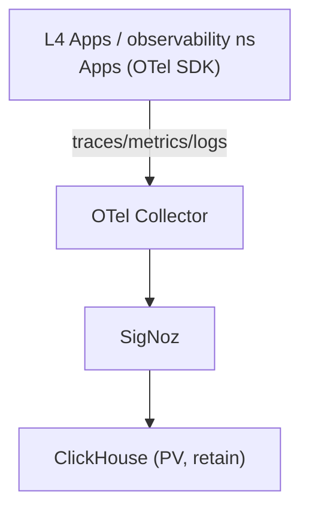

# 可观测性（日志/监控）SSOT

> **核心问题**：日志、指标、链路追踪怎么收？用什么工具？落在哪一层？

## 架构概览

## 组件矩阵

| 组件 | 层级 | 命名空间 | 作用 | 部署方式 | 数据落盘 |
|------|------|----------|------|----------|----------|
| **SigNoz** | L4 | `observability` | APM + Logs + Metrics UI/存储 | Helm (未来 TF) | ClickHouse PVC (`local-path-retain`) |
| **OpenTelemetry Collector** | L4 | `observability` | 统一接入、采样、export | Helm (随 SigNoz) | 无状态 |

## Feature Flag

| Flag | 层级 | 默认值 | 说明 |
|------|------|--------|------|
| `enable_observability` | L1 | `false` | 仅 staging/prod 部署 SigNoz/Collector |

## 域名与访问

| 服务 | 域名 | 备注 |
|------|------|------|
| SigNoz UI | `https://signoz.<internal_domain>` | 通过 Cloudflare proxy + cert-manager |

> 域名 SSOT 见 [platform.network.md](./platform.network.md)。
> 告警 SSOT 见 [ops.alerting.md](./ops.alerting.md)。

## 接入规范（Apps → OTel）

1. **统一用 OTel SDK**（语言各自官方发行版）。
2. **Service 名**：`{app}-{env}`（如 `cms-staging`）。
3. **Exporter**：OTLP gRPC → `otel-collector.observability.svc:4317`。
4. **采样**：MVP 默认 `parentbased_traceidratio=0.1`，按服务调。

## 数据保留与容量

- ClickHouse 数据在单 VPS 上，**PV reclaimPolicy=Retain**，避免误删。
- 建议从 7 天留存起步，按实际日志/trace 量调大 PV。
- 超过单机容量时，独立 ClickHouse 或迁移到独立 VPS（见 BRN-004 长期路径）。

> TODO(observability): 落地 SigNoz Helm/TF 模块
> TODO(observability): Apps OTel SDK 接入

## 实施状态

| 项目 | 状态 |
|------|------|
| SigNoz Helm/TF 模块 | ⏳ 未落地 |
| Apps OTel 接入 | ⏳ 未落地 |

## 相关文件

- 选型：`docs/project/BRN-004.md`
- Feature flags：[core.vars.md](./core.vars.md)
- 域名规则：[platform.network.md](./platform.network.md)
- 告警：[ops.alerting.md](./ops.alerting.md)

---

## Used by

- [docs/ssot/ops.pipeline.md](./ops.pipeline.md)

---

## TODO: 开发者体验改进

### 1. 缺少应用接入指南
**问题**: 文档主要是 SigNoz 的基础设施配置和接入规范，但开发者不知道如何在自己的应用中实际接入监控。

**建议**:
- [ ] 新增 "## 应用接入 SigNoz" 章节
- [ ] 提供各语言的完整接入示例：
  - **Node.js**:
    - 安装 `@opentelemetry/sdk-node` 等依赖
    - 配置自动 instrumentation
    - 设置 OTLP exporter 指向 `otel-collector.observability.svc:4317`
    - 完整代码示例
  - **Python**:
    - OpenTelemetry + FastAPI/Django 集成
    - 环境变量配置
  - **Go**:
    - OpenTelemetry SDK 初始化
    - 手动 span 创建示例
  - **Java**:
    - OpenTelemetry Java Agent 使用
- [ ] 每个示例包括：
  - 依赖安装命令
  - 完整的配置代码（可复制粘贴）
  - 环境变量设置（如何在 Kubero 中配置）
  - 验证方法（在 SigNoz UI 查看 traces/metrics）

**受影响角色**: 应用开发者（接入监控）

### 2. 缺少 PostHog 文档
**问题**: 文档完全没有提到 PostHog，但它在多个地方被提及为重要的用户行为分析服务。

**建议**:
- [ ] 新增 "## 用户行为分析: PostHog" 章节
- [ ] 包含内容：
  - PostHog 访问地址（`https://posthog.<internal_domain>`）
  - 如何获取项目 API Key
  - **前端接入**:
    - JavaScript SDK 安装和初始化
    - 常见事件追踪（页面浏览、按钮点击）
    - 用户属性设置
  - **后端接入**:
    - Node.js SDK 示例
    - Python SDK 示例
    - 服务端事件追踪场景
  - **常见分析场景**:
    - 用户注册转化漏斗
    - 功能使用情况分析
    - A/B 测试
  - 在 PostHog UI 中查看数据和创建 Dashboard

**受影响角色**: 应用开发者（产品分析需求）

### 3. 监控最佳实践缺失
**问题**: 文档告诉开发者"可以使用 SigNoz"和接入规范，但没有说明"应该监控什么"和"如何用好监控"。

**建议**:
- [ ] 新增 "## 监控与可观测性最佳实践" 章节
- [ ] 提供指导：
  - **必须监控的指标**:
    - HTTP 请求延迟 (P50/P95/P99)
    - HTTP 错误率（4xx/5xx）
    - 数据库查询性能
    - 外部 API 调用延迟和成功率
  - **必须追踪的事件**:
    - 关键业务流程（如用户注册、支付、下单）
    - 外部服务集成点
  - **日志级别建议**:
    - ERROR: 需要立即处理的问题
    - WARN: 异常但可恢复的情况
    - INFO: 关键业务事件
    - DEBUG: 仅在开发环境启用
  - **告警阈值建议**:
    - P95 延迟 > 1s
    - 错误率 > 1%
    - 数据库连接池耗尽
- [ ] 提供 SigNoz Dashboard 模板（JSON 导出）

**受影响角色**: 应用开发者（可观测性实践）

### 4. 实施状态与开发者行动关系不清
**问题**: 文档说"SigNoz Helm/TF 模块 ⏳ 未落地"，但开发者不知道这对他们意味着什么。

**建议**:
- [ ] 在 "实施状态" 表格后增加说明
- [ ] 明确当前状态对开发者的影响：
  - **当前状态**: SigNoz 基础设施尚未部署，开发者暂时无法使用
  - **开发者可以做什么**:
    - 在应用代码中预先集成 OTel SDK（使用环境变量控制是否启用）
    - 准备好 service name 和采样策略
  - **预计时间**: （如果有的话）
  - **如何获取通知**: 订阅相关 Issue 或加入通知频道

**受影响角色**: 应用开发者（计划和预期管理）
