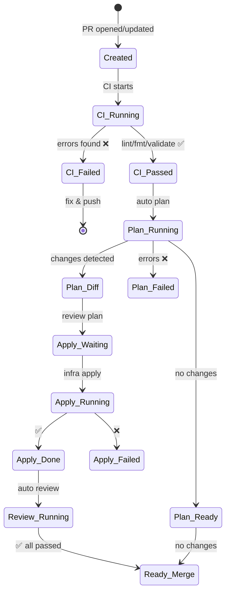
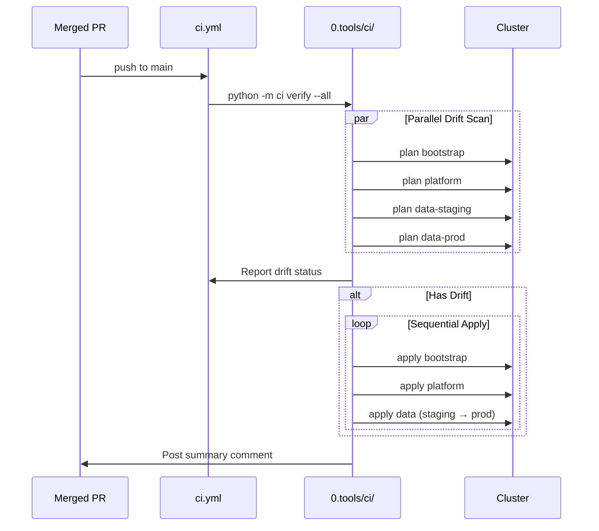

# Pipeline SSOT (运维流水线)

> **核心原则**：所有变更可审计；Python 脚本驱动逻辑；YAML 极简化；语义化命令。

---

## 1. 设计理念

### 1.1 架构转型

| 维度 | 旧架构 (当前) | 新架构 (目标) |
|:---|:---|:---|
| **逻辑位置** | 分散在 12+ YAML 文件内 | 集中于 `0.tools/ci/` Python 模块 |
| **YAML 职责** | 触发器 + 逻辑 + Dashboard 更新 | 纯触发器 + 调用 Python |
| **命令语法** | 工具绑定 (`atlantis plan`) | 语义化 (`infra plan`) |
| **执行引擎** | Atlantis Server (独立 Pod) | Digger CLI (无状态，CI 内跑) |

### 1.2 文件结构

```
.github/
└── workflows/
    ├── ci.yml              # 唯一入口：PR + Push + Comment + Dispatch
    └── docs.yml            # 文档站构建（独立）

0.tools/ci/
├── __init__.py
├── main.py                 # CLI 入口：python -m ci <command>
├── commands/
│   ├── plan.py             # infra plan
│   ├── apply.py            # infra apply
│   ├── verify.py           # infra verify (drift scan)
│   ├── health.py           # infra health
│   └── review.py           # infra review (AI)
├── core/
│   ├── terraform.py        # TF/Terragrunt 封装
│   ├── dashboard.py        # PR Dashboard CRUD
│   └── github.py           # GH API 封装
└── config.py               # 层级定义、路径映射
```

---

## 2. 斜杠命令矩阵

### 2.1 PR 评论命令

| 命令 | 作用 | 示例 |
|:---|:---|:---|
| `/plan` | 预览变更 (自动检测涉及的层) | `/plan` |
| `/plan <layer>` | 预览指定层 | `/plan bootstrap` |
| `/apply` | 部署变更 (需 plan 通过) | `/apply` |
| `/apply <layer>` | 部署指定层 | `/apply platform` |
| `/health` | 健康检查 (探测服务连通性) | `/health` |
| `/e2e` | 运行 E2E 回归测试 | `/e2e smoke` |
| `/review` | AI 代码审查 | `/review` |
| `/help` | 显示可用命令 | `/help` |

**Layer 参数**: `bootstrap`, `platform`, `data-staging`, `data-prod`, `all`

### 2.2 自动触发

| 事件 | 触发动作 |
|:---|:---|
| PR 创建/更新 | CI Validate + Dashboard 创建 + 自动 `/plan` |
| Push to main | `/verify` (全层 drift scan) + 顺序 apply + `/e2e` |
| Merge 完成 | 在原 PR 评论部署结果汇总 |

---

## 3. Dashboard 状态机

Dashboard 是每个 Commit 的 SSOT 看板：



---

## 4. Dashboard Schema

```markdown
<!-- infra-dashboard:abc1234 -->
## ⚙️ Commit `abc1234` Pipeline

| Stage | Status | Output | Time |
|:---|:---:|:---|:---|
| CI Validate | ✅ | [Log](#) | 12:34 |
| Plan: bootstrap | ✅ | [View](#) | 12:35 |
| Plan: platform | ⏳ | Running... | - |
| Plan: data-staging | ⏭️ | - | - |
| Apply | ⏭️ | - | - |
| AI Review | ⏭️ | - | - |

<!-- next-step -->
⏳ Waiting for plan...
<!-- /next-step -->
```

---

## 5. Post-Merge 流程



---

## 6. 层级定义

```python
# 0.tools/ci/config.py
LAYERS = {
    "bootstrap": {
        "path": "bootstrap",
        "engine": "terraform",  # native TF
        "state_key": "k3s/terraform.tfstate",
        "order": 1,
    },
    "platform": {
        "path": "platform",
        "engine": "terragrunt",
        "order": 2,
    },
    "data-staging": {
        "path": "envs/staging/data",
        "engine": "terragrunt",
        "order": 3,
    },
    "data-prod": {
        "path": "envs/prod/data",
        "engine": "terragrunt",
        "order": 4,
    },
}
```

---

## 7. 迁移路径

### Phase 1: Python 核心 (Week 1)
- [ ] 创建 `0.tools/ci/` 目录结构
- [ ] 实现 `dashboard.py` (Dashboard CRUD)
- [ ] 实现 `terraform.py` (plan/apply 封装)
- [ ] 实现 `main.py` CLI 入口

### Phase 2: 命令迁移 (Week 2)
- [ ] `infra plan` 替代 `atlantis plan`
- [ ] `infra apply` 替代 `atlantis apply`
- [ ] `infra health` 替代 `infra dig`
- [ ] `infra review` 替代 `@claude`

### Phase 3: YAML 精简 (Week 3)
- [ ] 合并所有 workflow 到 `ci.yml`
- [ ] 删除 Atlantis Server Pod
- [ ] 删除旧 workflow 文件

### Phase 4: 验收 (Week 4)
- [ ] E2E 测试覆盖新命令
- [ ] 文档更新
- [ ] 团队培训

---

## 8. 兼容性过渡

迁移期间支持旧命令别名：

```python
# 0.tools/ci/commands/parse.py
ALIASES = {
    "atlantis plan": "/plan",
    "atlantis apply": "/apply",
    "infra dig": "/health",
    "infra e2e": "/e2e",
    "@claude": "/review",
}
```

---

## 9. 实现状态

| 能力 | 目标 | 当前 |
|:---|:---|:---:|
| Python 驱动 | 所有逻辑在 Python | ❌ |
| 语义化命令 | `infra plan/apply/health/review` | ❌ |
| 单一 YAML | `ci.yml` 为唯一入口 | ❌ |
| Dashboard SSOT | 每 commit 一个看板 | ✅ |
| Post-Merge Verify | 自动 drift scan | ✅ |
| Digger 替代 Atlantis | 无状态 CLI | ❌ |

---

*Last Updated: 2025-12-24*
