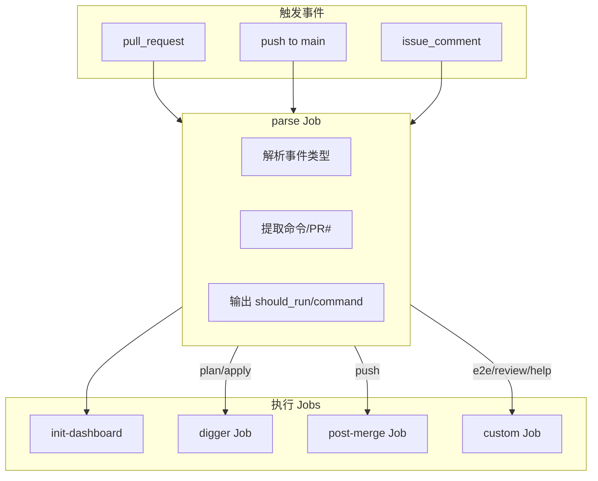

# Pipeline SSOT (运维流水线)

> **核心原则**：Digger 执行 Terraform；Python 处理辅助逻辑；语义化斜杠命令。

---

## 1. 架构概览

### 1.1 执行引擎

| 组件 | 职责 |
|:---|:---|
| **Digger** | Self-hosted Orchestrator 执行 Terraform (替代 Atlantis) |
| **ci.yml** | 统一入口，路由命令到 Digger 或自定义 Job |
| **Python (tools/ci/)** | Dashboard 更新、Vault 检查、解析辅助 |

### 1.2 工作流触发器

```yaml
on:
  pull_request:     # PR 创建/更新 → 自动 Plan
  push (main):      # Merge → 自动 Apply + 状态回报
  issue_comment:    # /命令 → 路由到对应 Job
  workflow_dispatch # 手动触发
```

---

## 2. 斜杠命令

### 2.1 PR 评论命令

| 命令 | 作用 | 执行者 |
|:---|:---|:---|
| `/plan` | 预览所有层变更 | Digger |
| `/apply` | 部署所有层变更 | Digger |
| `/e2e` | 触发 E2E 测试 | Custom Job |
| `/review` | AI 代码审查 | Custom Job |
| `/help` | 显示可用命令 | Custom Job |

> **注意**: `/health` 已移除，使用 `/e2e` 的 smoke test 替代。

### 2.2 自动触发

| 事件 | 动作 |
|:---|:---|
| PR 创建/更新 | Dashboard 初始化 + 自动 `/plan` |
| Push to main | Digger Apply + 状态回报到原 PR |
| `/apply` 评论 | Vault 解封检查 → Digger Apply |

---

## 3. CI Pipeline 架构



---

## 4. Dashboard 设计

每个 PR 有一个 Dashboard Comment（由 `init-dashboard` Job 创建）：

```markdown
<!-- infra-flash -->
## 🚀 infra-flash

| Stage | Status | Details |
|:---|:---:|:---|
| Plan | ✅ | [View](#run-link) |
| Apply | ⏳ | Waiting... |

<!-- next-step -->
👉 Plan 完成，评论 `/apply` 部署
<!-- /next-step -->
```

**更新时机**:
- `init-dashboard`: PR 创建时
- `digger` Job 完成后: 更新 Plan/Apply 状态
- `post-merge`: 在原 PR 添加部署结果

---

## 5. Vault 解封检查

Apply 前会自动检查 Vault 状态：

```python3 tools/ci_load_secrets.py
ck_vault.py
kubectl exec vault-0 -n platform -- vault status -format=json
```

| 状态 | CI 行为 |
|:---|:---|
| Unsealed | ✅ 继续 Apply |
| Sealed | ❌ 失败，提示手动解封 |
| Pod 不存在 | ⚠️ 跳过检查 (首次部署) |

---

## 6. 文件结构

```
.github/
├── workflows/
│   └── ci.yml              # 唯一入口
└── actions/
    └── terraform-setup/    # Secrets 注入

tools/ci/
├── __main__.py             # CLI: python -m ci <cmd>
├── commands/
│   ├── init.py             # Dashboard 创建
│   ├── update.py           # Dashboard 更新
│   ├── parse.py            # 命令解析
│   ├── check_vault.py      # Vault 状态检查
│   └── verify.py           # Drift 扫描
└── core/
    ├── dashboard.py        # Dashboard CRUD
    └── github.py           # GH API 封装
```

---

## 7. 即时反馈机制

| 阶段 | 反馈形式 | 执行账号 |
|:---|:---|:---|
| 命令收到 | 👀 Emoji Reaction | GITHUB_TOKEN |
| Plan/Apply 完成 | Dashboard 更新 | infra-flash App |
| Post-Merge | PR 评论 | infra-flash App |
| 失败 | Issue 创建 | infra-flash App |

---

## 8. 实现状态

| 能力 | 状态 |
|:---|:---:|
| Digger Plan/Apply | ✅ |
| Dashboard 自动更新 | ✅ |
| Vault 解封检查 | ✅ |
| Post-Merge 状态回报 | ✅ |
| /e2e 触发 | ✅ |
| /review AI 审查 | ⏳ |

---

## 9. 故障排查

| 问题 | 解决方案 |
|:---|:---|
| `/apply` 无响应 | 检查 `issue_comment` 事件是否触发 CI (Actions 页面) |
| Vault Sealed 报错 | 手动解封: `kubectl exec vault-0 -n platform -- vault operator unseal` |
| Dashboard 未更新 | 检查 `infra-flash` App Token 权限 |
| Plan 失败 | 查看 Digger 日志详细错误 |

---

*Last Updated: 2025-12-25*
