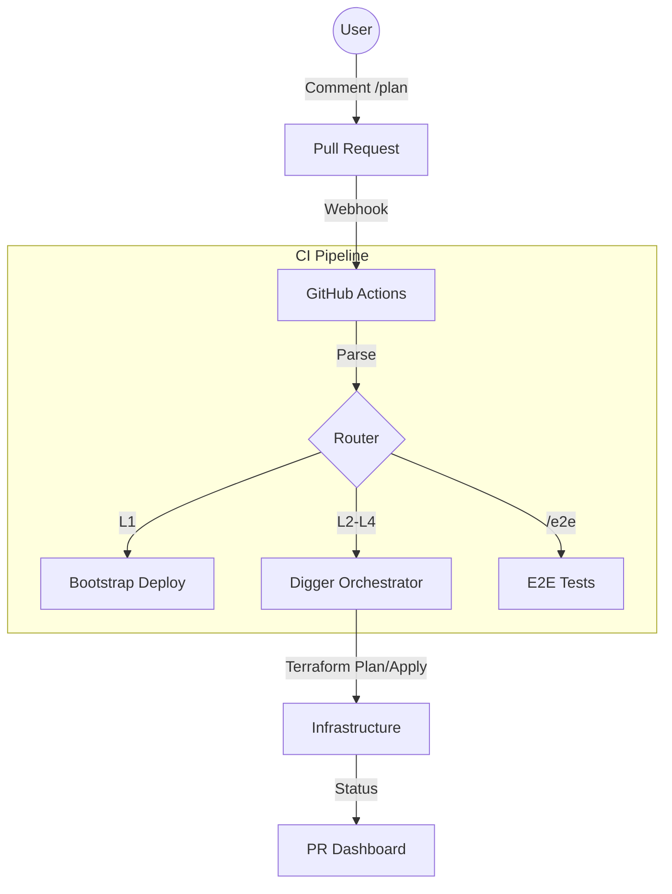

# Pipeline SSOT (运维流水线)

> **SSOT Key**: `ops.pipeline`
> **核心定义**: 定义基于 Digger Orchestrator 的 GitOps 工作流、自动化策略及手动介入流程。

---

## 1. 真理来源 (The Source)

> **原则**：CI 代码定义流程，GitHub Actions 负责调度，Digger 负责执行。

本话题的配置和状态由以下物理位置唯一确定：

| 维度 | 物理位置 (SSOT) | 说明 |
|------|----------------|------|
| **CI 入口** | [`.github/workflows/ci.yml`](../../.github/workflows/ci.yml) | 统一入口，路由事件 |
| **L1 流程** | [`.github/workflows/bootstrap-deploy.yml`](../../.github/workflows/bootstrap-deploy.yml) | Bootstrap 专用流程 |
| **辅助逻辑** | [`tools/ci/`](../../tools/ci/) | Python 编写的 Dashboard/Vault 检查脚本 |

### Code as SSOT 索引

- **命令解析器**：参见 [`tools/ci/commands/parse.py`](../../tools/ci/commands/parse.py)
- **Dashboard 渲染**：参见 [`tools/ci/commands/init.py`](../../tools/ci/commands/init.py)

---

## 2. 架构模型

### 关键决策 (Architecture Decision)

- **分层执行**:
    - **L1 Bootstrap**: 独立流程，避免“自己部署自己”的死锁。
    - **L2-L4**: 统一由 Digger 编排，支持依赖图 (DAG)。
- **Feedback Loop**: 使用 `infra-flash` 机器人更新 PR 顶部的 Dashboard，而不是刷屏评论。

---

## 3. 设计约束 (Dos & Don'ts)

### ✅ 推荐模式 (Whitelist)

- **模式 A**: 日常变更**必须**通过 PR 评论 `/plan` 和 `/apply` 触发。
- **模式 B**: 涉及多层变更时，应等待下层 Apply 成功后再触发上层 Plan。
- **模式 C**: 可选使用 `/review` 或 `@copilot` 触发 AI code review（手动触发）。

### ⛔ 禁止模式 (Blacklist)

- **反模式 A**: **禁止** 在本地执行 `terraform apply` 更新 L2+ 资源（会导致 State Lock 和审计丢失）。
- **反模式 B**: **禁止** 绕过 CI 直接修改线上资源（Drift 产生源）。

---

## 4. 标准操作程序 (Playbooks)

### SOP-001: 部署变更 (Standard GitOps)

- **触发条件**: 代码合并前
- **步骤**:
    1. 提交代码，等待 CI 初始化 Dashboard。
    2. 评论 `/plan`，检查 Digger 输出。
    3. 评论 `/apply`，等待部署成功。
    4. 合并 PR。

### SOP-002: 触发 E2E 测试

- **触发条件**: 需要验证部署效果
- **步骤**:
    1. 评论 `/e2e` (运行所有 smoke tests)。
    2. 或评论 `/e2e full` (运行完整回归测试)。
    3. 查看 Dashboard 链接的测试报告。

### SOP-003: 紧急回滚

- **触发条件**: 部署导致故障
- **步骤**:
    1. `git revert <commit-id>`。
    2. 提交新 PR。
    3. 快速执行 `/apply` (可跳过详细 Plan 审查)。

### SOP-004: AI Code Review (可选)

- **触发条件**: 需要 AI 辅助审查代码变更
- **步骤**:
    1. 在 PR 评论中输入 `@copilot please review` 或 `/review`。
    2. 等待 GitHub Copilot 分析并回复。
    3. 根据建议修改代码或标记为已阅。
- **注意**:
    - **手动触发**: 不会自动运行，需主动请求。
    - **权限要求**: 需要 Copilot 订阅或组织授权。
    - **Dashboard**: Copilot 原生 review 不会更新 PR Dashboard。
    - **详细指南**: 参见 [`docs/project/active/ai_code_review.md`](../project/active/ai_code_review.md)。

---

## 5. 验证与测试 (The Proof)

| 行为描述 | 测试文件 (Test Anchor) | 覆盖率 |
|----------|-----------------------|--------|
| **Pipeline 逻辑验证** | [`test_pipeline_parser.py`](../../tools/ci/tests/test_pipeline_parser.py) | ✅ Unit Test |
| **Digger 集成验证** | [`test_digger_flow.py`](../../e2e_regressions/tests/bootstrap/compute/test_digger.py) | ⚠️ Pending |

---

## Used by

- [docs/ssot/README.md](./README.md)
- [bootstrap/README.md](../../bootstrap/README.md)