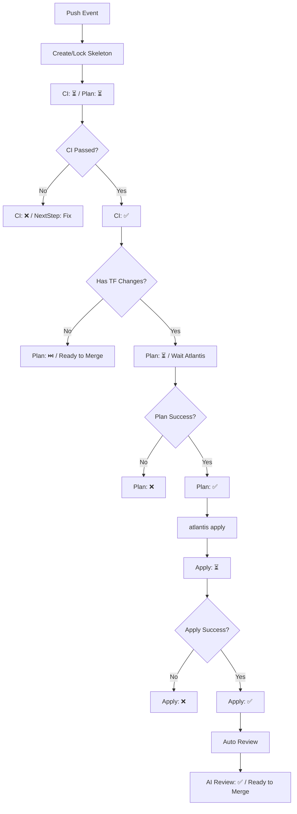
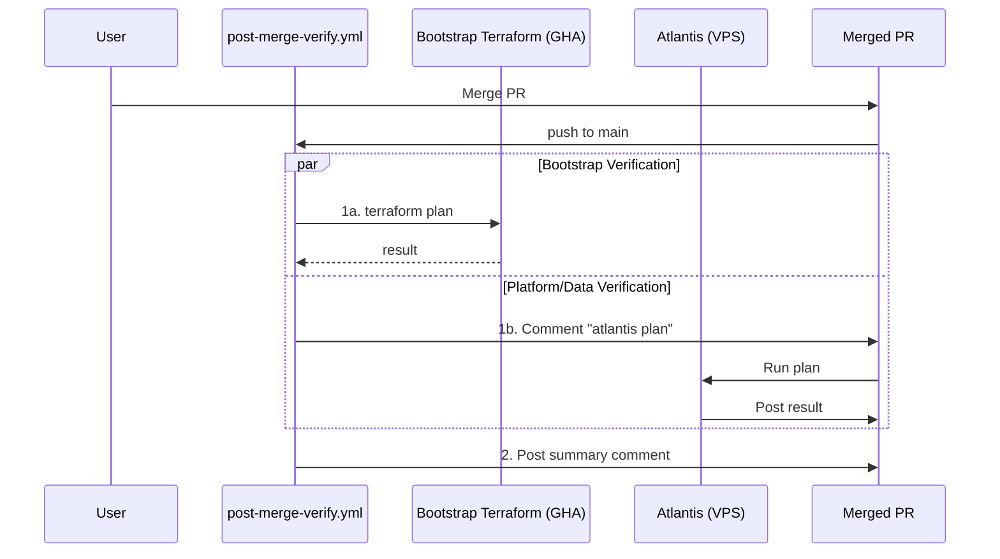

# Pipeline SSOT (运维流水线)

> **核心原则**：所有变更必须可审计。`infra-flash` 评论流是 PR 状态的单一真理来源 (SSOT)。

---

## 1. 核心问题域与解决方案

| 解决的问题 | 实际方案 | 执行位置 | 理由 |
|:---|:---|:---|:---|
| **静态质量** | `fmt`, `lint`, `validate` | GitHub Actions | 快速反馈，不依赖集群环境 |
| **动态预览** | `terraform plan` | Atlantis (Pod) | 必须访问集群内 Vault 和 Backend |
| **AI 护栏** | `@claude review` / 自动 | Claude App | 文档一致性、IaC 规范、安全审计 |
| **审计合规** | `infra-flash` 评论流 | GHA + Atlantis | 每一笔操作都有 Commit 级别的记录 |
| **环境健康** | `infra dig` | GitHub Actions | 外部视角验证服务连通性 |
| **Bootstrap 引导** | `deploy-bootstrap.yml` | GitHub Actions | 初始引导（手动触发）|
| **Drift 检测** | `post-merge-verify.yml` | GitHub Actions + Atlantis | Merge 后自动全量验证，防止配置漂移 |

---

## 2. Dashboard 状态机

Dashboard 是每个 Commit 的 SSOT 看板，状态转换遵循以下规则：



---

## 3. Post-Merge Verification

Merge 到 main 后，`post-merge-verify.yml` 自动执行全量验证。

### 完整流程



---

## 4. 运维指令矩阵

### A. 自动平面 (Push Trigger)
1. **Skeleton**: `terraform-plan.yml` 创建 `infra-flash` 评论。
2. **Static**: 执行 `validate` 并更新 CI 表格。
3. **Autoplan**: Atlantis 自动执行 `plan`。
4. **Post-Apply Review**: Apply 成功后自动触发 AI 审查。
5. **Post-Merge Verification**: Merge 后自动执行全量验证。

### B. 指令平面 (Comment Trigger)
- `atlantis plan`: 重新生成 Plan
- `atlantis apply`: 执行部署
- `infra dig`: 探测环境连通性
- `@claude <指令>`: AI 协助

---

## 5. Dashboard Schema

每个 `infra-flash` 评论遵循以下结构：

```markdown
| Stage | Status | Link | Time |
|:---|:---:|:---|:---|
| Bootstrap Plan | {✅/❌} | [View]({url}) | {time} |
| Static CI | {✅/❌} | [View]({url}) | {time} |
| Infra Plan | {✅/❌} | [View]({url}) | {time} |
| Infra Apply | {✅/❌} | [View]({url}) | {time} |
| AI Review | {✅} | [View]({url}) | {time} |
```

---

## 6. 实现状态

| 能力 | 理想态 | 当前状态 |
|:---|:---|:---:|
| Dashboard 创建 | 每次 push 自动创建 | ✅ |
| Atlantis Plan 回写 | 更新 Infra Plan 行 | ✅ |
| Atlantis Apply 回写 | 更新 Infra Apply 行 | ✅ |
| Claude 自动 review | apply 后自动触发 | ✅ |
| **Drift 检测** | Merge 后全量 plan | ✅ |

*Last Updated: 2025-12-24 (Unified Architectural Names)*
