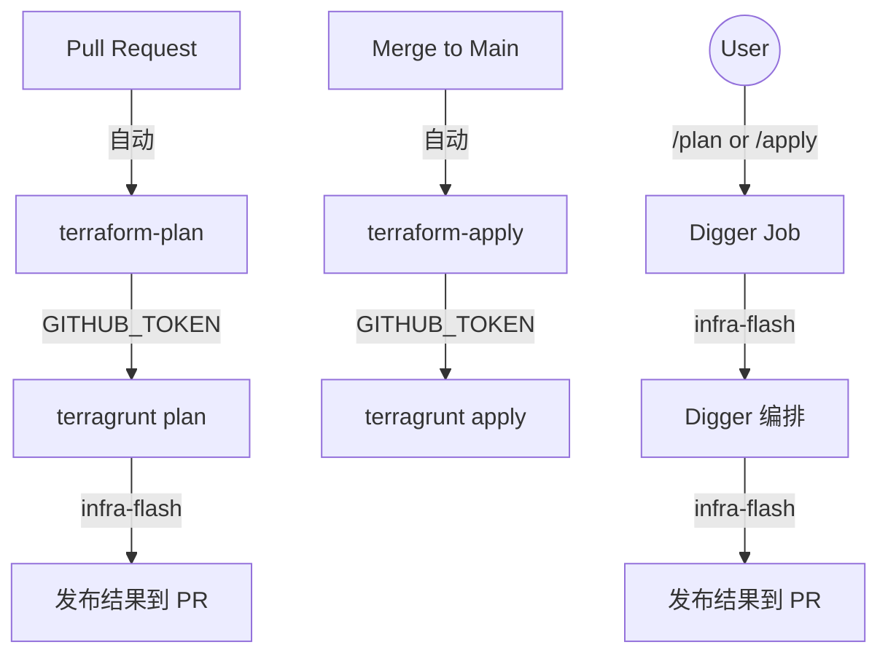

# Pipeline SSOT (运维流水线)

> **SSOT Key**: `ops.pipeline`
> **核心定义**: 双轨 CI 架构 - 自动 CI checks + 手动 Digger 命令。

---

## 1. 真理来源 (The Source)

本话题的配置和状态由以下物理位置唯一确定：

| 维度 | 物理位置 (SSOT) | 说明 |
|------|----------------|------|
| **CI 入口** | [`.github/workflows/ci.yml`](../../.github/workflows/ci.yml) | 双轨 CI: terraform-plan/apply + digger |
| **Bootstrap 脚本** | [`tools/ci/bootstrap.py`](../../tools/ci/bootstrap.py) | L1 层管理 |
| **Digger 配置** | [`digger.yml`](../../digger.yml) | Projects 定义、OSS 配置 |
| **测试防护** | [`tests/conftest.py`](../../tests/conftest.py) | Precondition checks |

---

## 2. 架构模型 (Dual-Track)



### 关键决策 (Architecture Decision)

**为什么双轨？**
- **自动 CI checks**: 使用 GITHUB_TOKEN，显示在 PR checks，可设为 required
- **手动命令**: 使用 infra-flash App，支持 Digger 项目级控制和高级功能
- **Digger OSS 限制**: 不支持 push 事件，必须用原生 terragrunt 实现自动 apply

**Token 策略**:
- **执行任务** (terraform/terragrunt) → `GITHUB_TOKEN`
- **PR 交互** (评论/回复/label) → `infra-flash` App token

---

## 3. 事件与 Token 映射

| Event | Job | 执行 | 交互 | CI Check |
|-------|-----|------|------|----------|
| `pull_request` | `terraform-plan` | `GITHUB_TOKEN` | `infra-flash` | ✅ |
| `push` (main) | `terraform-apply` | `GITHUB_TOKEN` | - | ✅ |
| `/plan` comment | `digger` | `infra-flash` | `infra-flash` | ❌ |
| `/apply` comment | `digger` | `infra-flash` | `infra-flash` | ❌ |
| `digger -p xxx` | `digger` | `infra-flash` | `infra-flash` | ❌ |
| `/bootstrap` | `bootstrap` | `GITHUB_TOKEN` | `infra-flash` | ❌ |
| `/e2e` | `e2e` | `GITHUB_TOKEN` | `infra-flash` | ❌ |

### Token 选择逻辑

```
需要显示在 CI checks？
  ├─ Yes → GITHUB_TOKEN 执行
  │        infra-flash 发布结果
  │        (terraform-plan, terraform-apply)
  │
  └─ No → infra-flash 全流程
           (digger, bootstrap, e2e)
```

---

## 4. 设计约束 (Dos & Don'ts)

### ✅ 推荐模式 (Whitelist)

- **模式 A**: PR 创建后自动 plan，review 输出，merge 后自动 apply
- **模式 B**: 需要单独 apply 某项目时，用 `digger apply -p <project>`
- **模式 C**: Bootstrap 变更通过 `/bootstrap apply`
- **模式 D**: 重大变更前先 `/e2e` 验证

### ⛔ 禁止模式 (Blacklist)

- **反模式 A**: **禁止** 在本地执行 `terraform apply` 更新 L2+ 资源
- **反模式 B**: **禁止** 绕过 CI 直接修改线上资源
- **反模式 C**: **禁止** 直接 push 到 main (repository rule 保护)

---

## 5. 标准操作程序 (Playbooks)

### SOP-001: 部署变更 (Standard GitOps)

- **触发条件**: 代码合并前
- **步骤**:
    1. 提交代码，等待 CI 初始化 Dashboard。
    2. 评论 `/plan`，检查 Digger 输出和 Dashboard 状态。
    3. 评论 `/apply`，等待部署成功，Dashboard 显示 ✅。
    4. 合并 PR。

### SOP-002: 触发 E2E 测试

- **触发条件**: 需要验证部署效果
- **步骤**:
    1. 评论 `/e2e` (运行所有 smoke tests)。
    2. 或评论 `/e2e full` (运行完整回归测试)。
    3. 查看 Dashboard 链接的测试报告。

### SOP-003: 紧急回滚

- **触发条件**: 部署导致故障
- **步骤**:
    1. `git revert <commit-id>`。
    2. 提交新 PR。
    3. 快速执行 `/apply` (可跳过详细 Plan 审查)。

### SOP-004: AI Code Review (可选)

- **触发条件**: 需要 AI 辅助审查代码变更
- **步骤**:
    1. 在 PR 评论中输入 `@copilot please review` 或 `/review`。
    2. 等待 GitHub Copilot 分析并回复。
    3. 根据建议修改代码或标记为已阅。
- **注意**:
    - **手动触发**: 不会自动运行，需主动请求。
    - **权限要求**: 需要 Copilot 订阅或组织授权。
    - **Dashboard**: Copilot 原生 review 不会更新 PR Dashboard。
    - **详细指南**: 参见 [`docs/project/active/ai_code_review.md`](../project/active/ai_code_review.md)。

### SOP-005: Dashboard 故障排查

- **症状**: Dashboard 不更新，所有状态 ⏳ pending
- **排查步骤**:
    1. 检查 workflow logs: `gh run view <run-id> --log | grep -i dashboard`
    2. 验证 PR 评论中是否有 marker: `<!-- infra-dashboard:{sha} -->`
    3. 检查 GitHub Token 权限（需要 `issues: write`）
    4. 手动测试：`python -m ci update --pr <num> --stage apply --status success`
- **常见原因**: 参见 [Workflow DESIGN.md 故障排查章节](../../.github/workflows/DESIGN.md#-known-issues--fixes)

---

## 5. 验证与测试 (The Proof)

| 行为描述 | 测试文件 (Test Anchor) | 覆盖率 |
|----------|-----------------------|--------|
| **Dashboard 创建与更新** | Manual test: `python -m ci init/update` | ⚠️ Manual |
| **Pipeline 逻辑验证** | [`tools/ci/tests/test_pipeline_parser.py`](../../tools/ci/tests/test_pipeline_parser.py) | ✅ Unit Test |
| **Digger 集成验证** | [`e2e_regressions/tests/bootstrap/compute/test_digger.py`](../../e2e_regressions/tests/bootstrap/compute/test_digger.py) | ⏳ Pending |

---

## Used by

- [docs/ssot/README.md](./README.md)
- [bootstrap/README.md](../../bootstrap/README.md)
- [.github/workflows/DESIGN.md](../../.github/workflows/DESIGN.md)
