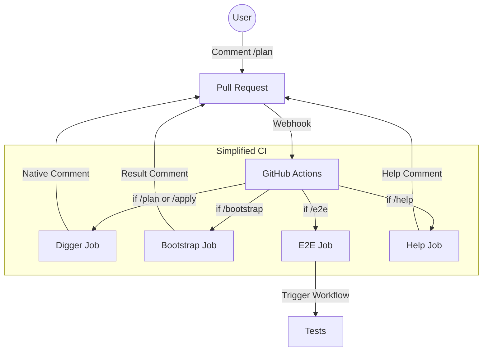

# Pipeline SSOT (运维流水线)

> **SSOT Key**: `ops.pipeline`
> **核心定义**: 基于 Digger 原生功能的简化 GitOps 工作流。

---

## 1. 真理来源 (The Source)

> **原则**：依赖 Digger 原生能力，最小化自定义代码。

本话题的配置和状态由以下物理位置唯一确定：

| 维度 | 物理位置 (SSOT) | 说明 |
|------|----------------|------|
| **Workflow 设计** | [`.github/workflows/DESIGN.md`](../../.github/workflows/DESIGN.md) | 简化架构、Job 职责、命令路由 |
| **CI 入口** | [`.github/workflows/ci.yml`](../../.github/workflows/ci.yml) | 4 个独立 jobs，简单 if 条件 |
| **Bootstrap 脚本** | [`tools/ci/bootstrap.py`](../../tools/ci/bootstrap.py) | L1 层管理（150 lines） |
| **Digger 配置** | [`digger.yml`](../../digger.yml) | Projects 定义、drift detection |

### 重大变更 (2025-12-25)

**删除**：
- Dashboard 系统 (dashboard.py, init.py, update.py, parse.py, run.py)
- 复杂路由逻辑 (parse job → digger/pyci)

**保留**：
- 所有命令 (/plan, /apply, /bootstrap, /e2e, /help)
- 用户体验完全一致

**简化**：
- 从 1609 lines → 291 lines (-82%)
- 使用 Digger 原生评论
- 简单 workflow if 条件

---

## 2. 架构模型

### 关键决策 (Architecture Decision)

- **Dashboard-First**:
    - **每个 commit 一个 Dashboard**：通过 `<!-- infra-dashboard:{sha} -->` marker 标识
    - **原地更新，不刷屏**：所有状态变更更新同一条评论
    - **Everything is Linked**：每个状态都有 workflow run 链接
- **分层执行**:
    - **L1 Bootstrap**: 独立流程（`pyci` job），避免"自己部署自己"的死锁
    - **L2-L4**: 统一由 Digger 编排（`digger` job），支持依赖图 (DAG)

---

## 3. 设计约束 (Dos & Don'ts)

### ✅ 推荐模式 (Whitelist)

- **模式 A**: 日常变更**必须**通过 PR 评论 `/plan` 和 `/apply` 触发。
- **模式 B**: 涉及多层变更时，应等待下层 Apply 成功后再触发上层 Plan。
- **模式 C**: Dashboard 更新必须使用 `dashboard.save()` 或 `python -m ci update`。
- **模式 D**: 可选使用 `/review` 或 `@copilot` 触发 AI code review（手动触发）。

### ⛔ 禁止模式 (Blacklist)

- **反模式 A**: **禁止** 在本地执行 `terraform apply` 更新 L2+ 资源（会导致 State Lock 和审计丢失）。
- **反模式 B**: **禁止** 绕过 CI 直接修改线上资源（Drift 产生源）。
- **反模式 C**: **禁止** 创建新评论更新状态（应更新 Dashboard 评论）。

---

## 4. 标准操作程序 (Playbooks)

### SOP-001: 部署变更 (Standard GitOps)

- **触发条件**: 代码合并前
- **步骤**:
    1. 提交代码，等待 CI 初始化 Dashboard。
    2. 评论 `/plan`，检查 Digger 输出和 Dashboard 状态。
    3. 评论 `/apply`，等待部署成功，Dashboard 显示 ✅。
    4. 合并 PR。

### SOP-002: 触发 E2E 测试

- **触发条件**: 需要验证部署效果
- **步骤**:
    1. 评论 `/e2e` (运行所有 smoke tests)。
    2. 或评论 `/e2e full` (运行完整回归测试)。
    3. 查看 Dashboard 链接的测试报告。

### SOP-003: 紧急回滚

- **触发条件**: 部署导致故障
- **步骤**:
    1. `git revert <commit-id>`。
    2. 提交新 PR。
    3. 快速执行 `/apply` (可跳过详细 Plan 审查)。

### SOP-004: AI Code Review (可选)

- **触发条件**: 需要 AI 辅助审查代码变更
- **步骤**:
    1. 在 PR 评论中输入 `@copilot please review` 或 `/review`。
    2. 等待 GitHub Copilot 分析并回复。
    3. 根据建议修改代码或标记为已阅。
- **注意**:
    - **手动触发**: 不会自动运行，需主动请求。
    - **权限要求**: 需要 Copilot 订阅或组织授权。
    - **Dashboard**: Copilot 原生 review 不会更新 PR Dashboard。
    - **详细指南**: 参见 [`docs/project/active/ai_code_review.md`](../project/active/ai_code_review.md)。

### SOP-005: Dashboard 故障排查

- **症状**: Dashboard 不更新，所有状态 ⏳ pending
- **排查步骤**:
    1. 检查 workflow logs: `gh run view <run-id> --log | grep -i dashboard`
    2. 验证 PR 评论中是否有 marker: `<!-- infra-dashboard:{sha} -->`
    3. 检查 GitHub Token 权限（需要 `issues: write`）
    4. 手动测试：`python -m ci update --pr <num> --stage apply --status success`
- **常见原因**: 参见 [Workflow DESIGN.md 故障排查章节](../../.github/workflows/DESIGN.md#-known-issues--fixes)

---

## 5. 验证与测试 (The Proof)

| 行为描述 | 测试文件 (Test Anchor) | 覆盖率 |
|----------|-----------------------|--------|
| **Dashboard 创建与更新** | Manual test: `python -m ci init/update` | ⚠️ Manual |
| **Pipeline 逻辑验证** | [`tools/ci/tests/test_pipeline_parser.py`](../../tools/ci/tests/test_pipeline_parser.py) | ✅ Unit Test |
| **Digger 集成验证** | [`e2e_regressions/tests/bootstrap/compute/test_digger.py`](../../e2e_regressions/tests/bootstrap/compute/test_digger.py) | ⏳ Pending |

---

## Used by

- [docs/ssot/README.md](./README.md)
- [bootstrap/README.md](../../bootstrap/README.md)
- [.github/workflows/DESIGN.md](../../.github/workflows/DESIGN.md)
