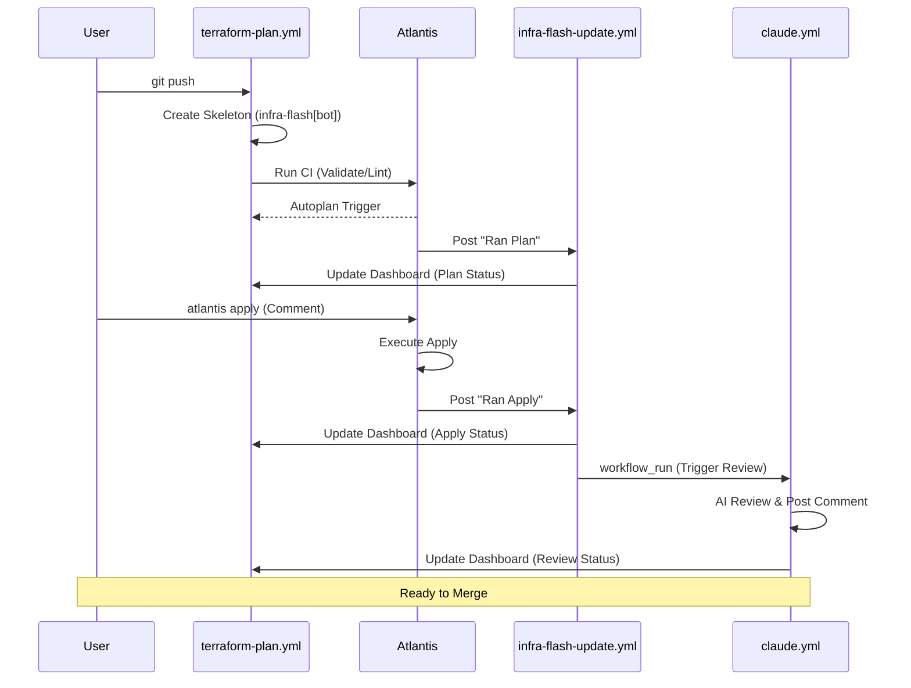

# Pipeline SSOT (运维流水线)

> **核心原则**：所有变更必须可审计。`infra-flash` 评论流是 PR 状态的单一真理来源 (SSOT)。

---

## 1. 核心问题域与解决方案

| 解决的问题 | 实际方案 | 执行位置 | 理由 |
|:---|:---|:---|:---|
| **静态质量** | `fmt`, `lint`, `validate` | GitHub Actions | 快速反馈，不依赖集群环境 |
| **动态预览** | `terraform plan` | Atlantis (Pod) | 必须访问集群内 Vault 和 Backend |
| **AI 护栏** | `@claude review` / 自动 | Claude App (Haiku 4.5) | 文档一致性、IaC 规范、安全审计 |
| **审计合规** | `infra-flash` 评论流 | GHA + Atlantis | 每一笔操作都有 Commit 级别的记录 |
| **环境健康** | `infra dig` | GitHub Actions | 外部视角验证服务连通性 |
| **全量恢复** | `deploy-k3s.yml` | GitHub Actions | 灾备与初始引导 (Bootstrap) |

---

## 2. Dashboard 状态机

Dashboard 是每个 Commit 的 SSOT 看板，状态转换遵循以下规则：

```mermaid
graph TD
    Push[Push Event] --> Create[Create/Lock Skeleton]
    Create --> CI_Wait[CI: ⏳ / Plan: ⏳]
    CI_Wait --> CI_Pass{CI Passed?}
    CI_Pass -- No --> CI_Fail[CI: ❌ / NextStep: Fix]
    CI_Pass -- Yes --> CI_Ok[CI: ✅]
    CI_Ok --> TF_Check{Has TF Changes?}
    TF_Check -- No --> TF_Skip[Plan: ⏭️ / Ready to Merge]
    TF_Check -- Yes --> Plan_Wait[Plan: ⏳ / Wait Atlantis]
    Plan_Wait --> Plan_Result{Plan Success?}
    Plan_Result -- No --> Plan_Fail[Plan: ❌]
    Plan_Result -- Yes --> Plan_Ok[Plan: ✅]
    Plan_Ok --> Apply_Cmd[atlantis apply]
    Apply_Cmd --> Apply_Wait[Apply: ⏳]
    Apply_Wait --> Apply_Result{Apply Success?}
    Apply_Result -- No --> Apply_Fail[Apply: ❌]
    Apply_Result -- Yes --> Apply_Ok[Apply: ✅]
    Apply_Ok --> Review[Auto Review]
    Review --> Final[AI Review: ✅ / Ready to Merge]
```



### 状态图标定义

| 图标 | 含义 | 说明 |
|:---:|:---|:---|
| ⏳ | Pending/Running | 等待中或执行中 |
| ✅ | Success | 成功完成 |
| ❌ | Failed | 执行失败 |
| ⏭️ | Skipped/N/A | 跳过或不适用 |

---

## 3. 时序图：Push 到 Merge 全流程



---

## 4. 运维节点与触发矩阵

我们将流程分为 **自动 (Push)** 和 **指令 (Comment)** 两个平面。

### A. 自动平面 (Push Trigger)

每当代码推送到 PR 分支，系统自动启动以下检查：

1. **Skeleton (骨架)**: `terraform-plan.yml` 立即创建或锁定一个 `infra-flash` 评论。
2. **Static (静态)**: 同上，执行 `validate` 并更新评论中的 CI 表格。
3. **Autoplan**: Atlantis 监听到 push，自动执行 `plan`，由 `infra-flash-update.yml` 将结果追加到评论。
4. **Post-Apply Review**: `claude-code-review.yml` 在 `atlantis apply` 成功后自动触发，Claude 审查已部署的变更。

### B. 指令平面 (Comment Trigger)

通过在 PR 下发表评论手动触发：

| 命令 | 作用 | 触发时机 | 反馈位置 |
|:---|:---|:---|:---|
| `atlantis plan` | 重新生成 Plan | 自动 Plan 失败或需要刷新时 | `infra-flash` 追加 |
| `atlantis apply` | 执行部署 | **必须**在 Plan 成功后 | `infra-flash` 追加 |
| `@claude review this` | 手动触发 AI 审计 | 随时，或针对特定问题时 | 新评论回复 |
| `@claude <指令>` | Claude 执行任务 | 需要 AI 协助时 | 新评论回复 |
| `infra dig` | 探测环境连通性 | 部署后验证或故障排错 | `infra-flash` 追加 |
| `infra help` | 获取指令帮助 | 任何时候 | 新评论回复 |

---

## 5. Dashboard Schema

每个 `infra-flash` 评论遵循以下结构：

```markdown
<!-- infra-flash-commit:{7位SHA} -->
## ⚡ Commit `{SHA}` Dashboard

| Component | Status | Info/Link | Time |
|:---|:---:|:---|:---|
| **Static CI** | {⏳/✅/❌} | [View Run]({url}) | {HH:MM UTC} |
| **AI Review** | {⏳/✅/⏭️} | {Pending/link} | {time} |
| **Infra Plan** | {⏳/✅/❌/⏭️} | {status/link} | {time} |
| **Infra Apply** | {⏳/✅/❌/⏭️} | {status/link} | {time} |
| **Health Check** | {⏳/✅/⏭️} | {status/link} | {time} |

---
<!-- claude-review-placeholder -->

---
### 🚀 Atlantis Actions
<!-- atlantis-actions -->
| Action | Commit | Trigger | Status | Output | Time |
|:-------|:-------|:--------|:------:|:-------|:-----|
{追加的action记录}
<!-- /atlantis-actions -->

<!-- health-check-placeholder -->

---
<details><summary>📖 Available Infra Commands</summary>

| Command | Description |
|:---|:---|
| `infra dig` | Run connectivity tests |
| `infra help` | Show this help |
| `atlantis plan` | Force a new terraform plan |
| `atlantis apply` | Apply the current plan |
</details>

---
👉 **Recommended Next Step:** {下一步建议}
```

### Marker 规范

| Marker | 用途 | 更新者 |
|:---|:---|:---|
| `<!-- infra-flash-commit:{sha} -->` | Dashboard 锁定标识 | terraform-plan.yml |
| `<!-- claude-review-placeholder -->` | AI Review 插入点 | claude.yml |
| `<!-- atlantis-actions -->` | Atlantis 记录表格区域 | infra-flash-update.yml |
| `<!-- health-check-placeholder -->` | Health Check 插入点 | infra-commands.yml |

---

## 6. SLA 与超时预期

| 阶段 | 正常耗时 | 超时阈值 | 超时处理 |
|:---|:---|:---|:---|
| Skeleton 创建 | <10s | 30s | 检查 GHA runner 状态 |
| CI Validate | 30-60s | 2min | 检查 TFLint/Validate 死循环 |
| Atlantis Plan | 1-3min | 5min | 检查 Atlantis Pod 日志 |
| Atlantis Apply | 2-5min | 10min | 检查资源创建阻塞点 |
| Claude Review | 30-60s | 2min | 检查 OAuth Token 有效性 |
| Health Check | 10-30s | 1min | 检查网络连通性 |

---

## 7. 并发与竞态处理

### 快速连续 Push
- **策略**: 使用 `concurrency` 取消旧的 CI run。
- **配置**: `concurrency: { group: terraform-${{ pr_number }}-${{ sha }}, cancel-in-progress: true }`。
- **结果**: 只有最新 commit 的 Dashboard 会被更新。

### 同一 Commit 多次触发
- **幂等性**: 如果 marker 已存在，复用现有评论而非创建新评论。

### Atlantis 队列
- **内置串行**: Atlantis 对同一 workspace 的 plan/apply 串行执行。
- **锁机制**: apply 期间会锁定 workspace，阻止其他 plan。

---

## 8. 回滚策略

### Apply 失败场景

| 场景 | 症状 | 回滚方式 | 命令 |
|:---|:---|:---|:---|
| Apply 中断（部分成功） | 部分资源已创建 | terraform import | `terraform import <resource> <id>` |
| Apply 完成但服务异常 | HTTP 5xx/无响应 | git revert + apply | `git revert HEAD && atlantis apply` |
| 配置错误需紧急回滚 | 服务不可用 | 手动 kubectl | 联系 on-call，参考 L1 README |
| State 损坏 | plan 报 inconsistent | State 修复 | `terraform state rm` + `import` |

### 回滚决策树

```
Apply 失败了?
├── 部分资源创建成功?
│   ├── 是 → terraform import 补齐 state → 重新 apply
│   └── 否 → 修复代码 → 重新 push
├── 服务已部署但异常?
│   ├── 配置问题 → git revert → atlantis apply
│   └── 资源问题 → kubectl describe → 手动修复
└── State 不一致?
    └── terraform state rm → terraform import → apply
```

---

## 9. Troubleshooting 决策树

```
Dashboard 显示异常?
│
├── CI 一直 ⏳?
│   ├── 检查 Actions tab → workflow 是否触发?
│   │   ├── 没触发 → 检查 paths 过滤器
│   │   └── 触发了 → 查看 job 日志
│   └── runner 排队 → 等待或检查 runner 状态
│
├── Plan 一直 ⏳?
│   ├── 检查 Atlantis Pod → kubectl logs -n platform atlantis-0
│   │   ├── Vault 401 → Token 过期 → 重启 Atlantis Pod
│   │   ├── Backend 403 → R2 权限 → 检查 Secrets
│   │   └── 无日志 → Webhook 未收到 → 检查 GitHub App 配置
│   └── 没有 TF 文件变化 → 正常，应显示 ⏭️
│
├── Apply 失败?
│   ├── 资源已存在 → terraform import
│   ├── 权限不足 → 检查 ServiceAccount
│   ├── 资源配额 → 清理或扩容
│   └── 依赖缺失 → 检查 depends_on
│
├── @claude 无响应?
│   ├── 检查 claude.yml 是否在 main 分支
│   ├── 检查 CLAUDE_CODE_OAUTH_TOKEN secret
│   └── 查看 Actions 日志
│
├── infra dig 无响应?
│   ├── 检查 infra-commands.yml 语法
│   ├── 检查评论是否包含 "infra"
│   └── 查看 Actions 日志
│
└── 评论没更新?
    ├── 检查 workflow 是否成功执行
    ├── 检查 app_token 权限 (issues:write, pull-requests:write)
    └── 检查 marker 是否匹配 (commit SHA)
```

---

## 10. 守卫节点与准入标准 (Guards & Admission)

为了确保流水线的健壮性，执行过程中嵌入了多个“守卫”节点。

| 守卫名称 | 职责 | 规范来源 | 强制位置 |
|:---|:---|:---|:---|
| **Variable Guard** | 校验变量是否已在 1P 映射 | [AGENTS.md](../../AGENTS.md#3-secret--variable-pipeline-the-variable-chain) | `terraform-plan.yml` |
| **Doc Guard** | 强制更新文档与 `check_now` | [AGENTS.md](../../AGENTS.md#原则) | `infra review` (AI) |
| **Identity Guard** | 统一 `infra-flash` 发件身份 | [ops.standards.md](./ops.standards.md) | 所有 `*.yml` |
| **Admission Guard** | 检查组件是否符合健康检查标准 | [ops.standards.md](./ops.standards.md) | `terraform validate` |

---

## 11. 关键工作流清单 (Workflows)

| 文件 | 身份 | 职责 | 触发器 |
|:---|:---|:---|:---|
| `terraform-plan.yml` | `infra-flash[bot]` | 静态 CI + 骨架评论创建 + CI 结果更新 | `pull_request` |
| `infra-commands.yml` | `infra-flash[bot]` | 指令分发器 (`dig`, `help`) | `issue_comment` |
| `infra-flash-update.yml` | `infra-flash[bot]` | 监听并搬运 Atlantis 的输出到主评论 | `issue_comment` |
| `claude.yml` | `claude[bot]` | 响应 @claude 评论，执行 AI 任务 | `issue_comment` |
| `claude-code-review.yml` | `claude[bot]` | Apply 成功后自动审查部署变更 | `workflow_run` |
| `deploy-k3s.yml` | `github-actions` | 灾备平面：全量 L1-L4 Flash | `push` to main |

---

## 12. 验收准则与测试场景 (UAT)

| 场景 | 操作 | 预期 Dashboard 行为 | 预期 Identity |
|:---|:---|:---|:---|
| **CI 守卫测试** | 推送包含格式错误的代码 | `Static CI` 显示 ❌，NextStep 显示修复建议 | `infra-flash[bot]` |
| **CI 通过测试** | 推送正确代码 | `Static CI` 显示 ✅ | `infra-flash[bot]` |
| **无 TF 变化测试** | 推送仅 .md/.yml 变化 | `Plan/Apply` 显示 ⏭️ | `infra-flash[bot]` |
| **手动 AI 审计** | 评论 `@claude review this` | 产生新评论包含审查建议 | `claude[bot]` |
| **Apply 后审计** | `atlantis apply` 成功 | `claude-code-review.yml` 触发 | `claude[bot]` |
| **指令分发测试** | 评论 `infra help` | 产生新评论，列出所有指令 | `infra-flash[bot]` |
| **环境探测测试** | 评论 `infra dig` | `Health Check` 状态更新 | `infra-flash[bot]` |

---

## 13. 版本要求

| 组件 | 最低版本 | 原因 |
|:---|:---|:---|
| Atlantis | 0.28+ | 支持 GitHub App 身份 |
| actions/github-script | v7 | 支持 paginate API |
| anthropics/claude-code-action | v1 | Claude GitHub App |

---

## 14. 实现状态与 TODO

### 当前实现状态 (2025-12)

| 能力 | 理想态 | 当前状态 | Drift |
|:---|:---|:---:|:---|
| Dashboard 创建 | 每次 push 自动创建 | ✅ | - |
| CI 状态回写 | 更新 Static CI 行 | ✅ | - |
| 无 TF 变化处理 | Plan/Apply 显示 ⏭️ | ✅ | - |
| NextStep 提示 | 根据状态显示建议 | ✅ | - |
| 评论身份 | infra-flash[bot] | ✅ | - |
| Atlantis Plan 回写 | 更新 Infra Plan 行 | ✅ | 已通过 `infra-flash-update.yml` 实现 |
| Atlantis Apply 回写 | 更新 Infra Apply 行 | ✅ | 已通过 `infra-flash-update.yml` 实现 |
| @claude 手动触发 | 响应评论执行任务 | ✅ | 已实现，但未回写 Dashboard |
| infra dig | 更新 Health Check | ✅ | 已实现，但需在 main 生效 |
| Claude 自动 review | apply 后自动触发 | ✅ | 已通过 `claude-code-review.yml` 实现，但未回写 Dashboard |
| AI Review 回写 Dashboard | 更新 AI Review 行 | ❌ | **Drift**: 尚未实现状态回写 |

### TODO Backlog

#### P0 - 合并后立即测试

- [ ] **合并 PR #287** 到 main，使所有 workflow 生效
- [ ] **测试 @claude 命令**: 在 PR 中评论 `@claude hello`
- [ ] **测试 infra dig**: 在 PR 中评论 `infra dig`
- [ ] **测试 infra help**: 在 PR 中评论 `infra help`

#### P1 - 功能完善

- [ ] **AI Review 回写 Dashboard**: 
    - [ ] 在 `claude.yml` 中添加回写 Dashboard 的步骤
    - [ ] 在 `claude-code-review.yml` 中添加回写 Dashboard 的步骤
- [ ] **验证 Atlantis Plan/Apply 回写**: 在实际 PR 中验证 `infra-flash-update.yml` 的 marker 匹配准确性

#### P2 - 健壮性增强

- [ ] **错误处理**: workflow 失败时应在 Dashboard 显示明确错误信息
- [ ] **超时处理**: 各阶段超时后应自动标记为 ❌ 并提示
- [ ] **Marker 校验**: 优化 SHA 匹配逻辑，支持多种 SHA 长度

#### P3 - 可观测性

- [ ] **文档-代码同步检查**: CI 检查 workflow 变更是否同步更新了本 SSOT

*Last Updated: 2025-12-19*
