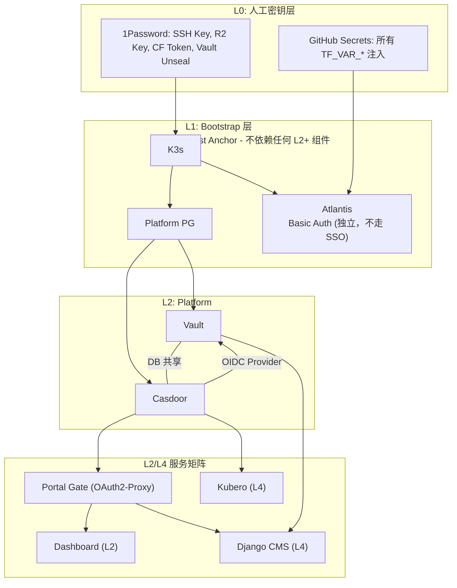

# 故障恢复 SSOT

> **核心问题**：出问题了怎么恢复？

---

## 组件依赖拓扑图



---

## SSO 认证路径 (分治策略)

| 组件 | 日常认证 | 紧急绕过 | 备注 |
|------|----------|----------|------|
| **Atlantis** | Basic Auth | 本地 TF apply | L1 不走 SSO |
| **Vault UI** | Casdoor OIDC (原生) | Root Token (CLI) | 双认证路径 |
| **Dashboard** | Portal Gate → Casdoor | kubectl proxy | ForwardAuth |
| **Kubero** | Casdoor OIDC (原生) | - | 业务应用 |
| **Django CMS** | Portal Gate → Casdoor | API Token (JWT) | ForwardAuth |

---

## 单点故障分析

| 组件挂掉 | 直接影响 | 间接影响 | 恢复难度 |
|----------|----------|----------|----------|
| **Platform PG** | Vault/Casdoor 不可用 | 所有 L2+ SSO | 需要 L1 apply + 备份恢复 |
| **Vault** | 密钥注入失败 | L3/L4 新 Pod 启动 | Unseal Keys (1Password) |
| **Casdoor** | SSO 登录失败 | Vault OIDC / Portal Gate | Vault Root Token 绕过 |
| **Portal Gate** | Dashboard 登录失败 | - | kubectl proxy 或重启 |
| **Atlantis** | CI/CD 失败 | L2+ 无法 apply | 本地 terraform apply |

---

## 死锁风险分析

### 场景 1: Casdoor 挂了

```
问题: Casdoor 挂了，需要登录 Vault 获取配置来修复
      但 Vault OIDC 依赖 Casdoor...

解法:
  1. 从 1Password 获取 Vault Root Token
  2. 用 CLI 登录: vault login <root_token>
  3. 获取配置/密钥
  4. 修复 Casdoor

结论: 无死锁 (Root Token 绕过)
```

### 场景 2: Platform PG 挂了

```
问题: Platform PG 挂了，Vault 和 Casdoor 都挂了
      需要恢复 PG，但 Atlantis 需要 apply L1...

解法:
  1. Atlantis 不依赖 PG (Basic Auth)
  2. GitHub Secret 注入 TF_VAR_vault_postgres_password
  3. atlantis apply 或本地 terraform apply
  4. PG 恢复后 Vault/Casdoor 自动恢复

结论: 无死锁 (L1 独立于 L2)
```

### 场景 3: Vault 挂了

```
问题: Vault 挂了，L3/L4 应用无法获取密钥

解法:
  1. kubectl exec vault-0 -- vault operator unseal
  2. 使用 1Password 中的 Unseal Keys
  3. 或: 如果 PG 数据在，Pod 重启后自动恢复

结论: 无死锁 (Unseal Keys 在 1Password)
```

### 场景 4: Atlantis 挂了

```
问题: Atlantis 挂了，无法做 terraform apply

解法:
  方式A: 本地 terraform apply (有 1Password 根密钥)
  方式B: GitHub Actions deploy-k3s.yml (push to main)

结论: 无死锁 (Basic Auth + 多恢复路径)
```

### 场景 5: 全部 L2 挂了 (PG 数据丢失)

```
最坏情况恢复:
  1. 从 VPS /data 恢复 PG 备份 (pg_dump)
  2. L1 terraform apply (重建 PG)
  3. kubectl exec vault-0 -- vault operator init (重新初始化)
  4. 用新 Unseal Keys 解封
  5. Casdoor 自动重建 (init_data.json)

需要的密钥 (全在 1Password):
  - VPS SSH Key
  - R2 Access Key
  - Cloudflare Token
  - GitHub App Key

结论: 无死锁 (1Password 恢复一切)
```

---

## 紧急恢复路径矩阵

| 故障组件 | 紧急绕过方式 | 所需密钥 | 密钥来源 |
|----------|--------------|----------|----------|
| **Casdoor** | Vault Root Token (CLI) | `VAULT_ROOT_TOKEN` | 1Password |
| **Vault** | Unseal Keys | `VAULT_UNSEAL_KEYS` | 1Password |
| **Portal Gate** | kubectl port-forward | kubeconfig | 1Password |
| **Dashboard** | kubectl proxy | kubeconfig | 1Password |
| **Atlantis** | 本地 terraform apply | 所有根密钥 | 1Password |
| **Platform PG** | L1 apply + pg restore | SSH Key + PG备份 | 1Password + VPS |

---

## Secrets 恢复

### 从 1Password 恢复 GitHub Secret

```bash
# 示例：恢复 VAULT_POSTGRES_PASSWORD
gh secret set VAULT_POSTGRES_PASSWORD \
  --body "$(op item get 'PostgreSQL (Platform)' --vault my_cloud --fields VAULT_POSTGRES_PASSWORD --reveal)"

# 示例：恢复 VPS_SSH_KEY
gh secret set VPS_SSH_KEY \
  --body "$(op item get 'VPS SSH' --vault my_cloud --fields VPS_SSH_KEY --reveal)"
```

### 批量恢复（灾难恢复）

```bash
# Cloudflare
for f in BASE_DOMAIN CLOUDFLARE_ZONE_ID INTERNAL_DOMAIN INTERNAL_ZONE_ID CLOUDFLARE_API_TOKEN; do
  gh secret set $f --body "$(op item get 'Cloudflare API' --vault my_cloud --fields $f --reveal)"
done

# R2/AWS
for f in R2_BUCKET R2_ACCOUNT_ID AWS_ACCESS_KEY_ID AWS_SECRET_ACCESS_KEY; do
  gh secret set $f --body "$(op item get 'R2 Backend (AWS)' --vault my_cloud --fields $f --reveal)"
done
```

---

## Vault 恢复

### Vault Token 过期

```bash
# 1. 获取新 token
op read 'op://Infrastructure/Vault Root Token/credential'

# 2. 更新 GitHub Secret
gh secret set VAULT_ROOT_TOKEN --body "<token>" --repo wangzitian0/infra

# 3. Apply L1 (更新 Atlantis Pod)
cd 1.bootstrap
terraform apply

# 4. 重试 Atlantis plan
# 在 PR 评论: atlantis plan（或 push 触发 autoplan）
```

### Vault Sealed (需要 Unseal)

```bash
# 1. 获取 Unseal Keys
op item get 'Vault Unseal Keys' --vault my_cloud --reveal

# 2. 解封 (需要 3 个 key)
kubectl exec -n platform vault-0 -- vault operator unseal <key1>
kubectl exec -n platform vault-0 -- vault operator unseal <key2>
kubectl exec -n platform vault-0 -- vault operator unseal <key3>

# 3. 验证状态
kubectl exec -n platform vault-0 -- vault status
```

### Vault 完全重建 (PG 数据丢失)

```bash
# 1. 恢复 Platform PG
cd 1.bootstrap && terraform apply

# 2. 等待 Vault Pod 启动
kubectl wait --for=condition=Ready pod/vault-0 -n platform --timeout=300s

# 3. 初始化 Vault
kubectl exec -n platform vault-0 -- vault operator init

# 4. 保存新的 Unseal Keys 和 Root Token 到 1Password！

# 5. 解封
kubectl exec -n platform vault-0 -- vault operator unseal <key1>
kubectl exec -n platform vault-0 -- vault operator unseal <key2>
kubectl exec -n platform vault-0 -- vault operator unseal <key3>

# 6. 更新 GitHub Secret
gh secret set VAULT_ROOT_TOKEN --body "<new_root_token>"
```

---

## Casdoor 恢复

### Casdoor 登录后显示原生界面 (双重认证问题)

```
问题: SSO 登录成功后，应用又显示原生登录界面

原因: Portal Gate (OAuth2-Proxy) 和应用原生 OIDC 同时启用

解决方案 (分治策略):
  1. Vault: 只用原生 OIDC，移除 ForwardAuth
  2. Dashboard: 用 Portal Gate (不支持原生 OIDC)
  3. Kubero: 用原生 OIDC
```

### Casdoor 白屏

```
原因: signupItems=null 触发 AgreementModal 报错

解决: 确保 signupItems=[] (空数组，不是 null)

验证:
  curl -s "https://sso.zitian.party/api/get-application?id=admin/portal-gate" | jq '.signupItems'
  # 应返回 []
```

---

## Platform PG 恢复

### 从备份恢复

```bash
# 1. SSH 到 VPS
ssh -i ~/.ssh/vps_key user@vps_host

# 2. 检查备份
ls -la /data/backup/

# 3. 恢复数据库
kubectl exec -i -n platform postgresql-0 -- \
  psql -U postgres < /data/backup/vault.sql

kubectl exec -i -n platform postgresql-0 -- \
  psql -U postgres < /data/backup/casdoor.sql
```

### 定期备份脚本 (建议添加到 CronJob)

```bash
#!/bin/bash
# /data/scripts/pg_backup.sh

DATE=$(date +%Y%m%d_%H%M%S)
BACKUP_DIR=/data/backup

# Vault 数据库
kubectl exec -n platform postgresql-0 -- \
  pg_dump -U postgres vault > ${BACKUP_DIR}/vault_${DATE}.sql

# Casdoor 数据库
kubectl exec -n platform postgresql-0 -- \
  pg_dump -U postgres casdoor > ${BACKUP_DIR}/casdoor_${DATE}.sql

# 保留最近 7 天
find ${BACKUP_DIR} -name "*.sql" -mtime +7 -delete

echo "Backup completed: ${DATE}"
```

---

## State Lock

```bash
# PR 评论
atlantis unlock
atlantis plan
```

---

## Provider 版本不匹配

```bash
terraform init -upgrade
terraform providers lock \
  -platform=linux_amd64 \
  -platform=darwin_amd64 \
  -platform=darwin_arm64
git add .terraform.lock.hcl
git commit -m "chore: update provider lock"
git push
```

---

## PVC 误删恢复

| 场景 | 恢复步骤 |
|------|----------|
| PVC 误删 | PV 仍保留（Retain）→ 重新绑定 PVC |
| VPS /data 丢失 | 从 R2 备份恢复 → 重新 apply Helm |
| 单机容量不足 | 扩容 PVC 或拆分到独立 VPS |

---

## 快速诊断命令

```bash
# 检查所有 platform 组件状态
kubectl get pods -n platform

# 检查 Vault 状态
kubectl exec -n platform vault-0 -- vault status

# 检查 Casdoor 日志
kubectl logs -n platform -l app.kubernetes.io/name=casdoor --tail=50

# 检查 PostgreSQL 连接
kubectl exec -n platform postgresql-0 -- psql -U postgres -c '\l'

# 检查 Portal Gate 状态
kubectl get pods -n platform -l app.kubernetes.io/name=oauth2-proxy

# 检查 Ingress 配置
kubectl get ingress -n platform
```

---

## 设计保证总结

| 设计原则 | 实现 | 死锁风险 |
|----------|------|----------|
| L1 独立于 L2 | Atlantis Basic Auth + GitHub Secrets | 无 |
| Vault 双认证 | 日常 OIDC + 紧急 Root Token | 无 |
| 1Password Trust Anchor | 所有根密钥可从零重建 | 无 |
| 每组件有绕过路径 | CLI/kubectl/本地 apply | 无 |

**唯一风险点**: Platform PG 数据丢失 → 建议定期 `pg_dump` 备份到 VPS `/data`

---

## Used by

- [docs/ssot/ops.pipeline.md](./ops.pipeline.md)
- [docs/project/BRN-008.md](../project/BRN-008.md)
