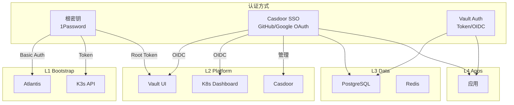

# 认证与授权 SSOT

> **一句话**：L1 使用根密钥，L2 支持根密钥+SSO 双认证，L3/L4 完全走 Vault+SSO。

## 分层认证架构



---

## 层级认证策略

| 层级 | 服务 | 认证方式 | 说明 |
|------|------|----------|------|
| **L1** | Atlantis | 根密钥 (Basic Auth) | 不能依赖 L2 SSO (循环依赖) |
| **L1** | K3s API | 根密钥 (Token) | 系统级 |
| **L2** | Vault | 根密钥 (Root Token) + SSO (OIDC) | **双认证** - 灾难恢复 |
| **L2** | Dashboard | 根密钥 + SSO (OIDC) | **双认证** - 运维需要 |
| **L2** | Casdoor | 根密钥 (admin 密码) | SSO 入口本身 |
| **L3** | PostgreSQL | Vault 动态凭据 | 业务 DB |
| **L3** | Redis | Vault 动态凭据 | 业务缓存 |
| **L4** | Apps | Vault + SSO | 业务层完全依赖平台认证 |

---

## 门户级统一 SSO（Casdoor）

L2 门户级服务正在按照 BRN-008 的设计，逐步迁移到 Casdoor 提供的统一登录入口，减少各自的 Token 配置并提升运维一致性。

| 服务 | 域名 | SSO 形态 | 当前状态 |
|------|------|-----------|----------|
| Vault UI | `https://secrets.<internal_domain>` | Casdoor OIDC 客户端（`vault-oidc`）+ Vault OIDC 提供者 | ⏳ OIDC 客户端已创建；Vault 侧 OIDC 依赖 `enable_portal_sso_gate` apply |
| Kubernetes Dashboard | `https://kdashboard.<internal_domain>` | Traefik forward-auth 指向 Casdoor（Dashboard 依旧靠 token 登录） | ⏳ Portal Gate 未部署（无 `portal-auth`） |
| Kubero UI | `https://kcloud.<internal_domain>` | Casdoor OAuth2 客户端（`kubero-oidc`） | ⏳ OIDC 客户端已创建；Portal Gate 未部署 |
| Atlantis Web | `https://atlantis.<internal_domain>` | Basic Auth（继续当前机制） | ✅ 保持手动管理 |

---

### 宏观进度（统一登录入口）

#### 最终态标准
- **统一入口**：应用访问统一跳转到 Casdoor 登录页，同一页显示 **密码 + GitHub**。
- **统一规则**：原生 OIDC 的应用直接对接 Casdoor；不支持 OIDC 的应用统一走 Portal Gate（OAuth2-Proxy + Traefik forwardAuth）。
- **域名策略**：业务应用域名不变，仅使用 `sso.<internal_domain>` + `auth.<internal_domain>` 作为登录/回调入口。

#### 当前快照（2025-12-19）
- **Casdoor 已部署**：`sso.<internal_domain>` 可访问，GitHub Provider 已存在。
- **OIDC 应用已创建**：`portal-gate` / `vault-oidc` / `dashboard-oidc` / `kubero-oidc` 已写入 Casdoor DB。
- **Portal Gate 未部署**：集群无 `portal-auth`，应用未进入 SSO 跳转。
- **登录页白屏**：`portal-gate.signupItems=null` 触发 `AgreementModal` 报错（JS `Cannot read properties of null (find)`）。
- **登录页不符合预期**：应用 `enablePassword=false` 且 providers `owner` 为空，无法同时展示“密码 + GitHub”。
- **登录报错**：`unknown application TokenFormat:`（Casdoor v1.570.0 未显式设置 `tokenFormat` 时会直接报错）。
- **登录回调失败**：OAuth2-Proxy 报 `id_token is expired`（应用 `expireInHours/refreshExpireInHours` 被写成 0）。

#### 阻断点
- `enable_portal_sso_gate` 未启用/未 apply → Portal Gate 与应用级 SSO 不生效。
- Casdoor 应用未打开密码登录、provider 绑定不完整 → 登录页缺少“密码 + GitHub”并存。
- `signupItems=null` → 登录页渲染异常（AgreementModal 依赖 `signupItems`）。
- `tokenFormat` 为空 → Casdoor v1.570.0 发 Token 时直接抛错（`unknown application TokenFormat`）。
- `expireInHours/refreshExpireInHours=0` → OAuth2-Proxy 校验 `id_token` 立刻过期。

> TODO(platform.auth): 启用 `enable_portal_sso_gate=true` 并 apply，部署 OAuth2-Proxy + Traefik middleware。
> TODO(platform.auth): 更新 Casdoor 应用默认值（`enablePassword=true`，`signupItems=[]`，补齐 `signinMethods/signinItems`，providers `owner=admin`），再 apply 同步。
> TODO(platform.auth): 显式设置 `tokenFormat=JWT` 并 apply，解除 Casdoor v1.570.0 的 TokenFormat 报错。
> TODO(platform.auth): 设置 `expireInHours=168`、`refreshExpireInHours=168` 并 apply，修复 `id_token is expired`。
> TODO(platform.auth): 验证 `secrets/kdashboard/kcloud` 访问链路 302 → Casdoor 登录 → GitHub/Password → 回跳成功。

### 实施路径

1. **前置填写**：准备 GitHub OAuth 与 Casdoor Admin 密码，保持 `enable_portal_sso_gate=false` 先落 Casdoor，避免锁死。
2. **自动化执行**：在 2.platform 设置变量后 `terraform init && terraform apply`。开关置 `true` 时：
   - 自动创建 Casdoor 应用（Portal/Vault/Dashboard/Kubero）
   - 生成 client secret（未手填时）
   - 部署 OAuth2-Proxy 并挂 Traefik ForwardAuth
3. **事后验证/切流**：依次验证 `secrets/kdashboard/kcloud` 登录链路。若异常可关回 `false` 并重跑 apply，避免锁死。

这一部分的更多细节参考 BRN-008 中的“场景 5：所有 Portal 走 Casdoor”。

---

## 根密钥管理

| 服务 | 根密钥位置 | GitHub Secret | 用途 |
|------|-----------|---------------|------|
| Atlantis | 1Password `Atlantis` | `ATLANTIS_WEB_PASSWORD` | Web 登录 |
| K3s | kubeconfig 文件 | *(CI 生成)* | kubectl |
| Vault | 1Password `Vault (zitian.party)` | `VAULT_UNSEAL_KEY` | 解封/Root 登录 |
| Casdoor | 1Password `Casdoor Admin` | *(代码中)* | 管理登录 |

---

## SSO (Casdoor) 配置

### Identity Providers

GitHub Provider 和 OIDC 应用现在通过 Terraform REST API 自动配置。

> **技术细节 (白盒化)**: 为了解决 Casdoor API 在 Query Parameter 中拼接 ID 导致的 500 Panic，我们使用了 `read_path = "/get-provider?id=admin/{id}"`。这里的 `{id}` 占位符确保了 ID 被正确注入到参数中而非追加到路径末尾。

| Provider | 用途 | 状态 |
|----------|------|------|
| GitHub | 开发者登录 | ✅ REST API 自动配置 |
| Google | 备用登录 | ⏳ 待配置 |

### OIDC Clients (通过 REST API 自动管理)

> OIDC 应用现在通过 `90.casdoor-apps.tf` 中的 REST API 自动创建/更新，无需手动操作。

| 应用 | Client ID | Redirect URI | 管理方式 |
|------|-----------|--------------|----------|
| Portal Gate | `portal-gate` | `https://auth.<internal_domain>/oauth2/callback` | REST API |
| Vault | `vault-oidc` | `https://secrets.<internal_domain>/ui/vault/auth/oidc/oidc/callback` | REST API |
| Dashboard | `dashboard-oidc` | `https://kdashboard.<internal_domain>/oauth2/callback` | REST API |
| Kubero | `kubero-oidc` | `https://kcloud.<internal_domain>/auth/callback` | REST API |

---

## 验证与健康检查

为了确保 SSO 链路的稳定性，我们在部署流程中引入了 **“白盒化健康检查”**：
1. **强制冷静期**：在 Ingress 创建后增加 `time_sleep` (60s)，确保 DNS 传播。
2. **可视化路径**：使用 `terraform_data` 显式输出检查的目标 URL（如 `https://auth.zitian.party/ping`），在 Atlantis Plan 阶段即可预览诊断路径。
3. **状态回显**：在 `sso_e2e_status` output 中包含 `target_url`，方便排查 Ingress 404 或证书错误。

---

## 认证凭据存储对照

| 凭据类型 | 存储位置 | 访问方式 |
|----------|----------|----------|
| 根密钥 | 1Password | `op` CLI 本地 |
| CI 密钥 | GitHub Secrets | `${{ secrets.* }}` |
| 运行时密钥 | Vault | Kubernetes SA |
| 用户凭据 | Casdoor DB | OIDC Token |

---

## 密钥策略（1Password Zero 依赖 / Vault-first）

- **目标一：1Password 仅存储根密钥**（Atlantis 管理密码、Vault Root Token、Casdoor Admin 密码等），作为离线恢复点，日常操作尽量不直接依赖 `op`。
- **目标二：其他凭据均由 Vault/Terraform 生成、动态注入或同步到 Vault，Casdoor client secret、Webhook Token、业务 token 等都有 Vault 副本，保持“Vault-first”。
- 若某密钥必须同时存于 1Password 与 Vault，则让 Vault 成为 SSOT，1Password 仅做备份（“Vault-first, 1Password fallback”），明确区分“1Password 0 依赖”和“Vault 作为自动源”两条路径。

---

## 实施状态

| 组件 | 状态 |
|------|------|
| Casdoor 部署 | ✅ 已部署 (sso.zitian.party) |
| GitHub OAuth | ✅ REST API 自动配置 (`90.casdoor-apps.tf`) |
| Vault OIDC | ⏳ Casdoor 应用已创建；Vault 侧 OIDC 待启用 |
| Dashboard OIDC | ⏳ Casdoor 应用已创建；Portal Gate 未部署 |
| Kubero OIDC | ⏳ Casdoor 应用已创建；Portal Gate 未部署 |
| Vault 策略/角色 | ✅ 已通过 Terraform 自动化 (`92.vault-kubero.tf`) |
| 自动导入机制 | ✅ REST API 自动同步 |
| OAuth2-Proxy | ⏳ 未部署（`enable_portal_sso_gate=false`） |

---

## 相关文件

- [platform.secrets.md](./platform.secrets.md) - 密钥管理 SSOT
- [5.casdoor.tf](../../2.platform/5.casdoor.tf) - Casdoor Helm release + Bootstrap
- [90.casdoor-apps.tf](../../2.platform/90.casdoor-apps.tf) - OIDC 应用 (local-exec API)
- [91.vault-auth.tf](../../2.platform/91.vault-auth.tf) - Vault OIDC 配置
- [92.portal-auth.tf](../../2.platform/92.portal-auth.tf) - Portal Gate (OAuth2-Proxy + Traefik)
- [2.secret.tf](../../2.platform/2.secret.tf) - Vault 配置

---

## 验证 SSO 配置

### 检查 OIDC Discovery

```bash
curl -s https://sso.zitian.party/.well-known/openid-configuration | jq .issuer
# 预期输出: "https://sso.zitian.party"
```

### 检查 GitHub Provider

```bash
# 需要 Casdoor admin 密码
PASSWORD=$(terraform -chdir=2.platform output -raw casdoor_admin_password)
curl -s "https://sso.zitian.party/api/get-provider?id=admin/GitHub" \
  -H "Authorization: Basic $(echo -n "casdoor-builtin-app:$PASSWORD" | base64)" | jq .name
# 预期输出: "GitHub"
```

### 检查 Portal Gate 应用

```bash
curl -s "https://sso.zitian.party/api/get-application?id=admin/portal-gate" \
  -H "Authorization: Basic $(echo -n "casdoor-builtin-app:$PASSWORD" | base64)" | jq '.providers[].name'
# 预期输出: "GitHub"
```

---
