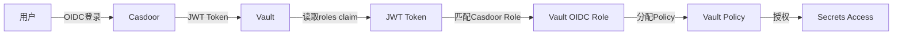

# 认证与授权 SSOT

> **一句话**：L1 保持独立根密钥，L2/L4 原生 OIDC 直连，Portal Gate 仅用于不支持 OIDC 的应用（避免双重认证），根密钥作为故障恢复通道。

## 分层认证架构

```mermaid
graph TD
    subgraph "认证方式"
        ROOT[根密钥<br/>1Password]
        SSO[Casdoor SSO<br/>GitHub/Password]
        VAULT_AUTH[Vault Auth<br/>Token/OIDC]
        GATE[Portal Gate<br/>OAuth2-Proxy + ForwardAuth]
    end

    subgraph "L1 Bootstrap"
        L1_ATLANTIS[Atlantis]
        L1_K3S[K3s API]
    end

    subgraph "L2 Platform"
        L2_VAULT[Vault UI (OIDC)]
        L2_DASH[K8s Dashboard (no OIDC)]
        L2_CASDOOR[Casdoor]
    end

    subgraph "L3 Data"
        L3_PG[PostgreSQL]
        L3_REDIS[Redis]
    end

    subgraph "L4 Apps"
        L4_OIDC[Apps (Native OIDC)]
        L4_GATE[Apps (No OIDC)]
    end

    ROOT -->|Basic Auth| L1_ATLANTIS
    ROOT -->|Token| L1_K3S
    
    ROOT -->|Root Token| L2_VAULT
    SSO -->|OIDC| L2_VAULT
    SSO -->|管理| L2_CASDOOR

    SSO --> GATE
    GATE --> L2_DASH
    GATE --> L4_GATE
    SSO -->|OIDC| L4_OIDC

    VAULT_AUTH --> L3_PG
    VAULT_AUTH --> L3_REDIS
    VAULT_AUTH --> L4_OIDC
```

---

## 层级认证策略

| 层级 | 服务 | 认证方式 | 说明 |
|------|------|----------|------|
| **L1** | Atlantis | 根密钥 (Basic Auth) | 不能依赖 L2 SSO (循环依赖) |
| **L1** | K3s API | 根密钥 (Token) | 系统级 |
| **L2** | Vault | 根密钥 (Root Token) + SSO (OIDC 直连) | **不挂 Portal Gate**，避免双重认证 |
| **L2** | Dashboard | Portal Gate (ForwardAuth) + Token | Dashboard 无原生 OIDC |
| **L2** | Casdoor | 根密钥 (admin 密码) | SSO 入口本身 |
| **L3** | PostgreSQL | Vault 动态凭据 | 业务 DB |
| **L3** | Redis | Vault 动态凭据 | 业务缓存 |
| **L4** | Apps (原生 OIDC) | Casdoor OIDC 直连 | Kubero / SigNoz / PostHog |
| **L4** | Apps (无 OIDC) | Portal Gate | Django CMS 等 |

## 紧急绕过与恢复（Break-glass）

- **原则**：SSO 不是信任根；L1/L2 的根密钥路径必须独立可用。
- **Vault Root Token**：用于 SSO 失效时的恢复入口；过期处理见 `docs/ssot/ops.recovery.md`。
- **Portal Gate**：只用于无 OIDC 的应用，避免挡住根密钥或原生 OIDC 的应急通道。

---

## 门户级认证分治（Issue 302）

Portal Gate 与原生 OIDC 同时启用会导致双重认证：OAuth2-Proxy 只透传 `X-Auth-Request-*` 头，Vault OSS / 原生 OIDC 应用不会识别这些头，结果是 Casdoor 登录成功后仍回到应用登录页。策略是**分治**：原生 OIDC 直连，Portal Gate 仅用于无 OIDC 的应用，独立入口保留为应急通道。

开关语义：
- `enable_casdoor_oidc`：控制原生 OIDC 应用（Vault/Kubero/预留 Dashboard）。
- `enable_portal_sso_gate`：控制 Portal Gate（仅无 OIDC 门户）。
- 向后兼容：`enable_casdoor_oidc` 未设置时默认沿用 `enable_portal_sso_gate`。

| 分类 | 服务 | 域名 | 认证路径 | 备注 |
|------|------|------|----------|------|
| 原生 OIDC | Vault UI | `https://secrets.<internal_domain>` | Casdoor OIDC 直连 | 禁用 forwardAuth |
| 原生 OIDC | Kubero UI | `https://kcloud.<internal_domain>` | Casdoor OIDC 直连 | Kubero 侧配置中 |
| 原生 OIDC | SigNoz / PostHog | *(未部署)* | Casdoor OIDC 直连 | 规划 |
| Portal Gate | K8s Dashboard | `https://kdashboard.<internal_domain>` | ForwardAuth -> Casdoor | 登录后仍需 token |
| Portal Gate | Django CMS | *(未部署)* | ForwardAuth -> Casdoor | 无 OIDC |
| 独立认证 | Atlantis | `https://atlantis.<internal_domain>` | Basic Auth | break-glass |
| 独立认证 | Vault CLI | *(无 UI)* | Root Token | break-glass |

---

### 宏观进度（分治策略）

#### 最终态标准
- **统一入口**：所有 SSO 流程最终进入 Casdoor 登录页，同一页显示 **密码 + GitHub**。
- **统一规则**：原生 OIDC 的应用直接对接 Casdoor；不支持 OIDC 的应用走 Portal Gate（OAuth2-Proxy + Traefik forwardAuth）。
- **零冲突**：原生 OIDC 应用不挂 forwardAuth，避免双重认证。
- **域名策略**：业务应用域名不变，仅使用 `sso.<internal_domain>` + `auth.<internal_domain>` 作为登录/回调入口。
- **应急通道**：L1/L2 根密钥路径始终可用（参见 `docs/ssot/ops.recovery.md`）。

#### 当前快照（2025-12-20）
- **Casdoor 已部署**：`sso.<internal_domain>` 可访问，GitHub Provider 已存在。
- **OIDC 应用已创建**：`enable_casdoor_oidc=true` 时写入 `vault-oidc` / `kubero-oidc` / `dashboard-oidc(预留)`；`enable_portal_sso_gate=true` 时写入 `portal-gate`。
- **Portal Gate 已部署**：仅用于无 OIDC 应用；若 Vault/Kubero 仍挂 forwardAuth 需移除。
- **登录页白屏已修复**：`signupItems=[]` 避免 `AgreementModal` 报错。
- **登录页策略已修复**：`enablePassword=true` 且 providers `owner=admin`，支持“密码 + GitHub”。
- **TokenFormat 已修复**：显式设置 `tokenFormat=JWT`。
- **Token TTL 已修复**：`expireInHours=168`、`refreshExpireInHours=168`。
- **Kubero OIDC**：接入中（Vault secret + Kubero 配置待完成）。

#### 阻断点
- forwardAuth 与原生 OIDC 同时启用 → 双重认证（Vault OSS 不识别 `X-Auth-Request-*`）。
- Portal Gate 路由范围过大 → 原生 OIDC 应用被挡。
- Casdoor 应用未打开密码登录、provider 绑定不完整 → 登录页缺少“密码 + GitHub”并存。
- `signupItems=null` → 登录页渲染异常（AgreementModal 依赖 `signupItems`）。
- `tokenFormat` 为空 → Casdoor v1.570.0 发 Token 时直接抛错（`unknown application TokenFormat`）。
- `expireInHours/refreshExpireInHours=0` → OAuth2-Proxy 校验 `id_token` 立刻过期。

> TODO(platform.auth): 移除 Vault/Kubero 的 forwardAuth，仅保留原生 OIDC 直连。
> TODO(platform.auth): 完成 Kubero 侧 OIDC 配置并 apply，验证 `kcloud` 回跳与免密登录链路。
> TODO(platform.auth): Portal Gate 仅保留 Dashboard/Django 等无 OIDC 应用，验证 token 登录路径。

### 实施路径（分治）

1. **前置准备**：确认 Casdoor 应用与登录页参数已就绪（`enablePassword=true`、`signupItems=[]`、`tokenFormat=JWT`、TTL 168h）。保持 `enable_casdoor_oidc=false` / `enable_portal_sso_gate=false` 先落 Casdoor，避免锁死。
2. **原生 OIDC 应用**：设置 `enable_casdoor_oidc=true` 并 apply，逐个接入 OIDC（Vault/Kubero/未来 SigNoz、PostHog），**移除 forwardAuth**，验证直连回跳。
3. **无 OIDC 应用**：开启 `enable_portal_sso_gate=true`，只在对应 Ingress 挂 forwardAuth（Dashboard、Django CMS 等），验证 token 登录路径。
4. **应急通道**：保留 L1/L2 根密钥入口（Atlantis Basic Auth、Vault Root Token），恢复流程见 `docs/ssot/ops.recovery.md`。

更多细节参考 Issue 302 的分治策略与 BRN-008 的认证设计约束。

---

## 根密钥管理

| 服务 | 根密钥位置 | GitHub Secret | 用途 |
|------|-----------|---------------|------|
| Atlantis | 1Password `Atlantis` | `ATLANTIS_WEB_PASSWORD` | Web 登录 |
| K3s | kubeconfig 文件 | *(CI 生成)* | kubectl |
| Vault | 1Password `Vault (zitian.party)` | `VAULT_UNSEAL_KEY` | 解封/Root 登录 |
| Casdoor | 1Password `Casdoor Admin` | *(代码中)* | 管理登录 |

---

## SSO (Casdoor) 配置

### Identity Providers

GitHub Provider 和 OIDC 应用现在通过 Terraform REST API 自动配置。

> **技术细节 (白盒化)**: 为了解决 Casdoor API 在 Query Parameter 中拼接 ID 导致的 500 Panic，我们使用了 `read_path = "/get-provider?id=admin/{id}"`。这里的 `{id}` 占位符确保了 ID 被正确注入到参数中而非追加到路径末尾。

| Provider | 用途 | 状态 |
|----------|------|------|
| GitHub | 开发者登录 | ✅ REST API 自动配置 |
| Google | 备用登录 | ⏳ 待配置 |

### OIDC Clients (通过 REST API 自动管理)

> OIDC 应用现在通过 `90.casdoor-apps.tf` 中的 REST API 自动创建/更新，无需手动操作。

| 应用 | Client ID | Redirect URI | 管理方式 |
|------|-----------|--------------|----------|
| Portal Gate | `portal-gate` | `https://auth.<internal_domain>/oauth2/callback` | REST API (`enable_portal_sso_gate`) |
| Vault | `vault-oidc` | `https://secrets.<internal_domain>/ui/vault/auth/oidc/oidc/callback` | REST API (`enable_casdoor_oidc`) |
| Dashboard | `dashboard-oidc` | `https://kdashboard.<internal_domain>/oauth2/callback` | REST API (`enable_casdoor_oidc`, 预留) |
| Kubero | `kubero-oidc` | `https://kcloud.<internal_domain>/auth/callback` | REST API (`enable_casdoor_oidc`) |

---

## Vault 权限管理（RBAC）

> **核心原则**：Vault 权限基于 Casdoor Roles 自动分配，所有配置通过 Terraform 管理，无需手动输入 role。

### 概览

Vault 的权限管理采用**"认证集中 + 授权自动化"**模式：

- **认证**：通过 Casdoor OIDC 统一认证
- **授权**：根据 Casdoor 中的用户 Roles 自动分配 Vault policies
- **配置**：完全由 Terraform 管理（IaC）

### RBAC 架构



### 角色与权限映射

| Casdoor Role | Vault OIDC Role | Vault Policy | 权限说明 |
|-------------|-----------------|--------------|---------|
| `vault-admin` | `vault-admin` | `admin` | 完全管理权限（读写配置） |
| `vault-developer` | `vault-developer` | `developer` | 应用密钥读写（无系统配置） |
| `vault-viewer` | `vault-viewer` | `viewer` | 只读权限 |
| *(无role)* | `vault-viewer` (默认) | `viewer` | 默认只读 |
| *(向后兼容)* | `reader` | `reader` (=viewer) | 兼容旧配置 |

### Policy 权限详情

#### Admin Policy

**用途**：Vault 管理员，负责系统配置和全局管理

**权限包括**：
- `secret/*`: 完全访问
- `sys/mounts/*`: 管理 secrets engines
- `sys/auth/*`: 管理认证方法
- `sys/policies/*`: 管理 policies
- `auth/token/*`: Token 管理
- `auth/oidc/*`: OIDC 配置

#### Developer Policy

**用途**：应用开发者，读写应用密钥但不能修改系统配置

**权限包括**：
- `secret/data/*`: 创建/读取/更新/删除应用密钥
- `secret/metadata/*`: 读取密钥元数据
- `sys/mounts`: 列出 secrets engines（只读）
- `auth/token/renew-self`: 续期自己的 token

**限制**：
- ❌ 不能修改 Vault 系统配置
- ❌ 不能管理认证方法和 policies
- ❌ 不能管理其他用户的 tokens

#### Viewer Policy

**用途**：只读用户，查看密钥但不能修改

**权限包括**：
- `secret/*`: 读取和列出
- `sys/mounts`: 列出 secrets engines（只读）

**限制**：
- ❌ 不能创建、修改或删除密钥
- ❌ 不能访问系统配置

### 使用流程

#### 1. 为用户分配 Casdoor Role

**方式 A：通过 Terraform 管理（推荐）**

编辑 `2.platform/91.casdoor-roles.tf`，在对应 role 的 `users` 数组中添加用户：

```hcl
resource "restapi_object" "role_vault_admin" {
  # ...
  data = jsonencode({
    # ...
    users = [
      "built-in/alice",   # 管理员
      "built-in/bob"
    ]
  })
}
```

**方式 B：通过 Casdoor Web UI（临时操作）**

1. 登录 `https://sso.zitian.party`
2. 进入 `Roles` 管理页面
3. 选择对应的 Role（如 `vault-admin`）
4. 在 `Users` 字段中添加用户

⚠️ **重要**：Web UI 修改会在下次 Terraform apply 时被覆盖，建议仅用于临时测试。

#### 2. 用户登录 Vault

1. 访问 `https://secrets.zitian.party/ui/`
2. 选择认证方法：`OIDC`
3. **无需手动输入 role**（自动使用 `vault-viewer` 作为默认）
4. 点击登录，跳转到 Casdoor
5. 使用 GitHub 或密码登录

#### 3. 自动权限分配

登录成功后，Vault 会：

1. 从 JWT token 中读取用户的 `roles` claim
2. 根据 `bound_claims` 匹配对应的 Vault OIDC role
3. 自动分配对应的 Vault policy

**匹配逻辑**：

- 用户有 `vault-admin` role → 获得 `admin` policy
- 用户有 `vault-developer` role → 获得 `developer` policy
- 用户有 `vault-viewer` role → 获得 `viewer` policy
- 用户无特定 role → 获得默认 `viewer` policy

**多 Role 场景**：

如果用户同时拥有多个 Vault roles（如同时是 `vault-admin` 和 `vault-developer`），Vault 会为每个匹配的 role 创建一个有效的登录路径。用户可以选择使用哪个 role 登录（UI 会显示选项），或使用 default_role 自动选择。

### "Resultant ACL check failed" 警告

**现象**：登录成功后，Vault UI 顶部显示黄色警告

```
Resultant ACL check failed
Links might be shown that you don't have access to. Contact your administrator to update your policy.
```

**原因**：这是正常提示，不是错误。

- ✅ 你已成功登录并获得对应权限
- ⚠️ Vault UI 尝试访问某些路径（如管理功能），但你的 policy 不允许
- 💡 UI 提醒你："有些按钮/链接你看得到但点不了"

**解决方案**：

- **非管理员用户**：忽略此警告，继续使用有权限的功能
- **需要更高权限**：联系管理员，在 Casdoor 中将你添加到对应的 role

### RBAC 常见问题

#### Q1: 为什么不需要手动输入 role 了？

A: 新配置启用了 `default_role = "vault-viewer"`，所有用户登录时自动使用此默认 role。Vault 会根据 JWT token 中的 `roles` claim 和 `bound_claims` 自动匹配正确的权限。

#### Q2: 如何给自己提升权限？

A: 有两种方式：

1. **Terraform（推荐）**：编辑 `2.platform/91.casdoor-roles.tf`，在对应 role 的 `users` 数组中添加你的用户名，然后提交 PR 并 apply
2. **临时测试**：使用 Casdoor admin 账号登录 Web UI，手动添加（会在下次 apply 时被覆盖）

#### Q3: 为什么我的权限没有更新？

A: 可能的原因：

1. **Casdoor role 未生效**：Terraform apply 后需要等待几秒钟
2. **Token 未刷新**：你的 Vault token 还是旧的，需要重新登录
3. **JWT token 未包含 roles**：检查 Casdoor OIDC 应用配置中的 `tokenFormat` 是否为 `JWT`

**解决方法**：

```bash
# 1. 确认 Casdoor role 已创建
curl -s "https://sso.zitian.party/api/get-roles?owner=admin" | jq '.[] | {name, users}'

# 2. 登出 Vault 并重新登录
# 访问 https://secrets.zitian.party/ui/ → 右上角 → Sign Out

# 3. 重新登录（使用 OIDC）
```

#### Q4: 如何查看我当前的权限？

在 Vault UI 中：

1. 点击右上角用户头像 → `Copy token`
2. 在浏览器 console 执行：

```javascript
// 解码 JWT token 查看 roles claim
let token = "你的token";
let payload = JSON.parse(atob(token.split('.')[1]));
console.log("Roles:", payload.roles);
console.log("Policies:", payload.policies);
```

或者使用 Vault CLI：

```bash
vault token lookup
# 查看 policies 字段
```

#### Q5: 旧的 `reader` role 还能用吗？

A: 可以！为了向后兼容，我们保留了 `reader` role 和 policy：

- `reader` role 没有 `bound_claims` 限制，任何人都可以使用
- `reader` policy 等同于 `viewer` policy（只读）
- 建议迁移到新的 role 命名（`vault-viewer`），但旧配置仍然有效

#### Q6: 如何实现更细粒度的权限控制（如按项目）？

当前配置是全局 Vault 权限管理。如果需要按项目或团队划分权限，可以：

1. **使用 Vault namespaces**（Vault Enterprise 功能）
2. **在 secret path 中使用前缀**：
   - `secret/data/team-a/*` → team-a-developer policy
   - `secret/data/team-b/*` → team-b-developer policy
3. **创建更多 Casdoor roles**：
   - `vault-team-a-admin`
   - `vault-team-b-developer`
   - 对应创建更多 Vault policies

### RBAC 实现文件

- `2.platform/91.casdoor-roles.tf` - Casdoor Roles 定义（vault-admin/vault-developer/vault-viewer）
- `2.platform/91.vault-auth.tf` - Vault OIDC 配置、Policies 和 OIDC Roles 映射
- `2.platform/90.casdoor-apps.tf` - OIDC 应用配置（JWT token format）

---

## 验证与健康检查

为了确保 SSO 链路的稳定性，我们在部署流程中引入了 **“白盒化健康检查”**：
1. **强制冷静期**：在 Ingress 创建后增加 `time_sleep` (60s)，确保 DNS 传播。
2. **可视化路径**：使用 `terraform_data` 显式输出检查的目标 URL（如 `https://auth.zitian.party/ping`），在 Atlantis Plan 阶段即可预览诊断路径。
3. **状态回显**：在 `sso_e2e_status` output 中包含 `target_url`，方便排查 Ingress 404 或证书错误。

---

## 认证凭据存储对照

| 凭据类型 | 存储位置 | 访问方式 |
|----------|----------|----------|
| 根密钥 | 1Password | `op` CLI 本地 |
| CI 密钥 | GitHub Secrets | `${{ secrets.* }}` |
| 运行时密钥 | Vault | Kubernetes SA |
| 用户凭据 | Casdoor DB | OIDC Token |

---

## 密钥策略（1Password Zero 依赖 / Vault-first）

- **目标一：1Password 仅存储根密钥**（Atlantis 管理密码、Vault Root Token、Casdoor Admin 密码等），作为离线恢复点，日常操作尽量不直接依赖 `op`。
- **目标二：其他凭据均由 Vault/Terraform 生成、动态注入或同步到 Vault，Casdoor client secret、Webhook Token、业务 token 等都有 Vault 副本，保持“Vault-first”。
- 若某密钥必须同时存于 1Password 与 Vault，则让 Vault 成为 SSOT，1Password 仅做备份（“Vault-first, 1Password fallback”），明确区分“1Password 0 依赖”和“Vault 作为自动源”两条路径。

---

## 实施状态（分治）

| 组件 | 状态 |
|------|------|
| Casdoor 部署 | ✅ 已部署 (`sso.<internal_domain>`) |
| GitHub OAuth | ✅ REST API 自动配置 (`90.casdoor-apps.tf`) |
| Portal Gate | ✅ 已部署（`92.portal-auth.tf`），仅用于无 OIDC 应用 |
| Vault 原生 OIDC | ✅ 已配置（`91.vault-auth.tf`），**无 Portal Gate**（PR #231） |
| Dashboard | ✅ Portal Gate 已配置（`3.dashboard.tf`），条件启用 |
| Kubero OIDC | 🛠️ 接入中（PR #307 - 待 apply） |
| Vault 策略/角色 | ✅ 已通过 Terraform 自动化 (`92.vault-kubero.tf`) |
| 自动导入机制 | ✅ REST API 自动同步 |

---

## 相关文件

- [platform.secrets.md](./platform.secrets.md) - 密钥管理 SSOT
- [ops.recovery.md](./ops.recovery.md) - SSO 死锁分析与恢复手册
- [5.casdoor.tf](../../2.platform/5.casdoor.tf) - Casdoor Helm release + Bootstrap
- [90.casdoor-apps.tf](../../2.platform/90.casdoor-apps.tf) - OIDC 应用 (REST API 自动配置)
- [91.vault-auth.tf](../../2.platform/91.vault-auth.tf) - Vault 原生 OIDC 配置
- [92.portal-auth.tf](../../2.platform/92.portal-auth.tf) - Portal Gate (OAuth2-Proxy + Traefik)
- [2.secret.tf](../../2.platform/2.secret.tf) - Vault 部署（无 Portal Gate）
- [3.dashboard.tf](../../2.platform/3.dashboard.tf) - Dashboard 部署（有 Portal Gate）
- [1.kubero.tf](../../4.apps/1.kubero.tf) - Kubero 部署（原生 OIDC）

## 相关 Issue & PR

- Issue #302: SSO 双重认证问题分析与方案对比
- PR #231: 移除 Vault Ingress 的 SSO Gate（方案 1 核心实施）
- PR #304: SSO 死锁分析与恢复手册文档
- PR #307: 解耦 Casdoor OIDC 与 Portal Gate（Kubero 原生 OIDC）

---

## 验证 SSO 配置

### 检查 OIDC Discovery

```bash
curl -s https://sso.zitian.party/.well-known/openid-configuration | jq .issuer
# 预期输出: "https://sso.zitian.party"
```

### 检查 GitHub Provider

```bash
# 需要 Casdoor admin 密码
PASSWORD=$(terraform -chdir=2.platform output -raw casdoor_admin_password)
curl -s "https://sso.zitian.party/api/get-provider?id=admin/GitHub" \
  -H "Authorization: Basic $(echo -n "casdoor-builtin-app:$PASSWORD" | base64)" | jq .name
# 预期输出: "GitHub"
```

### 检查 Portal Gate 应用

```bash
curl -s "https://sso.zitian.party/api/get-application?id=admin/portal-gate" \
  -H "Authorization: Basic $(echo -n "casdoor-builtin-app:$PASSWORD" | base64)" | jq '.providers[].name'
# 预期输出: "GitHub"
```

---

### 行为验证（分治）

- Vault UI：Casdoor 登录后直接进入 UI；若再次出现登录页，说明仍挂了 forwardAuth。
- Dashboard：Casdoor 登录后仍需输入 token（预期）。
- Kubero：Casdoor 登录后回跳进入 UI（不再出现二次登录）。

---

## Used by

- [docs/ssot/README.md](./README.md)
- [2.platform/README.md](../../2.platform/README.md)
- [4.apps/README.md](../../4.apps/README.md)
- [docs/ssot/db.vault-integration.md](./db.vault-integration.md)
- [docs/project/BRN-008.md](../project/BRN-008.md)

---

