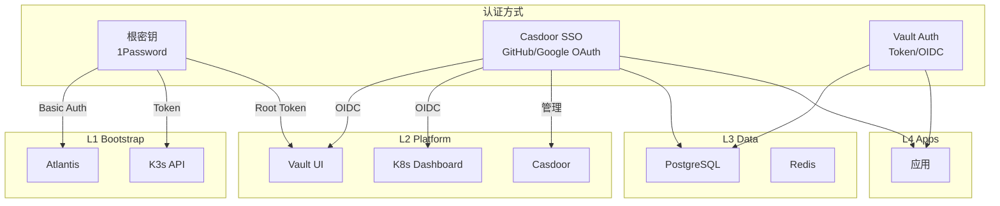

# 认证与授权 SSOT

> **一句话**：L1 使用根密钥，L2 支持根密钥+SSO 双认证，L3/L4 完全走 Vault+SSO。

## 分层认证架构

---

## 层级认证策略

| 层级 | 服务 | 认证方式 | 说明 |
|------|------|----------|------|
| **L1** | Atlantis | 根密钥 (Basic Auth) | 不能依赖 L2 SSO (循环依赖) |
| **L1** | K3s API | 根密钥 (Token) | 系统级 |
| **L2** | Vault | 根密钥 (Root Token) + SSO (OIDC) | **双认证** - 灾难恢复 |
| **L2** | Dashboard | 根密钥 + SSO (OIDC) | **双认证** - 运维需要 |
| **L2** | Casdoor | 根密钥 (admin 密码) | SSO 入口本身 |
| **L3** | PostgreSQL | Vault 动态凭据 | 业务 DB |
| **L3** | Redis | Vault 动态凭据 | 业务缓存 |
| **L4** | Apps | Vault + SSO | 业务层完全依赖平台认证 |

---

## 门户级统一 SSO（Casdoor）

L2 门户级服务正在按照 BRN-008 的设计，逐步迁移到 Casdoor 提供的统一登录入口，减少各自的 Token 配置并提升运维一致性。

| 服务 | 域名 | SSO 形态 | 当前状态 |
|------|------|-----------|----------|
| Vault UI | `https://secrets.<internal_domain>` | Casdoor OIDC 客户端（`vault-oidc`）+ Vault OIDC 提供者 | 🔜 注册客户端并更新 Helm 值 |
| Kubernetes Dashboard | `https://kdashboard.<internal_domain>` | Traefik forward-auth 指向 Casdoor（Dashboard 依旧靠 token 登录） | ⚙️ 中间件 + `dashboard-oidc` 回调对齐 |
| Kubero UI | `https://kcloud.<internal_domain>` | Casdoor OAuth2 客户端（`kubero-oidc`） | ⏳ 需 Casdoor 应用并下发 Client Secret |
| Atlantis Web | `https://atlantis.<internal_domain>` | Basic Auth（继续当前机制） | ✅ 保持手动管理 |

### 实施路径

1. **前置填写**：保持 `enable_portal_sso_gate=false` 部署 Casdoor。门户客户端可手动创建并填入 `casdoor_portal_client_id/secret`；若留空，开关开启时 Terraform 自动生成 secret 并写入 Casdoor `init_data`（同时生成 Vault/Dashboard 客户端）。
2. **自动化执行**：在 2.platform 设置变量后 `terraform init && terraform apply`，开关置 `true` 时 Ingress 自动挂 Traefik ForwardAuth（OAuth2-Proxy→Casdoor），相关 Casdoor 应用与凭据自动创建。
3. **事后验证/切流**：依次验证 `secrets/kdashboard` 登录链路。若异常可关回 `false` 并重跑 apply，避免锁死。随后按需启用 Vault/Dashboard 的 OIDC/OAuth 回调。

这一部分的更多细节参考 BRN-008 中的“场景 5：所有 Portal 走 Casdoor”。

---

## 根密钥管理

| 服务 | 根密钥位置 | GitHub Secret | 用途 |
|------|-----------|---------------|------|
| Atlantis | 1Password `Atlantis` | `ATLANTIS_WEB_PASSWORD` | Web 登录 |
| K3s | kubeconfig 文件 | *(CI 生成)* | kubectl |
| Vault | 1Password `Vault (zitian.party)` | `VAULT_UNSEAL_KEY` | 解封/Root 登录 |
| Casdoor | 1Password `Casdoor Admin` | *(代码中)* | 管理登录 |

---

## SSO (Casdoor) 配置

### Identity Providers

> TODO(auth): 在 Casdoor UI 配置 GitHub/Google OAuth Provider

| Provider | 用途 | 状态 |
|----------|------|------|
| GitHub | 开发者登录 | ⏳ 待配置 |
| Google | 备用登录 | ⏳ 待配置 |

### OIDC Clients (通过 REST API 自动管理)

> OIDC 应用现在通过 `5.casdoor-apps.tf` 中的 REST API 自动创建/更新，无需手动操作。

| 应用 | Client ID | Redirect URI | 管理方式 |
|------|-----------|--------------|----------|
| Portal Gate | `portal-gate` | `https://auth.<internal_domain>/oauth2/callback` | REST API |
| Vault | `vault-oidc` | `https://secrets.<internal_domain>/ui/vault/auth/oidc/oidc/callback` | REST API |
| Dashboard | `dashboard-oidc` | `https://kdashboard.<internal_domain>/oauth2/callback` | REST API |
| Kubero | `kubero-oidc` | `https://kcloud.<internal_domain>/auth/callback` | REST API |

---

## 认证凭据存储对照

| 凭据类型 | 存储位置 | 访问方式 |
|----------|----------|----------|
| 根密钥 | 1Password | `op` CLI 本地 |
| CI 密钥 | GitHub Secrets | `${{ secrets.* }}` |
| 运行时密钥 | Vault | Kubernetes SA |
| 用户凭据 | Casdoor DB | OIDC Token |

---

## 密钥策略（1Password Zero 依赖 / Vault-first）

-   **目标一：1Password 仅存储根密钥**（Atlantis 管理密码、Vault Root Token、Casdoor Admin 密码等），作为离线恢复点，日常操作尽量不直接依赖 `op`。
-   **目标二：其他凭据均由 Vault/Terraform 生成、动态注入或同步到 Vault，Casdoor client secret、Webhook Token、业务 token 等都有 Vault 副本，保持“Vault-first”。
-   若某密钥必须同时存于 1Password 与 Vault，则让 Vault 成为 SSOT，1Password 仅做备份（“Vault-first, 1Password fallback”），明确区分“1Password 0 依赖”和“Vault 作为自动源”两条路径。

---

## 实施状态

| 组件 | 状态 |
|------|------|
| Casdoor 部署 | ✅ 已部署 (sso.zitian.party) |
| GitHub OAuth | ⏳ Casdoor UI 中配置 |
| Vault OIDC | ✅ REST API 自动创建 (`vault-oidc`) |
| Dashboard OIDC | ✅ REST API 自动创建 (`dashboard-oidc`) |
| Kubero OIDC | ✅ REST API 自动创建 (`kubero-oidc`) |
| OAuth2-Proxy | ✅ 已移除 (被 Casdoor 替代) |

---

## 相关文件

- [platform.secrets.md](./platform.secrets.md) - 密钥管理 SSOT
- [5.casdoor.tf](../../2.platform/5.casdoor.tf) - Casdoor Helm release + Bootstrap
- [98.casdoor-apps.tf](../../2.platform/98.casdoor-apps.tf) - OIDC 应用 (local-exec API)
- [2.secret.tf](../../2.platform/2.secret.tf) - Vault 配置

---

