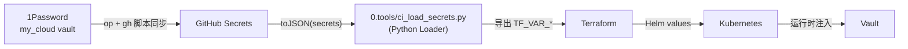
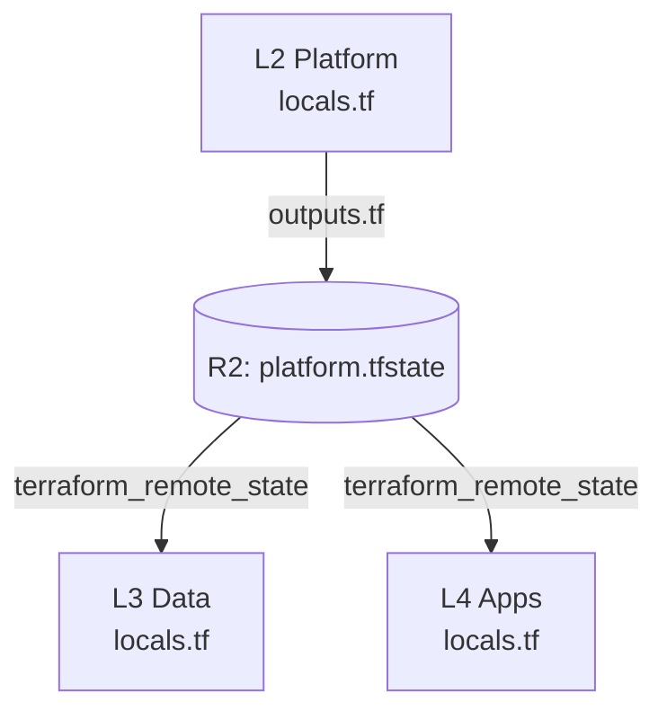

# 密钥管理 SSOT

> **一句话**：所有密钥的 Single Source of Truth 在 1Password，GitHub Secrets 是部署缓存，CI 运行时通过 Python 加载器统一注入。

## 信息流架构



**核心逻辑**：
- **存储**：1Password 是唯一的 master 记录。
- **分发**：GitHub Secrets 仅作为中间缓存，不负责业务逻辑。
- **注入**：`ci_load_secrets.py` 负责将 GitHub Secrets 映射为 IaC 环境所需的 `TF_VAR_` 变量，实现变量链条的 DRY（不重复）。

---

## 密钥清单

### 1. 1Password → GitHub Secrets 映射

同步所有密钥到 GitHub 的一键命令：

```bash
# 执行此命令前需 op signin
op item get "Infra-GHA-Secrets" --vault="my_cloud" --format json |
  jq -r '.fields[] | select(.value != null) | "\(.label) \(.value)"' |
  while read -r key value; do
    if [[ $key =~ ^[A-Z_]+$ ]]; then
      echo "Syncing $key..."
      gh secret set "$key" --body "$value"
    fi
  done
```

| 1Password 项目 | 字段（Label） | GitHub Secret | 映射后的 TF_VAR |
|----------------|---------------------|---------------|-----------------|
| `Infra-Cloudflare` | `BASE_DOMAIN` | `BASE_DOMAIN` | `base_domain` |
| | `CLOUDFLARE_ZONE_ID` | `CLOUDFLARE_ZONE_ID` | `cloudflare_zone_id` |
| | `INTERNAL_DOMAIN` | `INTERNAL_DOMAIN` | `internal_domain` |
| | `INTERNAL_ZONE_ID` | `INTERNAL_ZONE_ID` | `internal_zone_id` |
| | `CLOUDFLARE_API_TOKEN` | `CLOUDFLARE_API_TOKEN` | `cloudflare_api_token` |
| `Infra-R2` | `R2_BUCKET` | `R2_BUCKET` | `r2_bucket` |
| | `R2_ACCOUNT_ID` | `R2_ACCOUNT_ID` | `r2_account_id` |
| | `AWS_ACCESS_KEY_ID` | `AWS_ACCESS_KEY_ID` | `aws_access_key_id` |
| | `AWS_SECRET_ACCESS_KEY` | `AWS_SECRET_ACCESS_KEY` | `aws_secret_access_key` |
| `Infra-VPS` | `VPS_HOST` | `VPS_HOST` | `vps_host` |
| | `VPS_SSH_KEY` | `VPS_SSH_KEY` | `ssh_private_key` |
| `PostgreSQL (Platform)` | `VAULT_POSTGRES_PASSWORD` | `VAULT_POSTGRES_PASSWORD` | `vault_postgres_password` |
| `Infra-OAuth` | `GH_OAUTH_CLIENT_ID` | `GH_OAUTH_CLIENT_ID` | `github_oauth_client_id` |
| | `GH_OAUTH_CLIENT_SECRET` | `GH_OAUTH_CLIENT_SECRET` | `github_oauth_client_secret` |
| | `ENABLE_CASDOOR_OIDC` | `ENABLE_CASDOOR_OIDC` | `enable_casdoor_oidc` |
| | `ENABLE_PORTAL_SSO_GATE` | `ENABLE_PORTAL_SSO_GATE` | `enable_portal_sso_gate` |
| `Infra-Atlantis` | (Legacy) | - | - |
| `Infra-Digger` | `DIGGER_BEARER_TOKEN` | `DIGGER_BEARER_TOKEN` | `digger_bearer_token` |
| | `DIGGER_WEBHOOK_SECRET` | `DIGGER_WEBHOOK_SECRET` | `digger_webhook_secret` |
| | `DIGGER_HTTP_PASSWORD` | `DIGGER_HTTP_PASSWORD` | `digger_http_password` |
| `Infra-Vault` | `VAULT_ROOT_TOKEN` | `VAULT_ROOT_TOKEN` | `vault_root_token` |
| `Infra-GHA-Secrets` | `api_key` | `GEMINI_API_KEY` | - |
| `GitHub PAT` | `token` | `GH_PAT` | `github_token` |

### 3. Terraform 生成密钥 (Managed Secrets)

某些密钥不适合在 1Password 长期存储（如解决兼容性问题生成的随机密码），直接由 Terraform `random_password` 生成并存入 Kubernetes Secret。

**案例**: `platform-pg-simpleuser` (Vault/Casdoor 连接 Platform PG 用)

*   **生成**: Bootstrap 层 TF `random_password` 资源。
*   **存储**: TF State (R2) + K8s Secret (`platform/platform-pg-simpleuser`)。
*   **读取**:
    *   **Runtime**: Pod 挂载/读取 Secret。
    *   **Terraform**: Platform 层 `data "kubernetes_secret"` 读取。
*   **灾难恢复**:
    *   **Secret 丢失**: 重新运行 `terraform apply -target=module.bootstrap`。
    *   **密码泄露**: Taint 资源 `terraform taint random_password.simpleuser` -> Apply -> 手动 `ALTER USER` 同步数据库。

以下变量由 `ci_load_secrets.py` 在缺失时自动填充默认值：
- `VPS_USER`: `root`
- `VPS_SSH_PORT`: `22`
- `K3S_CLUSTER_NAME`: `truealpha-k3s`
- `K3S_CHANNEL`: `stable`

---

## 实施状态

| 组件 | 状态 |
|------|------|
| 1Password SSOT | ✅ 已覆盖 24+ 核心字段 |
| Python Loader | ✅ `0.tools/ci_load_secrets.py` 已上线 |
| Workflow DRY | ✅ `deploy-L1-bootstrap.yml` 冗余减少 80% |
| 变量链条 | ✅ 1Password -> GH -> Env -> TF 闭环 |

---

## 维护 SOP

### 1. 新增一个密钥
1.  在 1Password 对应条目中增加字段（Label 建议大写）。
2.  在 `0.tools/ci_load_secrets.py` 的 `MAPPING` 字典中增加一行映射。
3.  运行同步脚本更新 GitHub Secrets。
4.  在 Terraform `.tf` 文件中使用变量。

### 2. 密钥泄露/轮换
1.  在 1Password 中更新真值。
2.  重新运行同步脚本。
3.  重新触发 CI 流水线（`atlantis plan` / `push to main`）。

### 3. 新增独立 GHA 密钥 (如 GEMINI_API_KEY)

对于仅在工作流中使用、不参与 Terraform 的密钥：

1.  在 1Password 的 `Infra-GHA-Secrets` 项目中新增一个字段（Label 为 `GEMINI_API_KEY`）。

2.  运行一键同步脚本（见上文）将其推送到 GitHub。


3.  在 `.github/workflows/*.yml` 中通过 `${{ secrets.GEMINI_API_KEY }}` 引用。


---

## 层间依赖：terraform_remote_state (Issue #301)

> **适用范围**：仅 L3 和 L4。L1/L2 不读取其他层的 state。

### 架构



### L3 如何读取 L2 Outputs

```hcl
# 3.data/locals.tf
data "terraform_remote_state" "l2_platform" {
  backend = "s3"
  config = {
    bucket   = var.r2_bucket
    key      = "k3s/platform.tfstate"
    region   = "auto"
    endpoints = { s3 = "https://${var.r2_account_id}.r2.cloudflarestorage.com" }
    ...
  }
}

# 使用 L2 outputs
data "vault_kv_secret_v2" "postgres" {
  mount = data.terraform_remote_state.l2_platform.outputs.vault_kv_mount
  name  = data.terraform_remote_state.l2_platform.outputs.vault_db_secrets["postgres"]
}
```

### 安全边界

| 信息类型 | 存储位置 | 敏感级别 |
|----------|----------|----------|
| Secret 路径/名字 | R2 state file | 🟡 中 (地址，非密码) |
| 真正密码 | Vault | 🔴 高 (需 token) |
| vault_root_token | GitHub Secrets → Env | 🔴 高 |
| r2_bucket, r2_account_id | GitHub Secrets → Env | 🟢 低 |

### Preconditions (防御性约定)

L3/L4 应添加 precondition 确保 L2 outputs 存在：

```hcl
# 在 data sources 中添加
lifecycle {
  precondition {
    condition     = can(data.terraform_remote_state.l2_platform.outputs.vault_db_secrets)
    error_message = "L2 platform state missing vault_db_secrets output. Run L2 apply first."
  }
}
```

### 新增变量

L3/L4 需要声明这些变量以读取 R2 state：

```hcl
# 3.data/variables.tf
variable "r2_bucket" {
  description = "R2 bucket name for Terraform state"
  type        = string
}

variable "r2_account_id" {
  description = "Cloudflare R2 account ID"
  type        = string
}
```

这些变量通过 Atlantis Pod 环境变量传递（`TF_VAR_r2_bucket`）。

---

> 变更记录见 [change_log/](../change_log/README.md)
