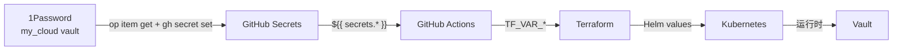

# 密钥管理 SSOT

> **一句话**：所有密钥的 Single Source of Truth 在 1Password，GitHub Secrets 是部署副本，可随时从 1Password 恢复。

## 信息流架构



**灾难恢复**：GitHub Secrets 丢失 → 从 1Password 恢复所有值

---

## 密钥清单

### 1Password → GitHub Secrets 映射

| 1Password 项目 | 字段 | GitHub Secret | 用途 |
|----------------|------|---------------|------|
| `Cloudflare API` | BASE_DOMAIN | `BASE_DOMAIN` | 主域名 |
| | CLOUDFLARE_ZONE_ID | `CLOUDFLARE_ZONE_ID` | 主 Zone |
| | INTERNAL_DOMAIN | `INTERNAL_DOMAIN` | 内部域名 |
| | INTERNAL_ZONE_ID | `INTERNAL_ZONE_ID` | 内部 Zone |
| | CLOUDFLARE_API_TOKEN | `CLOUDFLARE_API_TOKEN` | DNS 管理 |
| `R2 Backend (AWS)` | R2_BUCKET | `R2_BUCKET` | TF State |
| | R2_ACCOUNT_ID | `R2_ACCOUNT_ID` | R2 账户 |
| | AWS_ACCESS_KEY_ID | `AWS_ACCESS_KEY_ID` | R2 认证 |
| | AWS_SECRET_ACCESS_KEY | `AWS_SECRET_ACCESS_KEY` | R2 认证 |
| `VPS SSH` | VPS_HOST | `VPS_HOST` | VPS IP |
| | VPS_SSH_KEY | `VPS_SSH_KEY` | SSH 私钥 |
| `PostgreSQL (Platform)` | VAULT_POSTGRES_PASSWORD | `VAULT_POSTGRES_PASSWORD` | PG 密码 |
| `GitHub OAuth` | GH_OAUTH_CLIENT_ID | `GH_OAUTH_CLIENT_ID` | OAuth |
| | GH_OAUTH_CLIENT_SECRET | `GH_OAUTH_CLIENT_SECRET` | OAuth |
| `Atlantis` | ATLANTIS_WEBHOOK_SECRET | `ATLANTIS_WEBHOOK_SECRET` | Webhook |
| | ATLANTIS_WEB_PASSWORD | `ATLANTIS_WEB_PASSWORD` | Web 密码 |
| | ATLANTIS_GH_APP_ID | `ATLANTIS_GH_APP_ID` | App ID |
| | ATLANTIS_GH_APP_KEY | `ATLANTIS_GH_APP_KEY` | App 私钥 |
| `Vault (zitian.party)` | Unseal Key | `VAULT_UNSEAL_KEY` | 解封 |
| | Root Token | *(不在 GH)* | 管理登录 |
| `Casdoor Admin` | password | `CASDOOR_ADMIN_PASSWORD` | SSO 管理员密码 |

### 额外 GitHub Secrets（非 1Password 管理）

| Secret | 用途 | 备注 |
|--------|------|------|
| `CLAUDE_CODE_OAUTH_TOKEN` | Claude Code 集成 | 单独管理 |

---

## 同步命令

### 从 1Password 恢复 GitHub Secret

```bash
# 示例：恢复 VAULT_POSTGRES_PASSWORD
gh secret set VAULT_POSTGRES_PASSWORD \
  --body "$(op item get 'PostgreSQL (Platform)' --vault my_cloud --fields VAULT_POSTGRES_PASSWORD --reveal)"

# 示例：恢复 VPS_SSH_KEY
gh secret set VPS_SSH_KEY \
  --body "$(op item get 'VPS SSH' --vault my_cloud --fields VPS_SSH_KEY --reveal)"
```

### 批量恢复（灾难恢复）

```bash
# Cloudflare
for f in BASE_DOMAIN CLOUDFLARE_ZONE_ID INTERNAL_DOMAIN INTERNAL_ZONE_ID CLOUDFLARE_API_TOKEN; do
  gh secret set $f --body "$(op item get 'Cloudflare API' --vault my_cloud --fields $f --reveal)"
done

# R2/AWS
for f in R2_BUCKET R2_ACCOUNT_ID AWS_ACCESS_KEY_ID AWS_SECRET_ACCESS_KEY; do
  gh secret set $f --body "$(op item get 'R2 Backend (AWS)' --vault my_cloud --fields $f --reveal)"
done
```

---

## 层级认证模型

| 层级 | 认证方式 | 密钥来源 |
|------|----------|----------|
| **L1 Bootstrap** | 根密钥 (SSH + Vault Root Token) | 1Password 直接 |
| **L2 Platform** | 根密钥 + SSO (Casdoor OIDC) | GitHub Secrets → TF |
| **L3 Data** | Vault + SSO | Vault KV |
| **L4 Apps** | Vault + SSO | Vault 动态凭据 |

详见 [auth.md](auth.md)

---

## 实施状态

| 组件 | 状态 |
|------|------|
| 1Password SSOT | ✅ 9 项目，20+ 字段 |
| GitHub Secrets | ✅ 20 secrets |
| 1P → GH 同步 | ✅ VAULT_POSTGRES_PASSWORD 已同步 |
| CI Auto-unseal | ✅ 已实现 |
| Casdoor init_data.json | ✅ 正确挂载到 /init_data.json |

