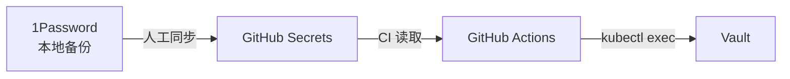

# 密钥管理 SSOT

> **一句话**：根密钥存 1Password（人类备份），同步到 GitHub Secrets（CI 可读），GitHub Actions 部署完自动 unseal。

## 架构



## 信任层次

| 层级 | 存储 | 可访问性 | 用途 |
|------|------|---------|------|
| **人类备份** | 1Password | 本地 `op` CLI | 灾难恢复 |
| **CI 可读** | GitHub Secrets | Actions Runner | 自动化 |
| **运行时** | Vault | K8s 内部 | 业务密钥 |

---

## 密钥同步流程

### 首次初始化（本地执行）
```bash
# 1. Vault init（通过 SSH）
INIT=$(ssh root@VPS "kubectl exec vault-0 -n platform -- vault operator init -format=json")

# 2. 写入 1Password（本地备份）
op item create --vault=my_cloud --title="Vault" \
  "Unseal Key=$(echo $INIT | jq -r '.unseal_keys_b64[0]')" \
  "Root Token=$(echo $INIT | jq -r '.root_token')"

# 3. 同步到 GitHub Secrets（CI 可读）
gh secret set VAULT_UNSEAL_KEY --body "$(echo $INIT | jq -r '.unseal_keys_b64[0]')"
```

### 后续部署（CI 自动）
```yaml
# deploy-k3s.yml (PR #135)
- name: Auto-unseal Vault
  run: |
    if kubectl exec vault-0 -- vault status | grep "Sealed.*true"; then
      kubectl exec vault-0 -- vault operator unseal "$VAULT_UNSEAL_KEY"
    fi
```

---

## 密钥清单

### GitHub Secrets（CI 用）

| Secret | 用途 | 来源 |
|--------|------|------|
| `VPS_SSH_KEY` | SSH 登录 | 手动生成 |
| `R2_ACCESS_KEY` | TF State | Cloudflare |
| `CLOUDFLARE_API_TOKEN` | DNS | Cloudflare |
| `VAULT_POSTGRES_PASSWORD` | PG 密码 | 手动设置 |
| `VAULT_UNSEAL_KEY` | Vault 解封 | vault init |

### 1Password（人类备份）

| Item | 内容 |
|------|------|
| `Vault (zitian.party)` | unseal_key, root_token, URL |
| `Cloudflare API` | API Token |
| `VPS SSH` | Private Key |

---

## 自动化行为

| 触发 | 行为 |
|------|------|
| `git push main` | L1 → L2 部署 → 检查 Vault → 自动 unseal |
| Pod 重启 | 下次 CI 运行时自动 unseal |
| 手动 unseal | `/vault-unseal` workflow (本地) |

---

## 实施状态

| 组件 | 状态 |
|------|------|
| 1Password 备份 | ✅ `Vault (zitian.party)` |
| GitHub Secret | ✅ `VAULT_UNSEAL_KEY` |
| CI Auto-unseal | ⏳ PR #135 待合并 |
