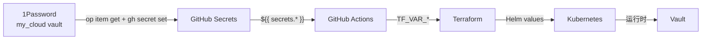

# 密钥管理 SSOT

> **一句话**：所有密钥的 Single Source of Truth 在 1Password，GitHub Secrets 是部署副本，可随时从 1Password 恢复。

## 信息流架构



**灾难恢复**：GitHub Secrets 丢失 → 从 1Password 恢复所有值

---

## 密钥清单

### 1Password → GitHub Secrets 映射

| 1Password 项目 | 字段 | GitHub Secret | 用途 |
|----------------|------|---------------|------|
| `Cloudflare API` | BASE_DOMAIN | `BASE_DOMAIN` | 主域名 |
| | CLOUDFLARE_ZONE_ID | `CLOUDFLARE_ZONE_ID` | 主 Zone |
| | INTERNAL_DOMAIN | `INTERNAL_DOMAIN` | 内部域名 |
| | INTERNAL_ZONE_ID | `INTERNAL_ZONE_ID` | 内部 Zone |
| | CLOUDFLARE_API_TOKEN | `CLOUDFLARE_API_TOKEN` | DNS 管理 |
| `R2 Backend (AWS)` | R2_BUCKET | `R2_BUCKET` | TF State |
| | R2_ACCOUNT_ID | `R2_ACCOUNT_ID` | R2 账户 |
| | AWS_ACCESS_KEY_ID | `AWS_ACCESS_KEY_ID` | R2 认证 |
| | AWS_SECRET_ACCESS_KEY | `AWS_SECRET_ACCESS_KEY` | R2 认证 |
| `VPS SSH` | VPS_HOST | `VPS_HOST` | VPS IP |
| | VPS_SSH_KEY | `VPS_SSH_KEY` | SSH 私钥 |
| `PostgreSQL (Platform)` | VAULT_POSTGRES_PASSWORD | `VAULT_POSTGRES_PASSWORD` | PG 密码 |
| `GitHub OAuth` | GH_OAUTH_CLIENT_ID | `GH_OAUTH_CLIENT_ID` | OAuth |
| | GH_OAUTH_CLIENT_SECRET | `GH_OAUTH_CLIENT_SECRET` | OAuth |
| `Casdoor Portal Gate` | client_secret | `CASDOOR_PORTAL_CLIENT_SECRET` | Portal SSO Gate OAuth（留空则 TF 自动生成） |
| `Casdoor Vault OIDC` | client_secret | `CASDOOR_VAULT_OIDC_CLIENT_SECRET` | Vault OIDC（留空则 TF 自动生成，**建议存 1Password 以防灾难恢复**） |
| `Casdoor Dashboard OIDC` | client_secret | `CASDOOR_DASHBOARD_OIDC_CLIENT_SECRET` | Dashboard OIDC（留空则 TF 自动生成，**建议存 1Password 以防灾难恢复**） |
| `Casdoor Kubero OIDC` | client_secret | `CASDOOR_KUBERO_OIDC_CLIENT_SECRET` | Kubero OIDC（留空则 TF 自动生成，**建议存 1Password 以防灾难恢复**） |
| `Atlantis` | ATLANTIS_WEBHOOK_SECRET | `ATLANTIS_WEBHOOK_SECRET` | Webhook |
| | ATLANTIS_WEB_PASSWORD | `ATLANTIS_WEB_PASSWORD` | Web 密码 |
| | ATLANTIS_GH_APP_ID | `ATLANTIS_GH_APP_ID` | App ID |
| | ATLANTIS_GH_APP_KEY | `ATLANTIS_GH_APP_KEY` | App 私钥 |
| `Vault (zitian.party)` | Unseal Key | `VAULT_UNSEAL_KEY` | 解封 |
| | Root Token | `VAULT_ROOT_TOKEN` | L2/L3 TF Provider |
| `Casdoor Admin` | password | `CASDOOR_ADMIN_PASSWORD` | SSO 管理员密码 |

### 额外 GitHub Secrets（非 1Password 管理）

| Secret | 用途 | 备注 |
|--------|------|------|
| `CLAUDE_CODE_OAUTH_TOKEN` | Claude Code 集成 | 单独管理 |

---

## 同步命令

### 从 1Password 恢复 GitHub Secret

```bash
# 示例：恢复 VAULT_POSTGRES_PASSWORD
gh secret set VAULT_POSTGRES_PASSWORD \
  --body "$(op item get 'PostgreSQL (Platform)' --vault my_cloud --fields VAULT_POSTGRES_PASSWORD --reveal)"

# 示例：恢复 VPS_SSH_KEY
gh secret set VPS_SSH_KEY \
  --body "$(op item get 'VPS SSH' --vault my_cloud --fields VPS_SSH_KEY --reveal)"
```

### 批量恢复（灾难恢复）

```bash
# Cloudflare
for f in BASE_DOMAIN CLOUDFLARE_ZONE_ID INTERNAL_DOMAIN INTERNAL_ZONE_ID CLOUDFLARE_API_TOKEN; do
  gh secret set $f --body "$(op item get 'Cloudflare API' --vault my_cloud --fields $f --reveal)"
done

# R2/AWS
for f in R2_BUCKET R2_ACCOUNT_ID AWS_ACCESS_KEY_ID AWS_SECRET_ACCESS_KEY; do
  gh secret set $f --body "$(op item get 'R2 Backend (AWS)' --vault my_cloud --fields $f --reveal)"
done
```

---

## 层级认证模型

| 层级 | 认证方式 | 密钥来源 |
|------|----------|----------|
| **L1 Bootstrap** | 根密钥 (SSH + Vault Root Token) | 1Password 直接 |
| **L2 Platform** | 根密钥 + SSO (Casdoor OIDC) | GitHub Secrets → TF |
| **L3 Data** | Vault + SSO | Vault KV |
| **L4 Apps** | Vault + SSO | Vault 动态凭据 |

详见 [auth.md](auth.md)

---

## 实施状态

| 组件 | 状态 |
|------|------|
| 1Password SSOT | ✅ 9 项目，20+ 字段 |
| GitHub Secrets | ✅ 20 secrets |
| 1P → GH 同步 | ✅ VAULT_POSTGRES_PASSWORD 已同步 |
| CI Auto-unseal | ✅ 已实现 |
| Casdoor init_data.json | ✅ 正确挂载到 /init_data.json |

---

## Casdoor OIDC Secrets 灾难恢复策略

### 问题背景

Casdoor 的 `init_data.json` **仅在首次启动且数据库为空时**读取。这导致以下灾难场景的不一致性：

| 场景 | Terraform State | Casdoor DB | 结果 |
|------|----------------|------------|------|
| **完全灾难** | ✅ R2 保留 | ❌ 丢失 | ✅ 一致（DB 重建时读取 init_data） |
| **State 丢失** | ❌ 丢失 | ✅ 保留 | ❌ **不一致**（新 random_password ≠ DB 中旧值） |
| **仅 DB 损坏** | ✅ 保留 | ❌ 丢失 | ✅ 一致（从 state 恢复 init_data） |

### 解决方案

**推荐做法**：将 Terraform 自动生成的 OIDC client secrets **手动保存到 1Password**，作为灾难恢复的备份。

1. **首次部署后**，导出自动生成的 secrets：
   ```bash
   terraform output -json | jq -r '.casdoor_*_client_secret.value'
   ```

2. **保存到 1Password**（创建新项目或添加字段）：
   - `Casdoor Vault OIDC` → client_secret
   - `Casdoor Dashboard OIDC` → client_secret
   - `Casdoor Kubero OIDC` → client_secret

3. **灾难恢复时**，从 1Password 恢复到 GitHub Secrets：
   ```bash
   gh secret set CASDOOR_VAULT_OIDC_CLIENT_SECRET \
     --body "$(op item get 'Casdoor Vault OIDC' --vault my_cloud --fields client_secret --reveal)"
   ```

4. **重新部署**时，Terraform 会优先使用这些手动设置的值，而不是重新生成。

### 灾难恢复操作流程

**场景：Terraform State 丢失，但 Casdoor DB 保留**

1. 从 Casdoor UI 导出现有的 client secrets（或从 1Password 恢复）
2. 设置 GitHub Secrets / TF 变量：
   ```bash
   export TF_VAR_casdoor_vault_oidc_client_secret="<from-casdoor>"
   export TF_VAR_casdoor_dashboard_oidc_client_secret="<from-casdoor>"
   export TF_VAR_casdoor_kubero_oidc_client_secret="<from-casdoor>"
   ```
3. 重新 `terraform import` 或 `terraform apply`
4. Terraform 会使用这些手动值，与 Casdoor DB 保持一致

---

## Vault-first 密钥策略

- **1Password 仅存根密钥**（Atlantis 登录、Vault root token、Casdoor 管理密码），作为离线恢复源，不再做日常运维依赖。
- **Vault 作为主库**：所有运行时凭据、Casdoor client secret、Webhook Token、Terraform `random_password` 等都优先写入 Vault，再由 Agent 注入或同步到 CI 环境，避免在 1Password 里频繁复制粘贴。
- **Fallback 设计**：当需要同时保留 1Password 与 Vault 副本时，Vault 为 SSOT、1Password 仅做 backup（“Vault-first, 1Password fallback”），确保可以实现“1Password 0 依赖”或将全部凭据迁移到 Vault 的两条路径。
