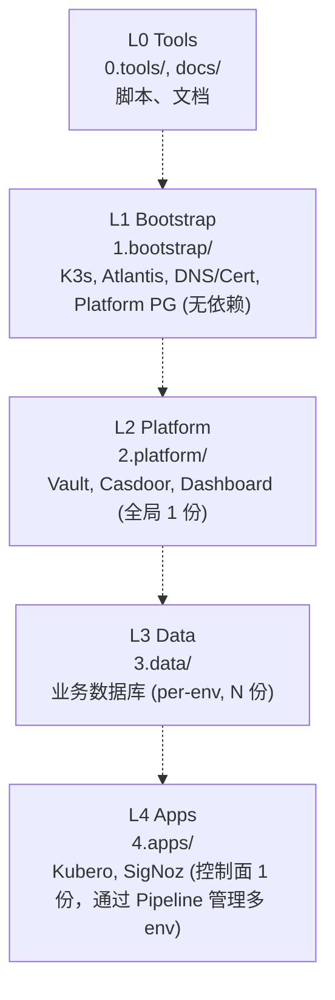
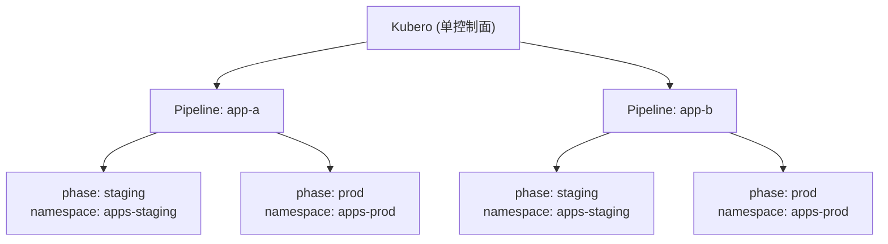

# 目录结构 SSOT

> **核心问题**：代码在哪里？负责什么？

---

## 层级架构



### 层级职责详解

| 层级 | 核心职责 | 部署份数 | 多环境策略 |
|------|----------|---------|-----------|
| **L1 Bootstrap** | Trust Anchor + 工具箱 | **1 套** | 无依赖，CI 直接部署 |
| **L2 Platform** | 基建控制面 (密钥/SSO) | **1 套** | Atlantis `default` workspace |
| **L3 Data** | 数据面 (业务 DB) | **N 套** | Per-env workspace (staging/prod) |
| **L4 Apps** | 应用控制面 (PaaS/Observability) | **1 套** | Kubero Pipeline/Phase 管理多 env |

### L4 多环境管理

L4 的 Kubero 是单控制面，通过 Pipeline/Phase 管理多 app × 多 env：



### 依赖 vs 数据流

```mermaid
flowchart LR
    subgraph Dep["依赖方向 (部署顺序)"]
        DepL1[L1] --> DepL2[L2] --> DepL3[L3] --> DepL4[L4]
    end

    subgraph Flow["数据流方向 (日志/指标)"]
        FlowL1[L1] --> SigNoz[SigNoz (L4)]
        FlowL2[L2] --> SigNoz
        FlowL3[L3] --> SigNoz
        FlowL4[L4] --> SigNoz
    end
```

> 可观测性数据从 L1-L4 流向 SigNoz，这是**数据流**而非代码依赖，不破坏 DAG。

---


## 完整目录树

```mermaid
flowchart TB
    Root["root/"]
    Root --> Agents["AGENTS.md<br/>(!) AI 行为准则"]
    Root --> CheckNow["0.check_now.md<br/>(!) 当前 sprint"]
    Root --> AtlantisYaml["atlantis.yaml<br/>(!) GitOps 配置"]
    Root --> RootReadme["README.md<br/>(!) 项目入口"]

    Root --> ToolsDir["0.tools/"]
    ToolsDir --> ToolsReadme["README.md<br/>脚本索引"]
    ToolsDir --> ToolsCheck["check-readme-coverage.sh<br/>README 覆盖检查"]
    ToolsDir --> ToolsPreflight["preflight-check.sh<br/>Helm URL 验证"]
    ToolsDir --> ToolsMigrate["migrate-state.sh<br/>State 迁移"]

    Root --> DocsDir["docs/"]
    DocsDir --> DocsReadme["README.md<br/>(!) 设计概念"]
    DocsDir --> DocsSsotDir["ssot/"]
    DocsDir --> DocsProjectDir["project/"]
    DocsDir --> DocsChangeLogDir["change_log/<br/>变更历史"]
    DocsDir --> DocsDeepDivesDir["deep_dives/<br/>深度分析"]

    DocsSsotDir --> SsotReadme["README.md<br/>(!) SSOT 索引"]
    DocsSsotDir --> SsotCoreDir["core.dir.md<br/>(!) 本文件"]
    DocsSsotDir --> SsotCoreEnv["core.env.md<br/>(!) 环境模型"]
    DocsSsotDir --> SsotCoreVars["core.vars.md<br/>变量定义"]
    DocsSsotDir --> SsotPlatformAuth["platform.auth.md<br/>认证架构"]
    DocsSsotDir --> SsotPlatformSecrets["platform.secrets.md<br/>密钥管理"]
    DocsSsotDir --> SsotPlatformNetwork["platform.network.md<br/>网络/域名"]
    DocsSsotDir --> SsotPlatformAi["platform.ai.md<br/>AI 接入"]
    DocsSsotDir --> SsotDb["db.*.md<br/>各数据库 SSOT"]
    DocsSsotDir --> SsotOpsPipeline["ops.pipeline.md<br/>(!) 部署流程"]
    DocsSsotDir --> SsotOpsStandards["ops.standards.md<br/>(!) 运维标准 (Guards/Admission)"]
    DocsSsotDir --> SsotOpsRecovery["ops.recovery.md<br/>故障恢复"]
    DocsSsotDir --> SsotOpsStorage["ops.storage.md<br/>存储备份"]
    DocsSsotDir --> SsotOpsObs["ops.observability.md<br/>可观测"]
    DocsSsotDir --> SsotOpsAlert["ops.alerting.md<br/>告警"]

    DocsProjectDir --> ProjectReadme["README.md<br/>BRN 索引"]
    DocsProjectDir --> ProjectBrn["BRN-*.md<br/>设计文档"]

    Root --> GithubDir[".github/"]
    GithubDir --> WorkflowsDir["workflows/"]
    WorkflowsDir --> WorkflowsReadme["README.md<br/>CI 索引"]
    WorkflowsDir --> TerraformPlan["terraform-plan.yml<br/>(!) TF 验证"]
    WorkflowsDir --> DeployL1["deploy-L1-bootstrap.yml<br/>(!) L1 引导 (手动)"]
    WorkflowsDir --> InfraCommands["infra-commands.yml<br/>Infra Commands (review, dig)"]

    Root --> BootstrapDir["1.bootstrap/<br/>L1: GitHub Actions 部署"]
    BootstrapDir --> BootstrapReadme["README.md<br/>(!) L1 文档"]
    BootstrapDir --> BootstrapBackend["backend.tf<br/>R2 后端"]
    BootstrapDir --> BootstrapProviders["providers.tf<br/>Provider"]
    BootstrapDir --> BootstrapVars["variables.tf<br/>变量定义"]
    BootstrapDir --> BootstrapLocals["locals.tf<br/>本地变量"]
    BootstrapDir --> BootstrapK3s["1.k3s.tf<br/>K3s 安装"]
    BootstrapDir --> BootstrapAtlantis["2.atlantis.tf<br/>Atlantis"]
    BootstrapDir --> BootstrapDns["3.dns_and_cert.tf<br/>DNS + Cert-Manager"]
    BootstrapDir --> BootstrapStorage["4.storage.tf<br/>存储类"]
    BootstrapDir --> BootstrapPlatformPg["5.platform_pg.tf<br/>Platform PostgreSQL"]

    Root --> PlatformDir["2.platform/<br/>L2: Atlantis 部署"]
    PlatformDir --> PlatformReadme["README.md<br/>(!) L2 文档"]
    PlatformDir --> PlatformBackend["backend.tf<br/>R2 后端"]
    PlatformDir --> PlatformProviders["providers.tf<br/>Provider"]
    PlatformDir --> PlatformVars["variables.tf<br/>变量定义"]
    PlatformDir --> PlatformLocals["locals.tf<br/>本地变量"]
    PlatformDir --> PlatformPortalAuth["1.portal-auth.tf<br/>Portal SSO Gate"]
    PlatformDir --> PlatformSecret["2.secret.tf<br/>Vault"]
    PlatformDir --> PlatformDashboard["3.dashboard.tf<br/>K8s Dashboard"]
    PlatformDir --> PlatformCasdoor["5.casdoor.tf<br/>Casdoor SSO"]

    Root --> DataDir["3.data/<br/>L3: Atlantis 部署 (per-env)"]
    DataDir --> DataReadme["README.md<br/>(!) L3 文档"]
    DataDir --> DataTf["*.tf<br/>Redis, PG, ClickHouse, ArangoDB"]

    Root --> AppsDir["4.apps/<br/>L4: Atlantis 部署 (per-env)"]
    AppsDir --> AppsReadme["README.md<br/>(!) L4 文档"]
    AppsDir --> AppsKubero["1.kubero.tf<br/>Kubero PaaS"]
    AppsDir --> AppsTf["*.tf<br/>业务应用"]

    Root --> EnvsDir["envs/<br/>环境配置"]
    EnvsDir --> EnvsReadme["README.md<br/>tfvars 指南"]
    EnvsDir --> EnvsStaging["staging.tfvars.example<br/>Staging 模板"]
    EnvsDir --> EnvsProd["prod.tfvars.example<br/>Prod 模板"]
```



**图例**：`(!)` = SSOT / 关键文件

---

## Namespace 规则

| 层级 | Namespace | 组件 | 部署模式 |
|------|-----------|------|---------|
| L1 | `kube-system` | K3s 系统组件 | 单例 |
| L1 | `bootstrap` | Atlantis | 单例 |
| L2 | `platform` | Vault, Dashboard, Casdoor | 单例 |
| L3 | `data-staging` | Staging 数据库 | per-env |
| L3 | `data-prod` | Prod 数据库 | per-env |
| L4 控制面 | `kubero` | Kubero UI | 单例 |
| L4 控制面 | `kubero-operator-system` | Kubero Operator | 单例 |
| L4 控制面 | `observability` | SigNoz, OTel Collector | 单例 |
| L4 工作负载 | `apps-staging` | Staging 应用 (Kubero Pipeline 部署) | per-env |
| L4 工作负载 | `apps-prod` | Prod 应用 (Kubero Pipeline 部署) | per-env |

> **持久化**: 
> - L1/L3 有状态组件用 PVC (`local-path-retain`)
> - L2 控制面无状态（依赖 L1 Platform PG）
> - L4 控制面存储需求由 **L3 提供**（如 Kubero 的 MongoDB/PG 部署在 L3 data namespace）

> **健康检查**: 见 [ops.pipeline.md](./ops.pipeline.md#8-健康检查分层)

---

## Used by

- [docs/README.md](../README.md)
- [docs/ssot/core.env.md](./core.env.md)
