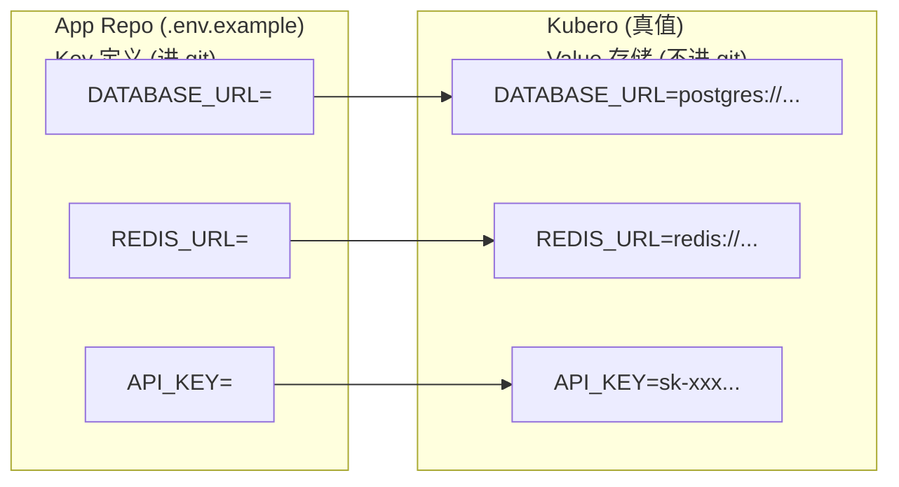

# 环境变量 SSOT

> **核心问题**：哪些变量需要配置？默认值是什么？

## 变量分类

| 类别 | 示例 | 定义位置 | 注入方式 |
|------|------|----------|----------|
| **TF 变量** | `base_domain`, `env_prefix` | `variables.tf` | tfvars / TF_VAR_* |
| **Feature Flags** | `enable_observability` | `variables.tf` | tfvars |
| **Helm Values** | chart versions | `variables.tf` | TF → Helm |
| **Runtime Env** | `NODE_ENV` | L4 App 定义 | K8s ConfigMap |

> 环境语义（environment/workspace/namespace/domain）与 tfvars 的边界，见：[core.env.md](./core.env.md)

## L1 Bootstrap 变量

| 变量 | 类型 | 必填 | 默认值 | 用途 |
|------|------|------|--------|------|
| `vps_host` | string | ✅ | - | VPS IP |
| `cluster_name` | string | ❌ | `truealpha-k3s` | K3s 集群名 |
| `base_domain` | string | ✅ | `truealpha.club` | 生产域名 |
| `internal_domain` | string | ❌ | (同 base) | 内部域名 |
| `env_prefix` | string | ❌ | `x-staging` | 环境前缀 |

## L2 Platform 变量

| 变量 | 类型 | 必填 | 默认值 | 用途 |
|------|------|------|--------|------|
| `vault_chart_version` | string | ❌ | `0.31.0` | Vault Helm 版本 |
| `vault_image_tag` | string | ❌ | `1.20.4` | Vault 镜像版本 |
| `github_oauth_org` | string | ❌ | - | OAuth 限制的 GitHub Org |

## Feature Flags

| Flag | 层级 | 默认值 | 作用 |
|------|------|--------|------|
| `enable_infra` | L1 | `true` | 是否部署共享基础设施 |
| `enable_observability` | L1 | `false` | 是否部署 SigNoz/OpenPanel |
| `enable_ssl` | L1 | `true` | 是否启用 TLS |

## 完整变量位置

- L1 Bootstrap: [`1.bootstrap/variables.tf`](../../1.bootstrap/variables.tf)
- L2 Platform: [`2.platform/variables.tf`](../../2.platform/variables.tf)

---

## L4 App Vars（Kubero 管理）

> L4 应用层变量不走 TF_VAR，由 Kubero 直接管理。

### 变量模型

| 层 | Key 定义 | Value 存储 | 修改方式 |
|----|---------|-----------|---------|
| **L1-L3 (Infra)** | `variables.tf` | 1Password → GitHub Secrets | CI/Atlantis 注入 |
| **L4 (App)** | App repo `.env.example` | **Kubero** | UI / CLI |

### 操作流程

```bash
# 查看当前 env vars
kubero app env get my-app

# 设置 env var（值存在 Kubero，不进 git）
kubero app env set my-app DATABASE_URL=postgres://...

# 导出配置（备份）
kubero app get my-app --output yaml > my-app-backup.yaml
```

### 可复现性



> **恢复策略**: Kubero 数据丢失时，从 `kubero app get --output yaml` 备份恢复。

---

## Used by

- [docs/ssot/core.env.md](./core.env.md)
- [docs/project/BRN-008.md](../project/BRN-008.md)
