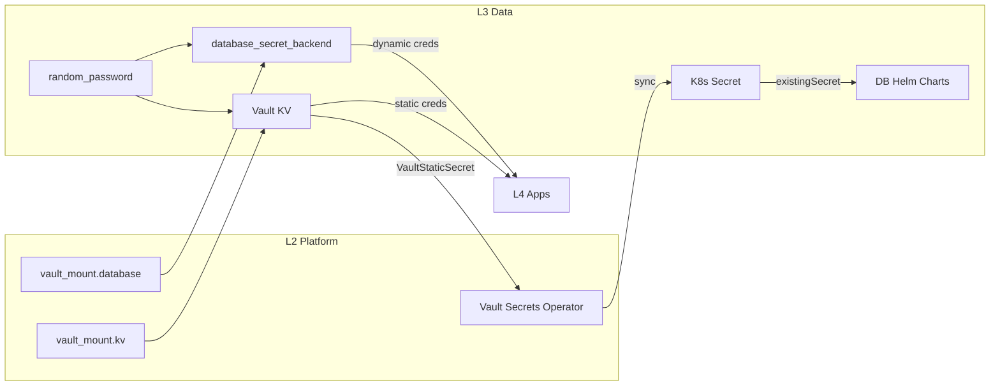

# 3.data (Data Layer / Layer 3) - Production Environment

> **环境**: Production
> **定位**: 模块维护文档（面向基础设施运维者）

**Scope**:
- **Relational**: Business PostgreSQL (Application data)
- **Cache**: Redis
- **Multi-model**: ArangoDB (Document, Graph, Key-Value)
- **OLAP**: ClickHouse
- **Namespace**: `data-<env>` (e.g. `data-prod`, `data-prod`)

## Architecture

This layer provides stateful services for **Business Applications** (L4).

*Note: Platform DB (for Vault/Casdoor) is in L1 (`1.bootstrap/5.platform_pg.tf`).*

### Password Flow (VSO Pattern - Issue #351)



**L3 owns password generation** - L2 deploys VSO for automatic sync.

**VSO Pattern**: Vault Secrets Operator automatically syncs Vault KV secrets to K8s Secrets:
1. `random_password` generates password on first deploy
2. `vault_kv_secret_v2` stores in Vault (SSOT, with `ignore_changes`)
3. `VaultStaticSecret` CR tells VSO to sync Vault → K8s Secret
4. Helm chart uses `existingSecret` to read from K8s Secret
5. No more fragile `data.external` + kubectl exec workarounds

### Components

| File | Component | Purpose |
|------|-----------|---------|
| `0.vault-auth.tf` | VaultAuth CR | VSO authentication config for Vault access |
| `1.postgres.tf` | PostgreSQL | Business database, existingSecret via VSO |
| `2.redis.tf` | Redis | Cache and session storage, existingSecret via VSO |
| `3.clickhouse.tf` | ClickHouse | OLAP analytics database, existingSecret via VSO |
| `4.arangodb.tf` | ArangoDB | Multi-model database, JWT + password via VSO |

### Deployment Order

1. **L1** (Bootstrap): k3s, Platform PostgreSQL
2. **L2** (Platform): Vault, vault_mount, VSO (Vault Secrets Operator)
3. **L3** (Data): Create Vault KV → VSO syncs to K8s Secret → Helm uses existingSecret
4. **L4** (Apps): Get dynamic credentials via Vault Agent

### Credentials

| Service | Vault Path | Type |
|---------|------------|------|
| PostgreSQL root | `secret/data/postgres` | Static (L3 generated, VSO synced) |
| PostgreSQL app users | `database/creds/postgres-*` | Dynamic (short-lived) |
| Redis | `secret/data/redis` | Static (L3 generated, VSO synced) |
| ClickHouse | `secret/data/clickhouse` | Static (L3 generated, VSO synced) |
| ArangoDB | `secret/data/arangodb` | Static (L3 generated, VSO synced) |

## Design Decisions

### Deployment & Configuration

**Terragrunt Integration**:
- **Backend/Providers**: Auto-generated by root `terragrunt.hcl` (gitignored)
- **State key**: `k3s/data-prod.tfstate`
- **Environment**: Automatically detected from directory path

```bash
# Standalone usage
cd envs/prod/3.data
export R2_BUCKET=<bucket> R2_ACCOUNT_ID=<account-id>
terragrunt init
terragrunt apply
```

### Namespace Ownership

The `data-prod` namespace is **owned by L3** (`envs/prod/3.data/1.postgres.tf`). This follows the pattern:
- L1 owns `kube-system`, `platform` (namespace created in L1)
- L2 operates within `platform` (namespace passed from L1)
- **L3 owns `data-prod`** (namespace created in L3 prod)
- L4 operates within `apps-prod` (and may create app-specific namespaces)

### VSO Pattern Rationale

Password flow: `random_password` → `Vault KV` → `VSO` → `K8s Secret` → `Helm existingSecret`

| Location | Purpose | Justification |
|----------|---------|---------------|
| Vault KV (`secret/data/postgres`) | SSOT for all credentials | Single source of truth, supports rotation |
| K8s Secret (via VSO sync) | Helm chart consumption | Helm `existingSecret` reads from K8s Secret |
| VaultStaticSecret CR | Automation | VSO watches Vault and auto-syncs to K8s |

**Why VSO instead of Vault Agent Injector?**
- Helm charts natively support `existingSecret` parameter
- VSO provides automatic sync (no sidecar needed for databases)
- Cleaner than `data.external` + kubectl exec workarounds

## Disaster Recovery

### Backup Strategy

```bash
# Backup L3 PostgreSQL (run on VPS)
NS="data-prod" # or data-prod
kubectl exec -n "$NS" postgresql-0 -- pg_dump -U postgres app > l3_backup.sql

# Restore
kubectl exec -n "$NS" postgresql-0 -- psql -U postgres -d app < l3_backup.sql
```

### Recovery Steps

1. **Terraform State Lost** (VSO Pattern - Issue #351):
   - Vault KV secrets protected by `ignore_changes` (won't overwrite)
   - VSO auto-syncs existing Vault secrets to K8s Secrets
   - Helm uses `existingSecret` → no password mismatch
   - Database continues with same credentials
2. **Data Loss**: Restore from pg_dump backup
3. **Full Recreation**: Delete `data-<env>` namespace, re-apply L3

## Health Checks & Validation

All L3 data services follow the health check matrix from [ops.pipeline.md](../docs/ssot/ops.pipeline.md#8-健康检查分层):

### Atlantis (In-Cluster Providers)

When `TF_VAR_kubeconfig_path` is empty (Atlantis in-cluster), the `kubectl` provider must set `load_config_file=false` to avoid defaulting to `http://localhost` and failing CRD applies (e.g., `kubectl_manifest`).

### Terraform-native Validation

Each service has **lifecycle preconditions** to ensure Vault KV availability:

```hcl
lifecycle {
  prevent_destroy = true  # Prevent accidental data loss
  
  precondition {
    condition     = can(data.vault_kv_secret_v2.{service}.data["password"]) && 
                    length(data.vault_kv_secret_v2.{service}.data["password"]) >= 16
    error_message = "{Service} password must be available in Vault KV and at least 16 characters."
  }
}
```

**Coverage**:
- ✅ **PostgreSQL**: Password validation (16+ chars)
- ✅ **Redis**: Password validation (16+ chars)  
- ✅ **ClickHouse**: Password validation (16+ chars)
- ✅ **ArangoDB**: Password validation (16+ chars) + JWT secret precondition

### Helm Chart Configuration

- **Timeout**: 300s (standardized across all releases)
- **Wait**: `wait = true` ensures readiness before completion
- **Lifecycle**: `prevent_destroy = true` on all database releases
- **Storage**: follow [ops.storage.md](../docs/ssot/ops.storage.md) (`local-path-retain`, reclaim policy, /data conventions)

**Note**: initContainer and other Pod-level health checks are configured via Helm chart defaults, not in Terraform values per SSOT guidelines.
Scalability for MVP:
- **Redis**: Master-only (no replicas)
- **ClickHouse**: Single shard, no ZooKeeper
- **ArangoDB**: Single mode (not Cluster)

Scale-out / multi-replica migration notes are tracked in:
- [docs/project/README.md](../docs/project/README.md) (execution plan / backlog)
- [db.overview.md](../docs/ssot/db.overview.md) (database capability SSOT)

---
*Last updated: 2025-12-23 (VSO Pattern - Issue #351)*
