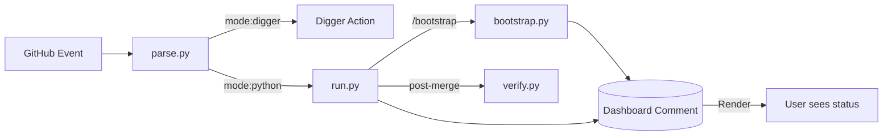

# CI Tools - Implementation

> **Role**: CI/CD Logic Implementation  
> **Language**: Python 3.11+  
> **Design**: Dashboard-first event-driven automation

This package (`tools.ci`) implements the core logic for the infrastructure pipeline.  
Workflows are thin YAML dispatchers; all complex logic lives here.

---

## 📚 Documentation Index

- **Design & Architecture**: [.github/workflows/DESIGN.md](../../.github/workflows/DESIGN.md)
- **Pipeline SSOT**: [docs/ssot/ops.pipeline.md](../../docs/ssot/ops.pipeline.md)

---

## Architecture



---

## Core Design: Dashboard System

### Concept

Every commit on a PR gets a **persistent Dashboard comment** that tracks all CI status.

**Marker Pattern**:
```markdown
<!-- infra-dashboard:abc1234 -->
## ⚙️ Commit Dashboard `abc1234`
| Stage | Status | Output | Time |
...
```

**Key Properties**:
1. **One per commit**: Identified by commit SHA
2. **Update in-place**: Never create duplicate comments
3. **Persistent state**: Serialized as JSON in comment
4. **Link everything**: Every status has a run URL

### Dashboard Lifecycle

```python
# 1. Initialize (once per commit)
dashboard = Dashboard(pr_number=123, commit_sha="abc123", github=gh)
dashboard.save()  # Creates comment

# 2. Update (multiple times)
dashboard.load()  # Find by marker
dashboard.update_stage("plan-bootstrap", "running", link=url)
dashboard.save()  # Updates same comment

# 3. Final state
dashboard.update_stage("plan-bootstrap", "success")
dashboard.save()
```

---

## Modules

| Module | Purpose | Dashboard? |
|--------|---------|------------|
| `commands/run.py` | **Entry Point**: Unified event handler | ✅ Updates |
| `commands/parse.py` | **Routing**: Determines mode (digger/python) | ❌ Read-only |
| `commands/init.py` | **Dashboard Init**: Creates per-commit comment | ✅ Creates |
| `commands/update.py` | **Dashboard Update**: CLI for external jobs | ✅ Updates |
| `commands/bootstrap.py` | Bootstrap layer plan/apply | ✅ Updates |
| `commands/plan.py` | L2/L3 Terraform plan | ⚠️ Stub |
| `commands/apply.py` | L2/L3 Terraform apply | ⚠️ Stub |
| `commands/verify.py` | Post-merge drift scan | ❌ No PR |
| `core/github.py` | GitHub API client | - |
| `core/dashboard.py` | Dashboard data model & rendering | - |

---

## CLI Usage

### From GitHub Actions

```yaml
# Initialize dashboard
- run: python -m ci init --pr 123

# Update stage status
- run: |
    python -m ci update \
      --pr 123 \
      --stage "plan-platform" \
      --status "success" \
      --link "https://..."

# Unified entry point (handles routing)
- run: python -m ci run
```

### Manual Testing

```bash
# Set up environment
export GITHUB_TOKEN="ghp_..."
export PYTHONPATH="."

# Initialize dashboard
python -m ci init --pr 123

# Update a stage
python -m ci update --pr 123 --stage apply --status success

# Run bootstrap
python -m ci bootstrap plan --pr 123
```

---

## Dashboard Stages

Default stages (defined in `core/dashboard.py`):

| Stage Key | Display Name | Updated By |
|-----------|--------------|------------|
| `plan-bootstrap` | Plan: bootstrap | `pyci` job (bootstrap.py) |
| `plan-platform` | Plan: platform | `digger` job + update step |
| `plan-data-staging` | Plan: data-staging | `digger` job + update step |
| `plan-data-prod` | Plan: data-prod | `digger` job + update step |
| `apply` | Apply | `digger` / `pyci` + update step |
| `e2e` | E2E Tests | `e2e-tests` workflow |
| `review` | AI Review | Manual / Copilot |

**States**: `pending`, `running`, `success`, `failure`, `skipped`

---

## Integration Patterns

### Pattern A: Python Command (Preferred)

Used by `pyci` job and all Python commands:

```python
from ..core.dashboard import Dashboard
from ..core.github import GitHubClient

gh = GitHubClient()
pr_info = gh.get_pr(pr_number)

dashboard = Dashboard(
    pr_number=pr_number,
    commit_sha=pr_info.head_sha,
    github=gh
)

# Load existing
dashboard.load()

# Update stage
dashboard.update_stage("plan-bootstrap", "running", link=run_url)
dashboard.save()

# ... do work ...

# Final update
dashboard.update_stage("plan-bootstrap", "success")
dashboard.save()
```

### Pattern B: CLI Update (For External Jobs)

Used when Python context not available (e.g., after Digger action):

```yaml
- name: Update Dashboard
  if: always()
  env:
    GITHUB_TOKEN: ${{ secrets.GITHUB_TOKEN }}
    PYTHONPATH: ${{ github.workspace }}/tools
  run: |
    python -m ci update \
      --pr ${{ needs.parse.outputs.pr_number }} \
      --stage "plan-platform" \
      --status "${{ steps.digger.outcome }}" \
      --link "${{ github.server_url }}/${{ github.repository }}/actions/runs/${{ github.run_id }}"
```

---

## Command Routing

`run.py` handles all events and routes to appropriate handlers:

| Event | Condition | Handler | Dashboard Update |
|-------|-----------|---------|------------------|
| `pull_request` | - | `plan.run()` | ❌ Stub |
| `push` | to main | `verify.run()` | ❌ No PR |
| `issue_comment` | `/plan` | `plan.run()` | ✅ Via run.py |
| `issue_comment` | `/apply` | `apply.run()` | ✅ Via run.py |
| `issue_comment` | `/bootstrap *` | `bootstrap.run()` | ✅ Via bootstrap.py |
| `issue_comment` | `/e2e` | Trigger workflow | ✅ Via run.py |
| `issue_comment` | `/review` | Placeholder | ✅ Via run.py |
| `workflow_dispatch` | - | Based on input | ✅ Varies |

---

## Troubleshooting

### Dashboard Not Updating

**Symptoms**:
- All stages show ⏳ pending
- History section empty

**Common Causes**:
1. `dashboard.save()` not called
2. Wrong PR number
3. GitHub token lacks permissions (`issues: write`)
4. Dashboard marker mismatch

**Debug**:
```bash
# Check if dashboard exists
gh pr view 123 --comments | grep "infra-dashboard"

# Check workflow logs
gh run view <run-id> --log | grep -i dashboard

# Manually test
python -m ci init --pr 123
python -m ci update --pr 123 --stage apply --status success
```

### Digger Updates Missing

**Fixed in latest**: Added post-step to `digger` job in `ci.yml`

If still broken, check:
1. `needs.parse.outputs.pr_number` is set
2. `GITHUB_TOKEN` has correct permissions
3. `PYTHONPATH` includes `tools` directory

---

*Last updated: 2025-12-25 - Full implementation documentation*