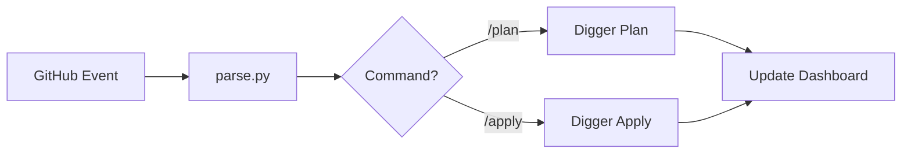

# CI Tools

> **Role**: CI/CD Logic Implementation
> **Dependencies**: Python 3.11+, GitHub Actions

This python package (`tools.ci`) implements the core logic for the infrastructure pipeline.

## 📚 SSOT References

> [**Pipeline SSOT**](../../docs/ssot/ops.pipeline.md)

## Architecture

The CI system is event-driven and centers around the **Pull Request Dashboard**.



## Modules

| Module | Purpose |
|--------|---------|
| `commands/` | **CLI Entrypoints**: Implements `plan`, `apply`, `verify` logic. |
| `core/` | **Library**: Shared logic for GitHub API, Dashboard rendering, Terraform execution. |
| `__main__.py` | **Router**: Dispatches CLI arguments to commands. |

## Local Development

```bash
# Run tests
uv run pytest tools/ci/tests/

# Manual execution (simulating CI)
export GITHUB_TOKEN=...
python3 -m tools.ci parse --event-file event.json
```

---
*Last updated: 2025-12-25*