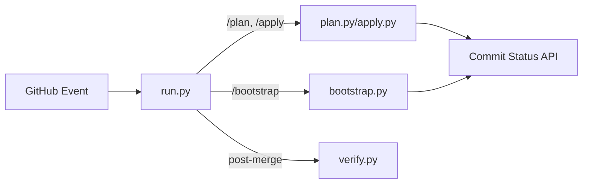

# CI Tools

> **Role**: CI/CD Logic Implementation
> **Dependencies**: Python 3.11+, GitHub Actions

This python package (`tools.ci`) implements the core logic for the infrastructure pipeline.
Workflows are thin YAML dispatchers; all complex logic lives here.

## 📚 SSOT References

> [**Pipeline SSOT**](../../docs/ssot/ops.pipeline.md)

## Architecture



## Modules

| Module | Purpose |
|--------|---------|
| `commands/run.py` | **Entry Point**: Unified event handler for all CI |
| `commands/bootstrap.py` | Bootstrap layer plan/apply logic |
| `commands/plan.py` | L2/L3 Terraform plan |
| `commands/apply.py` | L2/L3 Terraform apply |
| `commands/verify.py` | Post-merge drift scan |
| `core/github.py` | GitHub API client |
| `core/dashboard.py` | PR Dashboard rendering |

## CLI

```bash
# Unified entry (used by workflow)
python -m ci run

# Manual commands
python -m ci bootstrap plan --pr 123
python -m ci plan all --pr 123
```

---
*Last updated: 2025-12-25*